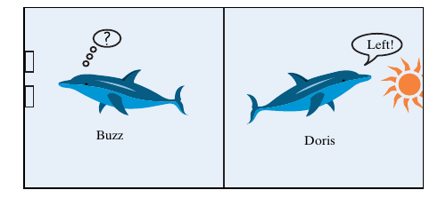
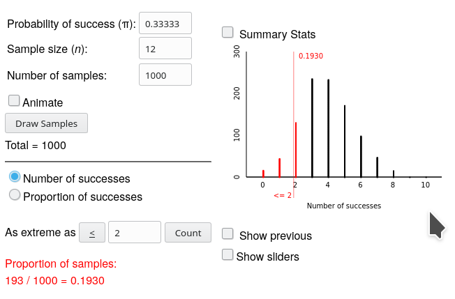
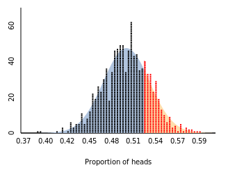

<script type="text/x-mathjax-config">
  MathJax.Hub.Config({ TeX: { extensions: ["color.js"] }});
</script>

```{r setup, include = F}

library(ggplot2)
library(tidyverse)
knitr::opts_chunk$set(dpi=300, message = F, warning = F, echo = F, fig.width = 8, fig.height = 4, out.width = "80%", fig.align = "center", cache = T)
theme_set(theme_bw())
```

# Navigation

.pull-left[
.large[By Date]

- January 16: [start](#3) - [end](#13)

- January 21: [start](#14) - [end](#33)

- January 23: [start](#34) - [end](#62)

- January 28: [start](#63) - [end](#86)

- January 30: [Review](#87)
]
.pull-right[
.large[By Section]

- [Section 1.1](#3)

- [Section 1.2](#14)

- [Section 1.3](#39)

- [Section 1.4](#55)

- [Section 1.5](#73)
]

---
class:inverse,middle,center
# 1.1: Introduction to Chance Models

---
## Statistical Significance

<br/><br/>
**Statistical significance** - unlikely to have occurred by random chance

> [Helper vs. Hinderer example](https://srvanderplas.github.io/unl-stat218-materials/slides/chapter-P-preliminaries.html#3), what is P(14/16 infants)? Is it rare? What is P(8/16 infants)?

--

<br/><br/>

**Probability** - Long run proportion of times an outcome from a random process occurs
> Let's Make a Deal example - result after 100s of simulations


---
## Statistical Significance

General strategy: 

1. Create a model for the process under random chance

2. Use the model to calculate the **probability** of the observation under random chance

3. If that probability is very small, conclude that the effect is likely not due to chance    
e.g. is **statistically significant**


---
## Vocabulary

- **Statistic** - number summarizing the results from a *sample*

- **Parameter** - long-run numerical property of the *population*

<br/>
***
<br/>
.center[
.inline-left[**P**arameter -> **P**opulation].inline-right[**S**tatistic -> **S**ample]

.small[.inline-left[unknown value].inline-right[known value]]
]
<br/>
***
<br/>

.center[We use **statistics** to estimate  **parameters**]

---
## Example 1.1: Can Dolphins Communicate?

.pull-left[
Training: 
1. Shine headlight into tank
2. If light is steady, hit the right-side lever to get a fish
3. If light is blinking, hit the left-side lever to get a fish

Experiment: 
1. Show Doris the light 
2. Give Buzz the levers
3. See if Doris could tell Buzz which lever to push

].pull-right[


]


---
## Example 1.1: Can Dolphins Communicate?

.pull-left[
Training: 
1. Shine headlight into tank
2. If light is steady, hit the right-side lever to get a fish
3. If light is blinking, hit the left-side lever to get a fish

Experiment: 
1. Show Doris the light 
2. Give Buzz the levers
3. See if Doris could tell Buzz which lever to push

].pull-right[


<br/><br/>
Buzz hit the correct lever 15/16 times
]


---
## Example 1.1: Can Dolphins Communicate?

1. Ask a research question:    
.red[Can the dolphins communicate ideas?]

2. Design a study and collect data:
  - Observational Units: .red[Each of Buzz's attempts]
  - Variable: .red[Correct or incorrect button]
  - Categorical or quantitative?: .red[Categorical]
  
3. Explore the data: .red[We observed 15 correct responses out of 16 total trials]

4. Draw inferences beyond the data:    
> What would we expect the **statistic** to be if Buzz was guessing?    
> Was the observed **statistic** significantly greater than that?

--

<br/><br/>
.large[.center[We need to build a chance model to find out!]]


---
## Example 1.1: Can Dolphins Communicate?

Real Study | Physical Simulation
---------: | :------------------
Lever pull by Buzz | Coin Flip
Correct lever | Heads
Incorrect lever | Tails
Probability of correct button<br> **when Buzz is guessing** (1/2) | Chance of heads (1/2)
16 attempts by Buzz | 16 coin flips = <br/>One **Repetition** of the study


.center[If Buzz is just guessing, what is a **typical** value we would see in one repetition of the study?

http://www.rossmanchance.com/ISIapplets.html]

---
## Determining Statistical Significance: 3 S Strategy

1. **Statistic** - numerical summary from sample
  - Helper/Hinderer: 14/16
  - Doris/Buzz: 15/16

2. **Simulate** - identify a "by chance alone" model for the scenario and repeatedly simulate values for the statistic under that model

3. **Strength of Evidence** - Is the observed statistic unusual?


```{r, fig.width = 8, fig.height = 3, ffmpeg.format='gif', fig.show='animate', dev = "jpeg", dpi = 300}
set.seed(50703092)
x2 <- rbinom(10000, 16, .5)
ymax <- function(x) max(table(x))*1.05
my_arrow <- arrow(ends = "both", length = unit(0.1, "inches"))

x <- x2[1:100]

ggplot(data = tibble(x = x), aes(x = x)) + 
  annotate("rect", xmin = 14.5, xmax = 16.5, ymin = 0, ymax = ymax(x), fill = "red", alpha = .2) + 
  annotate("text", x = 15.5, y = ymax(x)/2, vjust = .5, label = "As or\nmore extreme\nthan observed", color = "red") + 
  geom_bar(width = .9) + 
  annotate("segment", x = -0.5, xend = 3.5, y = ymax(x), yend = ymax(x), arrow = my_arrow) + 
  annotate("text", x = 1.5, y = Inf, vjust = 1.2, label = "Lower tail") + 
  annotate("segment", x = 3.5, xend = 12.5, y = ymax(x), yend = ymax(x), arrow =  my_arrow) + 
  annotate("text", x = 8, y = Inf, vjust = 1.2, label = "Typical outcomes") +
  annotate("segment", x = 12.5, xend = 16.5, y = ymax(x), yend = ymax(x), arrow =  my_arrow) + 
  annotate("text", x = 14.5, y = Inf, vjust = 1.2, label = "Upper tail") + 
  scale_y_continuous("# Simulations", expand = c(.1, 0)) + 
  scale_x_continuous("Simulation Statistic Value", breaks = (0:8)*2) + 
  ggtitle("100 simulations")

x <- x2[1:200]
ggplot(data = tibble(x = x), aes(x = x)) + 
  annotate("rect", xmin = 14.5, xmax = 16.5, ymin = 0, ymax = ymax(x), fill = "red", alpha = .2) + 
  annotate("text", x = 15.5, y = ymax(x)/2, vjust = .5, label = "As or\nmore extreme\nthan observed", color = "red") + 
  geom_bar(width = .9) + 
  annotate("segment", x = -0.5, xend = 3.5, y = ymax(x), yend = ymax(x), arrow = my_arrow) + 
  annotate("text", x = 1.5, y = Inf, vjust = 1.2, label = "Lower tail") + 
  annotate("segment", x = 3.5, xend = 12.5, y = ymax(x), yend = ymax(x), arrow =  my_arrow) + 
  annotate("text", x = 8, y = Inf, vjust = 1.2, label = "Typical outcomes") +
  annotate("segment", x = 12.5, xend = 16.5, y = ymax(x), yend = ymax(x), arrow =  my_arrow) + 
  annotate("text", x = 14.5, y = Inf, vjust = 1.2, label = "Upper tail") + 
  scale_y_continuous("# Simulations", expand = c(.1, 0)) + 
  scale_x_continuous("Simulation Statistic Value", breaks = (0:8)*2) + 
  ggtitle("200 simulations")


x <- x2[1:500]
ggplot(data = tibble(x = x), aes(x = x)) + 
  annotate("rect", xmin = 14.5, xmax = 16.5, ymin = 0, ymax = ymax(x), fill = "red", alpha = .2) + 
  annotate("text", x = 15.5, y = ymax(x)/2, vjust = .5, label = "As or\nmore extreme\nthan observed", color = "red") + 
  geom_bar(width = .9) + 
  annotate("segment", x = -0.5, xend = 3.5, y = ymax(x), yend = ymax(x), arrow = my_arrow) + 
  annotate("text", x = 1.5, y = Inf, vjust = 1.2, label = "Lower tail") + 
  annotate("segment", x = 3.5, xend = 12.5, y = ymax(x), yend = ymax(x), arrow =  my_arrow) + 
  annotate("text", x = 8, y = Inf, vjust = 1.2, label = "Typical outcomes") +
  annotate("segment", x = 12.5, xend = 16.5, y = ymax(x), yend = ymax(x), arrow =  my_arrow) + 
  annotate("text", x = 14.5, y = Inf, vjust = 1.2, label = "Upper tail") + 
  scale_y_continuous("# Simulations", expand = c(.1, 0)) + 
  scale_x_continuous("Simulation Statistic Value", breaks = (0:8)*2) + 
  ggtitle("500 simulations")


x <- x2[1:1000]
ggplot(data = tibble(x = x), aes(x = x)) + 
  annotate("rect", xmin = 14.5, xmax = 16.5, ymin = 0, ymax = ymax(x), fill = "red", alpha = .2) + 
  annotate("text", x = 15.5, y = ymax(x)/2, vjust = .5, label = "As or\nmore extreme\nthan observed", color = "red") + 
  geom_bar(width = .9) + 
  annotate("segment", x = -0.5, xend = 3.5, y = ymax(x), yend = ymax(x), arrow = my_arrow) + 
  annotate("text", x = 1.5, y = Inf, vjust = 1.2, label = "Lower tail") + 
  annotate("segment", x = 3.5, xend = 12.5, y = ymax(x), yend = ymax(x), arrow =  my_arrow) + 
  annotate("text", x = 8, y = Inf, vjust = 1.2, label = "Typical outcomes") +
  annotate("segment", x = 12.5, xend = 16.5, y = ymax(x), yend = ymax(x), arrow =  my_arrow) + 
  annotate("text", x = 14.5, y = Inf, vjust = 1.2, label = "Upper tail") + 
  scale_y_continuous("# Simulations", expand = c(.1, 0)) + 
  scale_x_continuous("Simulation Statistic Value", breaks = (0:8)*2) + 
  ggtitle("1000 simulations")


x <- x2[1:5000]
ggplot(data = tibble(x = x), aes(x = x)) + 
  annotate("rect", xmin = 14.5, xmax = 16.5, ymin = 0, ymax = ymax(x), fill = "red", alpha = .2) + 
  annotate("text", x = 15.5, y = ymax(x)/2, vjust = .5, label = "As or\nmore extreme\nthan observed", color = "red") + 
  geom_bar(width = .9) + 
  annotate("segment", x = -0.5, xend = 3.5, y = ymax(x), yend = ymax(x), arrow = my_arrow) + 
  annotate("text", x = 1.5, y = Inf, vjust = 1.2, label = "Lower tail") + 
  annotate("segment", x = 3.5, xend = 12.5, y = ymax(x), yend = ymax(x), arrow =  my_arrow) + 
  annotate("text", x = 8, y = Inf, vjust = 1.2, label = "Typical outcomes") +
  annotate("segment", x = 12.5, xend = 16.5, y = ymax(x), yend = ymax(x), arrow =  my_arrow) + 
  annotate("text", x = 14.5, y = Inf, vjust = 1.2, label = "Upper tail") + 
  scale_y_continuous("# Simulations", expand = c(.1, 0)) + 
  scale_x_continuous("Simulation Statistic Value", breaks = (0:8)*2) + 
  ggtitle("5000 simulations")


x <- x2[1:10000]
ggplot(data = tibble(x = x), aes(x = x)) + 
  annotate("rect", xmin = 14.5, xmax = 16.5, ymin = 0, ymax = ymax(x), fill = "red", alpha = .2) + 
  annotate("text", x = 15.5, y = ymax(x)/2, vjust = .5, label = "As or\nmore extreme\nthan observed", color = "red") + 
  geom_bar(width = .9) + 
  annotate("segment", x = -0.5, xend = 3.5, y = ymax(x), yend = ymax(x), arrow = my_arrow) + 
  annotate("text", x = 1.5, y = Inf, vjust = 1.2, label = "Lower tail") + 
  annotate("segment", x = 3.5, xend = 12.5, y = ymax(x), yend = ymax(x), arrow =  my_arrow) + 
  annotate("text", x = 8, y = Inf, vjust = 1.2, label = "Typical outcomes") +
  annotate("segment", x = 12.5, xend = 16.5, y = ymax(x), yend = ymax(x), arrow =  my_arrow) + 
  annotate("text", x = 14.5, y = Inf, vjust = 1.2, label = "Upper tail") + 
  scale_y_continuous("# Simulations", expand = c(.1, 0)) + 
  scale_x_continuous("Simulation Statistic Value", breaks = (0:8)*2) + 
  ggtitle("10000 simulations")
  
```

---
## Exploration 1.1: Can Dogs Understand Human Cues?

1. State the research question

2. Observational units

3. Variable

4. Sample size

5. Observed statistic

6. Is the statistic in the direction suggested by the researcher?

7. Is the observed result *possible*?

8. Is the observed result *probable*?

9. If he picked the cup at random, what is the probability (parameter) that he chooses correctly?

10. What would the probability of choosing the correct cup be if Harley understands the experimenter?    
.small[(can be a range of values)]


---
## For next time

- Exploration P.3 due January 17 (Friday) at 6pm

- Ch. P HW due January 20 at 6pm

- Complete Exploration 1.1 and submit it on Canvas by January 20 (Monday) at 6pm

- Read Section 1.2 of the textbook

- Complete the first two questions of Exploration 1.2: Tasting water

---
class:inverse,middle,center
# 1.2: Measuring the Strength of Evidence

---
## Definitions

The **Null Hypothesis** $H_0$ is the "by random chance alone" explanation

The **Alternative Hypothesis** $H_A$ is the explanation that consists of a not-random effect. 
> This is usually the thing we want to show - our research hypothesis.

We want to disprove $H_0$, forcing us to conclude that $H_A$ is a better (more probable) explanation. 

---
## Binary Variables

**Binary** variables have only two possible outcomes

$\pi$ is used to represent the *parameter* for a long-run probability or proportion

$n$ is the sample size or number of observational units

$\hat p$ represents our *sample statistic* (the observed value)


---
## Rock Paper Scissors
.pull-left[
- Two players
- Three options

Are all options equally likely to be played?

Some evidence* suggests that novice players are less likely to choose scissors. 

.bottom[\*[See Eyler et al., 2009](https://www.jstor.org/stable/pdf/25653686.pdf)]

].pull-right[

]


---
## Rock Paper Scissors

1. Research question: .red[Are novice players are less likely to choose scissors?]

2. Design a study and collect data:    
Play $n$ rounds, recording 0 or 1, where 1 = scissors was played
  - Observational Unit: .red[Each round of play]
  - Variable: .red[Outcome of a round (rock, paper, scissors)] .small[Categorical]
  - Outcomes: .red[Scissors or not scissors (rock, paper)] .small[Binary]
  - Statistic: .red[Let x=# scissors selected in n rounds; then] <math xmlns="http://www.w3.org/1998/Math/MathML"><mstyle color="red">
  <mrow class="MJX-TeXAtom-ORD">
    <mover>
      <mi>p</mi>
      <mo stretchy="false">&#x005E;<!-- ^ --></mo>
    </mover>
  </mrow>
  <mo>=</mo>
  <mfrac>
    <mi>x</mi>
    <mi>n</mi>
  </mfrac></mstyle>
</math>
> In our study, $n=12, x=2$
  - Parameter of interest: .red[Probability of selecting scissors]    
  Options:
      - Equal preference for all 3 choices, so $\pi = 1/3$
      - $\pi_{\text{scissors}} < 1/3$, that is, scissors is chosen less frequently    
.grey[.small[Note: You don't specify a particular value, just a direction from a particular value]]
    
3. Explore the data: .red[2 scissors in 12 trials; 2/12 = 1/6] <math xmlns="http://www.w3.org/1998/Math/MathML"><mstyle color="red">
  <mo>&#x2248;<!-- ≈ --></mo>
  <mn>0.1667</mn></mstyle>
</math>

.toprightfig[

]
---
## Rock Paper Scissors

1. Research question
2. Design a study and collect data
  - Outcomes: .red[Scissors or not scissors (rock, paper)] .small[Binary]
  - Statistic: <math xmlns="http://www.w3.org/1998/Math/MathML"><mstyle color="red">
  <mrow class="MJX-TeXAtom-ORD">
    <mover>
      <mi>p</mi>
      <mo stretchy="false">&#x005E;<!-- ^ --></mo>
    </mover>
  </mrow>
  <mo>=</mo>
  <mfrac>
    <mi>x</mi>
    <mi>n</mi>
  </mfrac></mstyle>
</math>
  - Parameter of interest: .red[Probability of selecting scissors]    
  Options:
      - Equal preference for all 3 choices, so $\pi = 1/3$
      - $\pi_{\text{scissors}} < 1/3$, that is, scissors is chosen less frequently    
.grey[.small[Note: You don't specify a particular value, just a direction from a particular value]]
    
3. Explore the data
4. Draw inferences beyond the data: 

--

.center[Your parameter options represent the null and alternative hypotheses.<br/>Which is which?]

---
## Rock Paper Scissors

1. Research question
2. Design a study and collect data
  - Outcomes: .red[Scissors or not scissors (rock, paper)] .small[Binary]
  - Statistic:  <math xmlns="http://www.w3.org/1998/Math/MathML"><mstyle color="red">
  <mrow class="MJX-TeXAtom-ORD">
    <mover>
      <mi>p</mi>
      <mo stretchy="false">&#x005E;<!-- ^ --></mo>
    </mover>
  </mrow>
  <mo>=</mo>
  <mfrac>
    <mi>x</mi>
    <mi>n</mi>
  </mfrac></mstyle>
</math>
  - Parameter of interest: .red[Probability of selecting scissors]    
  Options:
      - Equal preference for all 3 choices, so $\pi = 1/3$
      - $\pi_{\text{scissors}} < 1/3$, that is, scissors is chosen less frequently    
.grey[.small[Note: You don't specify a particular value, just a direction from a particular value]]
    
3. Explore the data
4. Draw inferences beyond the data: 
<math xmlns="http://www.w3.org/1998/Math/MathML" display="block"><mstyle color="red">
  <mtable columnalign="right left right left right left right left right left right left" rowspacing="3pt" columnspacing="0em 2em 0em 2em 0em 2em 0em 2em 0em 2em 0em" displaystyle="true">
    <mtr>
      <mtd>
        <msub>
          <mi>H</mi>
          <mn>0</mn>
        </msub>
        <mo>:</mo>
      </mtd>
      <mtd>
        <mspace width="thickmathspace" />
        <mspace width="thickmathspace" />
        <mi>&#x03C0;<!-- π --></mi>
        <mo>=</mo>
        <mn>1</mn>
        <mrow class="MJX-TeXAtom-ORD">
          <mo>/</mo>
        </mrow>
        <mn>3</mn>
      </mtd>
    </mtr>
    <mtr>
      <mtd>
        <msub>
          <mi>H</mi>
          <mi>A</mi>
        </msub>
        <mo>:</mo>
      </mtd>
      <mtd>
        <mspace width="thickmathspace" />
        <mspace width="thickmathspace" />
        <mi>&#x03C0;<!-- π --></mi>
        <mo>&lt;</mo>
        <mn>1</mn>
        <mrow class="MJX-TeXAtom-ORD">
          <mo>/</mo>
        </mrow>
        <mn>3</mn>
      </mtd>
    </mtr>
  </mtable></mstyle>
</math>

.toprightfig[

]


---
## Rock Paper Scissors
.toprightfig[

]

- Is $\hat p_{scissors}$ less than the probability specified in the null hypothesis?<br/>    
.red[Yes, the sample proportion of 1/6 is in the direction of the alternative hypothesis]

- Is it possible that $\hat p$ could turn out this small even if $H_0$ were true?<br/>    
.red[Yes, it is possible that it could be this small]

---
## P-values

The **p-value** is the probability of obtaining a value of the statistic at least as extreme as the observed statistic *when the null hypothesis is true*

We estimate a p-value by finding the **proportion of simulated statistics** using the random chance model assuming $H_0$  

**that are at least as extreme** (in the direction of $H_A$)  

**as the value of the observed statistic** from the research study.

.grey[.bottom[Note that the <strong>p-value</strong> is not the same p as the sample proportion, <math xmlns="http://www.w3.org/1998/Math/MathML"><mstyle color="gray">
  <mrow class="MJX-TeXAtom-ORD">
    <mover>
      <mi>p</mi>
      <mo stretchy="false">&#x005E;<!-- ^ --></mo>
    </mover>
  </mrow></mstyle>
</math>. <br/>p-values can be computed using any sample statistic, not just proportions.]]

---
## Guidelines for Interpreting p-values

p-value range | Interpretation 
------------: | :--------------
$0.10 < p\;\phantom{\leq 0.10}$ | Not much evidence against $H_0$ <br> ( $H_0$ is plausible)
$0.05 < p \leq 0.10$ | Moderate evidence against $H_0$
$0.01 < p \leq 0.05$ | Strong evidence against $H_0$
$\phantom{0.10 <}p < 0.01$ | Very strong evidence against $H_0$

If you have done the modeling correctly, you'll still be wrong $(100\times p)$% of the time when $H_0$ is actually true

.large[The smaller the p-value, the more evidence against]  $\displaystyle H_0$ 

---
## Rock Paper Scissors
.toprightfig[

]

3 S Strategy:

1. Statistic: .red[2/12 ]<math xmlns="http://www.w3.org/1998/Math/MathML"><mstyle color="red">
  <mo>&#x2248;<!-- ≈ --></mo>
  <mn>0.1667</mn></mstyle>
</math>

2. Simulation: .red["coin flip" with p(heads) = 1/3]
.pull-left[.small[Actual coins don't work, but we could use dice - rolls of 1 or 2 represent scissors... or we could let the computer do it for us using the <br/>[**One Proportion** applet](http://www.rossmanchance.com/ISIapplets.html)]]
.pull-right[]
<br/>
3. Strength of evidence:
.red[
193 of 1000 simulation samples showed a value of 0, 1, or 2 scissors (out of 12 games)

~19% of the time, we would see a value as or more extreme than 2 under the random chance model
]

---
## P-values

```{r, fig.height = 5, dpi = 300}
set.seed(2016100700)
df <- tibble(x = rbinom(1000, 12, 1/3))

ggplot(df, aes(x = x)) + geom_bar() + 
  scale_x_continuous("# Scissors in 12 trials", breaks = 0:12, limits = c(0, 12)) +
  scale_y_continuous("# Simulation Trials") + 
  ggtitle("Simulation Results")
```

---
## P-values

```{r, fig.height = 5, dpi = 300}

ggplot(df, aes(x = x)) + geom_bar() + 
  scale_x_continuous("# Scissors in 12 trials", breaks = 0:12, limits = c(0, 12)) +
  scale_y_continuous("# Simulation Trials") + 
  ggtitle("Simulation Results with observed statistic") +
  annotate("segment", y = 0, yend = Inf, x = 2, xend = 2, color = "red")

```

---
## P-values

```{r, fig.height = 5, dpi = 300}
ggplot(df, aes(x = x)) + geom_bar() + 
  scale_x_continuous("# Scissors in 12 trials", breaks = 0:12, limits = c(0, 12)) +
  scale_y_continuous("# Simulation Trials") + 
  ggtitle("Which direction to go?") +
  annotate("segment", y = 0, yend = Inf, x = 2, xend = 2, color = "red") +
  annotate("text", y = 175, x = 1, label = "atop(displaystyle(atop(In~the,direction)),of~H[A])", color = "red", parse = T, vjust = 0) + 
  annotate("segment", x = 1.75, xend = 0, y = 150, yend = 150, color = "red", arrow = arrow(ends = "last", length = unit(0.1, "inches")) )
```

---
## P-values

```{r, fig.height = 5, dpi = 300}

df <- df %>%
  mutate(extreme = factor(x <=2, labels = c("Not extreme", "Extreme"))) 

ggplot(df, aes(x = x, fill = extreme)) + geom_bar() + 
  scale_fill_manual("", values = c("Extreme" = "red", "Not extreme" = "grey20")) + 
  theme(legend.title = element_blank(), legend.position = c(1, 1), legend.justification = c(1,1), legend.background = element_rect(fill = "transparent")) + 
  scale_x_continuous("# Scissors in 12 trials", breaks = 0:12, limits = c(0, 12)) +
  scale_y_continuous("# Simulation Trials") + 
  ggtitle("Simulation statistics as or more extreme than the observed statistic") +
  annotate("segment", y = 0, yend = Inf, x = 2, xend = 2, color = "red") +
  annotate("text", y = 175, x = 1, label = "atop(displaystyle(atop(In~the,direction)),of~H[A])", color = "red", parse = T, vjust = 0) + 
  annotate("segment", x = 1.75, xend = 0, y = 150, yend = 150, color = "red", arrow = arrow(ends = "last", length = unit(0.1, "inches")) )

```

---
## P-values

```{r, fig.height = 5, dpi = 300}
ggplot(df, aes(x = x, fill = extreme)) + geom_bar() + 
  scale_fill_manual("", values = c("Extreme" = "red", "Not extreme" = "grey20")) + 
  theme(legend.title = element_blank(), legend.position = c(1, 1), legend.justification = c(1,1), legend.background = element_rect(fill = "transparent")) + 
  scale_x_continuous("# Scissors in 12 trials", breaks = 0:12, limits = c(0, 12)) +
  scale_y_continuous("# Simulation Trials") + 
  ggtitle("Simulation Results with p-value calculation") +
  annotate("segment", y = 0, yend = Inf, x = 2, xend = 2, color = "red") +
  annotate("text", y = 175, x = 1, label = "atop(displaystyle(atop(In~the,direction)),of~H[A])", color = "red", parse = T, vjust = 0) + 
  annotate("segment", x = 1.75, xend = 0, y = 150, yend = 150, color = "red", arrow = arrow(ends = "last", length = unit(0.1, "inches")) ) #+ 
  # annotate("text", x = 12, y = 150, label = paste("P~bgroup('(', x^'*'<= 2,')')~phantom(0)== frac(", sum(df$extreme == "Extreme"), ", ", nrow(df), ")~phantom(0)== ", mean(df$extreme == "Extreme")), parse = T, hjust = 1)

```

$$\underbrace{P(x \leq 2)} \approx P(x^\ast \leq 2) =  \frac{193}{1000} = .193$$

---
## Rock Paper Scissors
.toprightfig[

]


$$\underbrace{P(x \leq 2)} \approx P(x^\ast \leq 2) =  \frac{193}{1000} = .193$$

Is this an unlikely result if $H_0$ is true?

--

.red[No, our sample statistic is not in the tail of the distribution. There is an almost 20% chance of obtaining a result as or more extreme as this by random chance.]

--

What would you expect to happen to the p-value if we had seen only 1 scissors in the 12 rounds of the original study?

--

.red[There would be fewer simulation statistics as or more extreme than the observed statistic, so the p-value would be smaller.]

--

How much smaller?

--

$$P(x \leq 1) \approx P(x^\ast \leq 1) = \frac{58}{1000} = 0.058$$

.red[If we had originally observed only 1/12 scissors, we would have moderate evidence against the null hypothesis.]

---
## Exploration 1.2: Tasting Water

People spend a lot of money on bottled water. But do they really prefer bottled water to ordinary tap water? 

Researchers at Longwood University investigated this question by presenting people who came to a booth at 
a local festival with four cups of water.  

Three cups contained different brands of bottled water, and one cup was filled with tap water.  

Each participant (person) was asked which of the four cups of water they most preferred. 

Researchers kept track of how many people chose tap water in order to see whether tap water was chosen significantly less often than would be expected by random chance.

---
## Exploration 1.2: Tasting Water
### Step 1: Ask a research question

What is the question the researcher hoped to answer?


---
## Exploration 1.2: Tasting Water
### Step 2: Design a study and collect data

Identify the observational units in this study


In groups, continue with Exploration 1.2. Answer questions 1-24. 

Hand in one submission per group on Canvas by Jan 24 at 6pm.

---
class: inverse,middle,center
## Review

---
## Review

.large[
The p-value is the .underline[.hidden[probability]] of obtaining a value for the statistic which is as or more .underline[.hidden[extreme]] as the observed statistic when .underline[.hidden[the null hypothesis]] is true
]

---
## Review

If the p-value is $\leq 0.05$, we have .underline[.hidden[strong]] evidence .underline[.hidden[against]] the null hypothesis (suggesting the phenomenon is NOT random)

- We are .underline[.hidden[not very]] likely to see our observed result if the process happens by random chance.

- **Written conclusion**: With a p-value of .underline[.hidden[0.05]], I .underline[.hidden[reject]] the null hypothesis and conclude the alternative .grey[(in the context of the problem)]

---
## Review

If the p-value is $> 0.05$, we have .underline[.hidden[not much]] evidence against the null (suggesting the phenomenon could plausibly occur due to chance).

- **Written conclusion**: With a p-value of .underline[.hidden[more than 0.05]], I .underline[.hidden[cannot reject]] the null hypothesis. We do not have enough evidence to conclude that the alternative hypothesis is more plausible than the null hypothesis that the effect occurred by chance alone. 

- This does not mean we know the .underline[.hidden[null hypothesis]]!

---
## Review

- P-value calculation
  - Want to calculate statistics as or more extreme than our observed statistic, in the direction of the alternative hypothesis
  - Compare our statistic (from the data) to the randomly simulated statistics
  
- When solving questions
  - Calculate the p-value with the applet
  - Is the p-value less than or greater than 0.05?
  - Should I reject or fail to reject?
  - Make conclusion
  - Interpret in the context of the problem

---
class:inverse,middle,center
# 1.3: Alternative Measure of Strength of Evidence
## Standardized Statistics

---
## Example 1.3 - Heart Transplant Operations

- Sudden spike in heart transplant mortality rates at St. George's Hospital in London

- Of the last 10 transplants, 80% resulted in deaths within 30 days of the transplant
    - Over 5x the national average mortality rate of 15% for the procedure
  
- **Research question:** .hidden[Is the current heart transplantation mortality rate at St. George's Hospital higher than the national rate?]

- **Observational Units**: .hidden[individual heart transplants]

- **Variable**: .hidden[whether the patient dies within 30 days of the transplant]

- **Parameter**: .hidden[$\pi$, the long-run mortality rate from heart transplant operations at St. George's Hospital in London]

- **Statistic**: .hidden[$p = 0.80$, the number of patients who died within 30 days of a transplant divided by the number of patients who received transplants (mortality rate)]


<!-- .bottom[<button onclick = "myFunction()">Show Answers</button>] -->

---
## Example 1.3 - Heart Transplant Operations

- Binary variables are often coded as 0 = failure, 1 = success, where the choice of 0/1 is arbitrary or based on the desired statistic (survival rate vs. mortality rate) 

- In medical and epidemiological studies, 1 or success may be used to denote "the patient died" because X-day mortality rate may be more informative


<br/><br/>

.center[]


---
## Example 1.3 - Heart Transplant Operations

- **Null hypothesis** .hidden[The transplant mortality rate at St. George's Hospital is the same as the national rate (0.15) $$H_0: \pi = 0.15$$] 

- **Alternative hypothesis** .hidden[The mortality rate at St. George's Hospital is higher than the national mortality rate of 0.15 $$H_A: \pi > 0.15$$]


---
## Example 1.3 - Heart Transplant Operations

In your groups, use the online applet to conduct a relevant simulation, and apply the 3 S's strategy to the problem:

- Statistic

- Simulate

- Strength

---
## Example 1.3 - Heart Transplant Operations

- Statistic: 0.80 (8/10)

- Simulate: .underline[.hidden[10]] trials per simulation, with success probability .underline[.hidden[0.15]]
```{r, fig.cap = "Simulated 30 day mortality rate", fig.width = 8, fig.height = 3.5, fig.align = "center", out.width = "80%"}
set.seed(342509182)
tbl <- tibble(x = rbinom(1000, 10, .15)/10, extreme = x > .8)

ggplot(tbl, aes(x = x, fill = extreme)) + 
  geom_bar() + 
  scale_x_continuous(limits = c(-0.05, 1), breaks = (0:10)/10, "30 Day Mortality Rate, 10 patients") + 
  scale_y_continuous("# Simulated Cases") + 
  annotate("segment", x = 0.8, xend = 0.8, y = 0, yend = Inf) + 
  annotate("label", x = 0.8, y = 300, label = "St. George's\nMortality Rate") +
  annotate("text", x = .9, y = -Inf, label = sprintf("Mean: %0.3f  \nSD: %0.3f  \nProp: %0.3f  ", mean(tbl$x), sd(tbl$x), mean(tbl$extreme)), hjust = 0, vjust = -0.25)
```

- Strength: An as or more extreme result than our statistic, assuming the national mortality rate of 15%, occurs with probability $< `r mean(tbl$x >= .8) + 1/1000`$<br/>
.small[.grey[We only conducted 1000 simulations, so we can't say the p-value is equal to 0. We can say it is less than 1/1000. Remember that this approach is an *approximation*]] 

---
## Example 1.3 - Heart Transplant

- Could it be that people are only paying attention because of a run of bad luck?

- Has something changed in the hospital recently?

- Has St. George's historically had a higher mortality rate than the national average?
  - Previous 361 heart transplants (dating back to 1986) - 71 of the patients died within 30 days of the transplant
  
  

---
## Example 1.3

```{r, fig.cap = "Simulated 30 day mortality rate", fig.width = 8, fig.height = 3.5, fig.align = "center", out.width = "80%"}
set.seed(342509182)
tbl1 <- tibble(x = rbinom(1000, 361, .15)/361, extreme = x > 71/361)

ggplot(tbl1, aes(x = x, fill = extreme)) + 
  geom_bar() + 
  scale_x_continuous("30 Day Mortality Rate, 361 patients") + 
  scale_y_continuous("# Simulated Cases") + 
  annotate("segment", x = 71/361, xend = 71/361, y = 0, yend = Inf) + 
  annotate("label", x = 71/361, y = 40, label = "St. George's\nMortality Rate\n(1986-2000)") +
  annotate("text", x = .08, y = Inf, label = sprintf("Mean: %0.3f\nSD: %0.3f\nProp: %0.3f", mean(tbl1$x), sd(tbl1$x), mean(tbl1$extreme)), nudge_x = .15, hjust = 0, vjust = 1.5)
```

- Our simulated p-value is $P(x > \frac{71}{361}) = `r mean(tbl1$x >= 71/376)`$


---
## An Alternative to the P-value: Standardized Value of a Statistic

**Standardized statistic** - a measure of how far an observed statistic is from the mean of the distribution

- Commonly denoted by $z$

- $\displaystyle z=\frac{\text{Statistic} - \text{Mean of null distribution}}{\text{standard deviation of null distribution}}$

---
## An Alternative to the P-value: Standardized Value of a Statistic


**Standard Deviation** - a measure of the distance a "typical" value is away from the mean

.center[]


Observations more than 2 or 3 standard deviations from the mean are "in the tail of the distribution" or extreme

---
## Guidelines for Interpreting Standardized Statistics

z-value range | Interpretation 
------------: | :-------------
$\phantom{\leq 0.10}\;\lvert z\rvert < 1.5$ | **little or no** evidence against $H_0$ 
$1.5 \leq \lvert z\rvert < 2\phantom{.5}$ | **moderate** evidence against $H_0$
$2 \leq \lvert z\rvert < 3\phantom{.5}$ | **strong** evidence against $H_0$
$3 \leq \lvert z\rvert\phantom{< 3}\;\phantom{.5}$ | **very strong** evidence against $H_0$


```{r, fig.width = 6, fig.height = 3}

tibble(
  x = seq(-5, 5, .01),
  y = dnorm(x),
  evidence = case_when(abs(x) < 1.5 ~ "little or none", 
                       abs(x) <= 2 ~ "moderate",
                       abs(x) <= 3 ~ "strong", 
                       TRUE ~ "very strong") %>%
    factor(levels = rev(c("little or none", "moderate", "strong", "very strong")), ordered = T),
  side = ifelse(abs(x) < 1.5, TRUE, x >= 0)
) %>% 
ggplot(aes(x = x)) + 
  geom_area(aes(x = x, y = y, fill = evidence, color = evidence, group = interaction(evidence, side))) + 
  geom_ribbon(aes(x = x, ymin = -Inf, ymax = 0, color = evidence, fill = evidence)) + 
  annotate("rect", xmin = -Inf, xmax = Inf, ymin = -Inf, ymax = 0, alpha = 0.75, fill = "white", color = NA) + 
  stat_function(fun = dnorm, geom = "line") + 
  xlab("Standardized Statistic (z) Value") + 
  ggtitle("Interpretation of Standardized Statistic Values") + 
  coord_cartesian(xlim = c(-4, 4)) + 
  theme(legend.position = "bottom", axis.title.y = element_blank())
```

---
## An Alternative to the P-value: Standardized Value of a Statistic

**Standardized statistic** - a measure of how far an observed statistic is from the mean of the distribution

- Commonly denoted by $z$

- $\displaystyle z=\frac{\text{Statistic} - \text{Mean of null distribution}}{\text{standard deviation of null distribution}}$ (Equation 1.5)

.center[.large[Indicates how many standard deviations from the observed value to the hypothesized process mean]]

---
## Ex: St. George

.pull-left[$n=10$

- **Statistic**: 

- **Mean of $H_0$**:

- **Std. Dev of $H_0$**:

- $\mathbf{z}$

].pull-right[$n=361$

- **Statistic**: 

- **Mean of $H_0$**:

- **Std. Dev of $H_0$**:

- $\mathbf{z}$

]

---
## Ex: St. George

.pull-left[
$$n=10$$

- **Statistic**: 0.8

- **Mean of $H_0$**: 0.15

- **Std. Dev of $H_0$**: `r sd(tbl$x)`

$$z = \frac{0.8 - 0.15}{0.113} \approx 5.729$$

].pull-right[
$$n=361$$

- **Statistic**: $\frac{71}{361} = `r 71/361`$

- **Mean of $H_0$**: 0.15

- **Std. Dev of $H_0$**: `r sd(tbl1$x)`

$$z = \frac{0.197 - 0.15}{0.018} \approx 2.544$$

]


---
## Standardized Statistic

- Applet will calculate $z$ as well

- Normally use .underline[.hidden[$|z| > 2$]] as a single cut-off
  - $z$ can be .underline[.hidden[positive or negative]]
  - The .underline[.hidden[further]] the standardized statistic is from zero, the stronger the evidence against the null model

### Summary - Standardized Statistics

Standardized statistic far from 0 $\rightarrow$ .underline[.hidden[small]] p-value $\rightarrow$ .underline[.hidden[reject $H_0$]]

Standardized statistic close to 0 $\rightarrow$ .underline[.hidden[large]] p-value $\rightarrow$ .underline[.hidden[fail to reject $H_0$]]

---
## Standardized Statistic

- Can calculate both p-value and standardized statistic

- Quizzes/Exams may have either one, or both

- P-value and standardized statistic should always give the same conclusion

- Standardized Statistic takes into account .underline[sample size] and .underline[spread] of the data - helpful to compare multiple samples with different sample sizes

<br/><br/>
**What you need to find Standardized Statistic**
- Observed statistic (from the sample)
- Mean of null distribution
- Standard deviation of null distribution    
.small[.grey[May be given to you in the question, from the applet, or from equation 1.5]]

$$\displaystyle z=\frac{\text{Statistic} - \text{Mean of null distribution}}{\text{standard deviation of null distribution}} \;\;\;\;\text{(Equation 1.5)}$$

---
class:center,middle,inverse
# 1.4: What Impacts Strength of Evidence?

---
## Bob vs. Tim

.bottom[[Link to full study](https://www.researchgate.net/publication/5760749)]


.center[Is the man on the left named Tim or Bob?]

---
## What Impacts the Strength of Evidence?

- Bob/Tim: 85% of people say Tim is on the left
  - Compared to .5 as the null (chance) value

- What happens as the statistic gets farther away from .5?
  - **p-value** gets .underline[.hidden[smaller]]
  - **standardized statistic** gets .underline[.hidden[larger]]

- Closer to 0.5?
  - **p-value** gets .underline[.hidden[larger]]
  - **standardized statistic** gets .underline[.hidden[smaller]]

---
## What Impacts the Strength of Evidence?

\# 1: Difference between the statistic and the null hypothesis
  - Farther apart: Random chance/null is less plausible
      - p-value gets smaller
      - standardized statistic gets larger
      
  - Closer together: Random chance becomes more plausible
      - p-value gets larger
      - standardized statistic gets smaller
      
---
## What Impacts the Strength of Evidence?

.pull-left[
\# 2: Sample size
  - What happens as sample size increases (holding the statistic constant)?
  
  - Depends on standard deviation, variability, and the spread of the data
  
  Assume the statistic is 0.6. What happens to the strength of evidence against the null as the sample size increases?
]
```{r, out.extra = "class='pull-right'", fig.width = 4, fig.height = 6}
tbl <- tibble(n = c(32, 128, 256), x = purrr::map(n, rbinom, n = 100, prob = 23/32)) %>%
  unnest(x) %>%
  mutate(x = x/n)

ggplot(tbl, aes(x = x)) + 
  geom_histogram(bindwidth = .02) + 
  facet_wrap(~n, labeller = "label_both", ncol = 1) + 
  ylab("# Simulations") + 
  xlab("Simulated Proportion")
```


---
## What Impacts the Strength of Evidence?

\# 3: One-sided vs. Two-sided alternatives

Two-sided alternative:
- don't care about the direction of the effect - only care about the magnitude difference from the null

```{r}
tbl <- tibble(x = seq(-4, 4, .01), y = dnorm(x)) %>%
  mutate(`One Sided` = ifelse(x > 2, y, NA), `Two Sided` = ifelse(abs(x) > 2, y, NA), sign = x >= 0) %>%
  pivot_longer(`One Sided`:`Two Sided`, names_to = "Type", values_to = "value")
  

ggplot(tbl) + 
  geom_area(aes(x = x, y = value, group = interaction(Type, sign)), fill = "darkgreen") + 
  geom_line(aes(x = x, y = y)) + 
  facet_wrap(~Type) + 
  theme(axis.title = element_blank())
```

- Using a two-sided hypothesis causes p-values to .underline[.hidden[increase]]


---
## Scenarios Worksheet

- Write the hypotheses in symbols for all five scenarios

- Choose 1 to complete a simulation on. Find the p-value, standardized statistic, and draw a conclusion.

.center[This is practice, so ask questions!]


## Due dates

- Exploration 1.2 is due at 6pm on Friday, Jan 24

- WileyPlus Chapter 1 Homework is due Feb 3 at 6pm

- Quiz over Ch. P and Ch. 1 is due Feb 5 at 11:59 pm

---
class: inverse,middle,center
## Review

---
## Review

- Standardized Statistic

- What impacts strength of evidence?
--
  - Distance between hypothesis and statistic

--
  - Sample size

--
  - One sided vs. Two sided tests


---
## Standardized Statistic

- We can't use raw values to determine significance

Example: Determining if coins are fair
- Flip a coin twice and get heads both times
  - $H_0: \pi = 0.5$
  - $\hat p = 1$
  - $|\hat p - \pi_0 | = 0.5$

- Flip a coin 100 times and get heads 80 times
  - $H_0: \pi = 0.5$
  - $\hat p = .8$
  - $|\hat p - \pi_0 | = 0.3$
  
- Standardization allows us to add some context (the mean and spread of the null distribution) to our estimate

---
## Standardized Statistic


- Length of I-80 traveling across NE: 455.3 miles

- Distance from LA to Hawaii: 2491 miles
<br/><br/>
.center[.large[How many times could you fit the state of Nebraska in between LA and Hawaii?]]
--
.bottom[Roughly 5.47 times]

---
## Standardized Statistic Practice


- Flip a coin 10 times and get heads 8 times

  - What value is $H_0$ centered at?
  
  - How many standard deviations could fit between the null hypothesis value and the observed value?
  
  - Is this value significant?
  
```{r}
set.seed(41209083)
tbl <- tibble(x = rbinom(10000, 10, .5)/10)

ggplot(tbl, aes(x = x)) + 
  geom_bar() + 
  ylab("# simulations") + xlab("Proportion of heads") + 
  annotate("text", x = 0, y = 2500, label = sprintf("Mean: %0.3f\nSD: %0.3f", mean(tbl$x), sd(tbl$x)), vjust = 1, hjust = 0)
```

---
## What Impacts Strength of Evidence?

- Strength of evidence - difference between the observed statistic and the null hypothesis

Which would give us more evidence against $H_0$?

- Flipping a coin 100 times and getting 55 heads

- Flipping a coin 100 times and getting 70 heads


---
## What Impacts Strength of Evidence?

- Strength of evidence - difference between the observed statistic and the null hypothesis

Which would give us more evidence against $H_0$?

- Flipping a coin 5 times and getting 4 heads

- Flipping a coin 1000 times and getting 800 heads

---
## What Impacts Strength of Evidence?

One Sided vs. Two Sided

- One Sided
  - Testing whether we get heads more often than tails
  - $H_0: \pi = 0.5$, $H_A: \pi > 0.5$

- Two Sided
  - Testing whether a coin is fair
  - $H_0: \pi=0.5$, $H_A: \pi\neq 0.5$
  
---
## One Sided vs. Two Sided Examples

Decide whether the test should be one sided or two sided and determine what $H_A$ should be

- My favorite outside temperature is $75^\circ$ F. Has the average temperature this year been significantly different from that?

- In 2009, a dog brought to a shelter had about a 55% chance of being adopted or returned to its owner. In 2017, the chance of adoption or return to owner was almost 70%. Has the probability of a good outcome for shelter pups increased significantly?

-  A government official claims that the dropout rate for local schools is 25%. Last year, 190 out of 603 students dropped out. Is there enough evidence to reject the government official’s claim?

  
---
## One Sided vs. Two Sided Examples

Decide whether the test should be one sided or two sided and determine what $H_A$ should be

- My favorite outside temperature is $75^\circ$ F. Has the average temperature this year been significantly **different** from that?    
.red[Different ->] $H_A: T \neq 75$ .red[-> two-sided test]

- In 2009, a dog brought to a shelter had about a 55% chance of being adopted or returned to its owner. In 2017, the chance of adoption or return to owner was almost 70%. Has the probability of a good outcome for shelter pups **increased** significantly?    
.red[increased ->]  $H_A: \pi > .55$ .red[-> one-sided test]

-  A government official claims that the dropout rate for local schools **is** 25%. Last year, 190 out of 603 students dropped out. Is there enough evidence to reject the government official’s claim?    
.red[is (equal to) ->]  $H_A: \pi \neq .25$ .red[-> two sided test]


---
## One-Sided vs. Two-Sided tests

```{r}
set.seed(204908579)
tbl <- tibble(x = rbinom(100, 10, .5)/10, one_sided = x >= .8, two_sided = abs(x - .5) >= .3) %>%
  pivot_longer(-x, names_to = "type", values_to = "extreme") %>%
  mutate(type = str_replace(type, "_", " ") %>% str_to_title())

ggplot(tbl, aes(x = x)) + 
  geom_dotplot(aes(fill = extreme)) + 
  facet_wrap(~type) + 
  scale_fill_discrete(guide = F) + 
  scale_x_continuous("Proportion", breaks = (0:10)/10, limits = c(0,1)) + 
  theme(axis.title.y = element_blank(), axis.text.y = element_blank(), axis.ticks.y = element_blank())
```
- There are 100 dots. To find the p-value, we count the dots which are as or more extreme than what we observed (0.8)

- For a 1-sided test of whether we observed more heads (0.8, 0.9, and 1.0), $p=0.03$

- For a 2-sided test of whether the coin is fair (0.8, 0.9, 1.0, and 0.2, 0.1, 0.0), $p=0.07$

---
class:center,middle,inverse
# 1.5: Inference for a Single Proportion: Theory-Based Approach

---
## Simulations vs. Theory

- Simulation provides an easy method for comparing a statistic to a model representing random chance, but it requires a lot of computer power

.center[
<a href="https://www.theatlantic.com/technology/archive/2013/10/computing-power-used-to-be-measured-in-kilo-girls/280633/"></a></br>
.grey[A room full of "computers" during WWII]
]
.bottom[.tiny[If you'd like to read more about human computers, [this](https://www.amazon.com/When-Computers-Human-David-Grier/dp/0691133824) book is very interesting.]
]

- Historically, statisticians didn't have enough computing power for simulation, so they developed theory-based approaches to find p-values and standardized statistics

---
## Distributions

What do the following pictures have in common? What makes the exceptions different?


```{r fig.scap="Simulation results from Doris and Buzz, fair coin, heart transplant, and rock-paper-scissors examples. Of the examples, only the heart transplant example is not symmetric (because it is truncated at 0).", fig.height =  5, out.width = "100%"}
set.seed(2016100700)
df <- bind_rows(
    tibble(x = rbinom(1000, 12, 1/3)/12, example = "Rock Paper Scissors"),
    tibble(x = rbinom(1000, 10, .15)/10, example = "Heart Transplant - 10 cases"),
    tibble(x = rbinom(500, 361, .15)/361, example = "Heart Transplant - 361 cases"),
    tibble(x = rbinom(1000, 10, .5)/10, example = "Fair Coin"),
    tibble(x = rbinom(1000, 16, .5)/16, example = "Doris and Buzz")
  )

ggplot(df, aes(x = x)) + geom_histogram(breaks = (0:50)/50) + 
  facet_wrap(~example, scales = "free_y") + 
  scale_x_continuous("Proportion of Successes") +
  scale_y_continuous("# Simulation Trials") + 
  ggtitle("Simulation Results")
```

---
## Theoretical Null Distributions

Most of the null distributions we've seen so far have been fairly symmetric and "bell shaped"

```{r fig.scap="Simulation results from fair coin, heart transplant, and rock-paper-scissors examples. Of the examples, only the heart transplant example is not symmetric (because it is truncated at 0).", fig.height =  2.5, out.width = "100%"}
set.seed(2016100700)
df <- bind_rows(
    tibble(x = rbinom(1000, 12, 1/3)/12, example = "Rock Paper Scissors"),
    tibble(x = rbinom(1000, 10, .15)/10, example = "Heart Transplant\n10 cases"),
    tibble(x = rbinom(500, 361, .15)/361, example = "Heart Transplant\n361 cases"),
    tibble(x = rbinom(1000, 10, .5)/10, example = "Fair Coin"),
    tibble(x = rbinom(1000, 16, .5)/16, example = "Doris and Buzz")
  )

ggplot(df, aes(x = x)) + geom_histogram(breaks = (0:50)/50) + 
  facet_wrap(~example, scales = "free_y", ncol = 5) + 
  scale_x_continuous("Proportion of Successes") +
  scale_y_continuous("# Simulation Trials") + 
  ggtitle("Simulation Results")

```

The not symmetric distribution has p = 0.15 and only 10 cases. In the other examples with small $n$, p is 0.333 or  0.5. 

---
## Theoretical Null Distribution

When $n$ is "big enough"\*, we can use theoretical approximations instead of simulations.

Using a theoretical distribution, we can calculate p-values and standardized statistics, if we have

1. the mean of the distribution

2. the theoretical standard deviation of the distribution

3. a good idea of whether the assumptions hold 

2 (and sometimes 1) will require formulas and calculations.

.bottom[\*More on this in a couple of slides]


---
## Theory Based approach

Based on the **Central Limit Theorem** (see [Wikipedia](https://en.wikipedia.org/wiki/Illustration_of_the_central_limit_theorem#Illustration_of_the_discrete_case) for an illustration)

> If the sample size $n$ is large enough, the distribution of the _sample proportion_ will be approximately bell shaped, centered at the long-run probability $\pi$ with the standard deviation of the null distribution.

The standard deviation of the null distribution, $\sigma$, will also be used in the standardized statistic calculation. 

We need a formula for $\sigma$ because we are no longer doing simulation.

---
## How large is large enough?

- Our book: if the number of successes and failures are at least 10
- Others: $n > 30$, $n > 50$, ...
- Depends on the discipline (and likely values for $p$ within the discipline)

In the animation below, when does each distribution appear to be centered around the red line? 
```{r, ffmpeg.format='gif', fig.show='animate', dev = "jpeg", dpi = 300, fig.width = 8, fig.height = 3}
tbl <- expand_grid(size = c(20, 30, 40, 50, 100, 150, 200, 500),
                   prob = c(.05, .15, .3)) %>%
  mutate(sample = purrr::pmap(., rbinom, n = 1000)) %>% 
  unnest_longer(sample) %>%
  mutate(sample = sample/size) %>% 
  mutate(n = size) %>% nest(-n)

plot_hists <- function(data) {
  bw <- 1/unique(data$size)
  sz <- unique(data$size)
  print(ggplot(data, aes(x = sample)) + 
          geom_vline(aes(xintercept = prob), data = unique(select(data, prob)), color = "red") + 
    geom_histogram(binwidth = .025) + 
    facet_grid(.~prob, label = "label_both") + 
    ggtitle(paste("1000 samples with n = ", sz)) + 
    scale_x_continuous("Sample proportion", limits = c(0, 1))) + 
    theme(axis.text.y = element_text(angle = 90, vjust = 0.5, hjust = 0.5))
}

tbl$data %>%
  purrr::walk(plot_hists)
```

---
## Example

St George: $\pi = 0.15$, $\hat p = 0.197$, $n = 361$

New SD? Standardized Statistic?
<br/><br/>

Simulation approach: SD = $0.018$ and standardized statistic = $2.544$
<br/><br/>
--
Simulation results could be different for everyone. 

---
## Normal Distribution

- Replaces the simulated null distribution

- Fits curve to what we'd expect to see in the data given random chance

- Used to find p-values
> Technically, we'd need calculus to find p-values, but the applet will do it for us. 
    
- We can see if it's a good approximation or not by comparing to the simulation results
> The prediction is valid if $n\pi \geq 10$ and $n(1-\pi) \geq 10$ 
> (**Validity condition** for 1-proportion problems)

For proportions, the normal distribution has a mean of $\pi$ and a standard deviation of $\sqrt{\pi(1-\pi)/n}$


---
## Example 1.5: Halloween Treats

Do children show any preference for candy vs. toys?

Measure the proportion of children choosing candy, compare to $\pi=0.5$

- $H_0:$
- $H_A:$

Data:
- Sample Size $n = 283$
- Sample Statistic $\hat p = 148/283 = 0.523$

Use the app to find the standard deviation of the null distribution. How does it compare to the theoretical standard deviation?

---
## Example 1.5: Halloween Treats

Does the distribution look like one where a bell shaped curve will approximate it?

.pull-left[]
.pull-right[
Quantity | Theory | Simulation
-------- | ------ | ----------
SD | | 
Z-score | |
Decision | | 
]

---
## Example: Rock Paper Scissors
.toprightfig[

]

$n = 12$, with 10 successes and 2 failures

- Are the validity conditions met? Why or why not?

- Normal distribution predictions:
    - bell shaped, approximately normal
    - null centered at .333
    - standard deviation will be: 

- What happens with more/less skew?
<br/><br/>

- What happens with a smaller/larger sample size?

---
## Summary: Chapter 1.5

- If you want to use a theory based approach: 
  - need a sample size large enough to say $H_0$ follows a normal distribution
  - Applet: Normal approximation button (calculates p-value for you)
  - Can always calculate standardized statistic by hand
  
- Theory based approach doesn't always work
  - if the sample size is small, null distribution will not be approximately bell shaped
  - if the distribution is not bell shaped, the normal approximation to the p-value and the standardized statistic are not accurate
  
- Simulation ALWAYS works

---
## Reminders

- Ch 1 HW due on Canvas Feb 3 at 6pm

- Quiz over Ch P and Ch 1 is due Feb 5. Please work independently on the quizzes.

- Exam 1 is Feb 13 during class and covers Ch P, Ch 1, and Ch 2.

- Read Section 2.1 for Feb. 4
