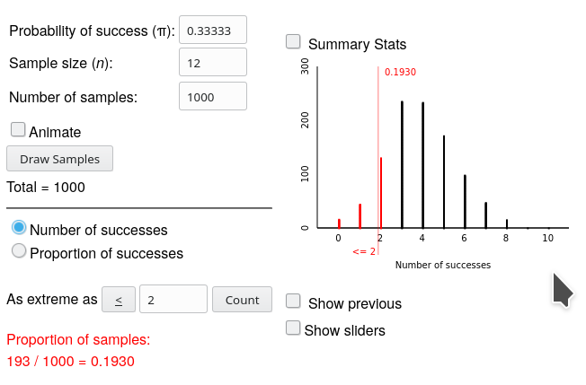

<script type="text/x-mathjax-config">
  MathJax.Hub.Config({ TeX: { extensions: ["color.js"] }});
</script>

```{r setup, include = F}

library(ggplot2)
library(tidyverse)
knitr::opts_chunk$set(dpi=300, message = F, warning = F, echo = F, fig.width = 8, fig.height = 4, out.width = "80%", fig.align = "center")
```

class: inverse,middle,center
# 1.1: Introduction to Chance Models

---
## Statistical Significance

<br/><br/>
**Statistical significance** - unlikely to have occurred by random chance

> [Helper vs. Hinderer example](https://srvanderplas.github.io/unl-stat218-materials/slides/chapter-P-preliminaries.html#3), what is P(14/16 infants)? Is it rare? What is P(8/16 infants)?

--

<br/><br/>

**Probabilty** - Long run proportion of times an outcome from a random process occurs
> Let's Make a Deal example - result after 100s of simulations


---
## Statistical Significance

General strategy: 

1. Create a model for the process under random chance

2. Use the model to calculate the **probability** of the observation under random chance

3. If that probability is very small, conclude that the effect is likely not due to chance    
e.g. is **statistically significant**


---
## Vocabulary

- **Statistic** - number summarizing the results from a *sample*

- **Parameter** - long-run numerical property of the *population*

<br/>
***
<br/>
.center[
.inline-left[**P**arameter -> **P**opulation].inline-right[**S**tatistic -> **S**ample]

.small[.inline-left[unknown value].inline-right[known value]]
]
<br/>
***
<br/>

.center[We use **statistics** to estimate  **parameters**]

---
## Example 1.1: Can Dolphins Communicate?

.pull-left[
Training: 
1. Shine headlight into tank
2. If light is steady, hit the right-side lever to get a fish
3. If light is blinking, hit the left-side lever to get a fish

Experiment: 
1. Show Doris the light 
2. Give Buzz the levers
3. See if Doris could tell Buzz which lever to push

].pull-right[

]


---
## Example 1.1: Can Dolphins Communicate?

.pull-left[
Training: 
1. Shine headlight into tank
2. If light is steady, hit the right-side lever to get a fish
3. If light is blinking, hit the left-side lever to get a fish

Experiment: 
1. Show Doris the light 
2. Give Buzz the levers
3. See if Doris could tell Buzz which lever to push

].pull-right[

<br/><br/>
Buzz hit the correct lever 15/16 times
]


---
## Example 1.1: Can Dolphins Communicate?

1. Ask a research question:    
.red[Can the dolphins communicate ideas?]

2. Design a study and collect data:
  - Observational Units: .red[Each of Buzz's attempts]
  - Variable: .red[Correct or incorrect button]
  - Categorical or quantitative?: .red[Categorical]
  
3. Explore the data: .red[We observed 15 correct responses out of 16 total trials]

4. Draw inferences beyond the data:    
> What would we expect the **statistic** to be if Buzz was guessing?    
> Was the observed **statistic** significantly greater than that?

--

<br/><br/>
.large[.center[We need to build a chance model to find out!]]


---
## Example 1.1: Can Dolphins Communicate?

Real Study | Physical Simulation
---------: | :------------------
Lever pull by Buzz | Coin Flip
Correct lever | Heads
Incorrect lever | Tails
Probability of correct button<br> **when Buzz is guessing** (1/2) | Chance of heads (1/2)
16 attempts by Buzz | 16 coin flips = <br/>One **Repetition** of the study


.center[If Buzz is just guessing, what is a **typical** value we would see in one repetition of the study?

http://www.rossmanchance.com/ISIapplets.html]

---
## Determining Statistical Significance: 3 S Strategy

1. **Statistic** - numerical summary from sample
  - Helper/Hinderer: 14/16
  - Doris/Buzz: 15/16

2. **Simulate** - identify a "by chance alone" model for the scenario and repeatedly simulate values for the statistic under that model

3. **Strength of Evidence** - Is the observed statistic unusual?


```{r, fig.width = 8, fig.height = 3, ffmpeg.format='gif', fig.show='animate', dev = "jpeg", dpi = 300}
set.seed(50703092)
x2 <- rbinom(10000, 16, .5)
ymax <- function(x) max(table(x))*1.05
my_arrow <- arrow(ends = "both", length = unit(0.1, "inches"))

x <- x2[1:100]

ggplot(data = tibble(x = x), aes(x = x)) + 
  annotate("rect", xmin = 14.5, xmax = 16.5, ymin = 0, ymax = ymax(x), fill = "red", alpha = .2) + 
  annotate("text", x = 15.5, y = ymax(x)/2, vjust = .5, label = "As or\nmore extreme\nthan observed", color = "red") + 
  geom_bar(width = .9) + 
  annotate("segment", x = -0.5, xend = 3.5, y = ymax(x), yend = ymax(x), arrow = my_arrow) + 
  annotate("text", x = 1.5, y = Inf, vjust = 1.2, label = "Lower tail") + 
  annotate("segment", x = 3.5, xend = 12.5, y = ymax(x), yend = ymax(x), arrow =  my_arrow) + 
  annotate("text", x = 8, y = Inf, vjust = 1.2, label = "Typical outcomes") +
  annotate("segment", x = 12.5, xend = 16.5, y = ymax(x), yend = ymax(x), arrow =  my_arrow) + 
  annotate("text", x = 14.5, y = Inf, vjust = 1.2, label = "Upper tail") + 
  scale_y_continuous("# Simulations", expand = c(.1, 0)) + 
  scale_x_continuous("Simulation Statistic Value", breaks = (0:8)*2) + 
  ggtitle("100 simulations")

x <- x2[1:200]
ggplot(data = tibble(x = x), aes(x = x)) + 
  annotate("rect", xmin = 14.5, xmax = 16.5, ymin = 0, ymax = ymax(x), fill = "red", alpha = .2) + 
  annotate("text", x = 15.5, y = ymax(x)/2, vjust = .5, label = "As or\nmore extreme\nthan observed", color = "red") + 
  geom_bar(width = .9) + 
  annotate("segment", x = -0.5, xend = 3.5, y = ymax(x), yend = ymax(x), arrow = my_arrow) + 
  annotate("text", x = 1.5, y = Inf, vjust = 1.2, label = "Lower tail") + 
  annotate("segment", x = 3.5, xend = 12.5, y = ymax(x), yend = ymax(x), arrow =  my_arrow) + 
  annotate("text", x = 8, y = Inf, vjust = 1.2, label = "Typical outcomes") +
  annotate("segment", x = 12.5, xend = 16.5, y = ymax(x), yend = ymax(x), arrow =  my_arrow) + 
  annotate("text", x = 14.5, y = Inf, vjust = 1.2, label = "Upper tail") + 
  scale_y_continuous("# Simulations", expand = c(.1, 0)) + 
  scale_x_continuous("Simulation Statistic Value", breaks = (0:8)*2) + 
  ggtitle("200 simulations")


x <- x2[1:500]
ggplot(data = tibble(x = x), aes(x = x)) + 
  annotate("rect", xmin = 14.5, xmax = 16.5, ymin = 0, ymax = ymax(x), fill = "red", alpha = .2) + 
  annotate("text", x = 15.5, y = ymax(x)/2, vjust = .5, label = "As or\nmore extreme\nthan observed", color = "red") + 
  geom_bar(width = .9) + 
  annotate("segment", x = -0.5, xend = 3.5, y = ymax(x), yend = ymax(x), arrow = my_arrow) + 
  annotate("text", x = 1.5, y = Inf, vjust = 1.2, label = "Lower tail") + 
  annotate("segment", x = 3.5, xend = 12.5, y = ymax(x), yend = ymax(x), arrow =  my_arrow) + 
  annotate("text", x = 8, y = Inf, vjust = 1.2, label = "Typical outcomes") +
  annotate("segment", x = 12.5, xend = 16.5, y = ymax(x), yend = ymax(x), arrow =  my_arrow) + 
  annotate("text", x = 14.5, y = Inf, vjust = 1.2, label = "Upper tail") + 
  scale_y_continuous("# Simulations", expand = c(.1, 0)) + 
  scale_x_continuous("Simulation Statistic Value", breaks = (0:8)*2) + 
  ggtitle("500 simulations")


x <- x2[1:1000]
ggplot(data = tibble(x = x), aes(x = x)) + 
  annotate("rect", xmin = 14.5, xmax = 16.5, ymin = 0, ymax = ymax(x), fill = "red", alpha = .2) + 
  annotate("text", x = 15.5, y = ymax(x)/2, vjust = .5, label = "As or\nmore extreme\nthan observed", color = "red") + 
  geom_bar(width = .9) + 
  annotate("segment", x = -0.5, xend = 3.5, y = ymax(x), yend = ymax(x), arrow = my_arrow) + 
  annotate("text", x = 1.5, y = Inf, vjust = 1.2, label = "Lower tail") + 
  annotate("segment", x = 3.5, xend = 12.5, y = ymax(x), yend = ymax(x), arrow =  my_arrow) + 
  annotate("text", x = 8, y = Inf, vjust = 1.2, label = "Typical outcomes") +
  annotate("segment", x = 12.5, xend = 16.5, y = ymax(x), yend = ymax(x), arrow =  my_arrow) + 
  annotate("text", x = 14.5, y = Inf, vjust = 1.2, label = "Upper tail") + 
  scale_y_continuous("# Simulations", expand = c(.1, 0)) + 
  scale_x_continuous("Simulation Statistic Value", breaks = (0:8)*2) + 
  ggtitle("1000 simulations")


x <- x2[1:5000]
ggplot(data = tibble(x = x), aes(x = x)) + 
  annotate("rect", xmin = 14.5, xmax = 16.5, ymin = 0, ymax = ymax(x), fill = "red", alpha = .2) + 
  annotate("text", x = 15.5, y = ymax(x)/2, vjust = .5, label = "As or\nmore extreme\nthan observed", color = "red") + 
  geom_bar(width = .9) + 
  annotate("segment", x = -0.5, xend = 3.5, y = ymax(x), yend = ymax(x), arrow = my_arrow) + 
  annotate("text", x = 1.5, y = Inf, vjust = 1.2, label = "Lower tail") + 
  annotate("segment", x = 3.5, xend = 12.5, y = ymax(x), yend = ymax(x), arrow =  my_arrow) + 
  annotate("text", x = 8, y = Inf, vjust = 1.2, label = "Typical outcomes") +
  annotate("segment", x = 12.5, xend = 16.5, y = ymax(x), yend = ymax(x), arrow =  my_arrow) + 
  annotate("text", x = 14.5, y = Inf, vjust = 1.2, label = "Upper tail") + 
  scale_y_continuous("# Simulations", expand = c(.1, 0)) + 
  scale_x_continuous("Simulation Statistic Value", breaks = (0:8)*2) + 
  ggtitle("5000 simulations")


x <- x2[1:10000]
ggplot(data = tibble(x = x), aes(x = x)) + 
  annotate("rect", xmin = 14.5, xmax = 16.5, ymin = 0, ymax = ymax(x), fill = "red", alpha = .2) + 
  annotate("text", x = 15.5, y = ymax(x)/2, vjust = .5, label = "As or\nmore extreme\nthan observed", color = "red") + 
  geom_bar(width = .9) + 
  annotate("segment", x = -0.5, xend = 3.5, y = ymax(x), yend = ymax(x), arrow = my_arrow) + 
  annotate("text", x = 1.5, y = Inf, vjust = 1.2, label = "Lower tail") + 
  annotate("segment", x = 3.5, xend = 12.5, y = ymax(x), yend = ymax(x), arrow =  my_arrow) + 
  annotate("text", x = 8, y = Inf, vjust = 1.2, label = "Typical outcomes") +
  annotate("segment", x = 12.5, xend = 16.5, y = ymax(x), yend = ymax(x), arrow =  my_arrow) + 
  annotate("text", x = 14.5, y = Inf, vjust = 1.2, label = "Upper tail") + 
  scale_y_continuous("# Simulations", expand = c(.1, 0)) + 
  scale_x_continuous("Simulation Statistic Value", breaks = (0:8)*2) + 
  ggtitle("10000 simulations")
  
```

---
## Exploration 1.1: Can Dogs Understand Human Cues?

1. State the research question

2. Observational units

3. Variable

4. Sample size

5. Observed statistic

6. Is the statistic in the direction suggested by the researcher?

7. Is the observed result *possible*?

8. Is the observed result *probable*?

9. If he picked the cup at random, what is the probability (parameter) that he chooses correctly?

10. What would the probability of choosing the correct cup be if Harley understands the experimenter?    
.small[(can be a range of values)]


---
## For next time

- Complete Exploration 1.1 and submit it on Canvas by January 20 (Monday) at 6pm

- Read Section 1.2 of the textbook

- Complete the first two questions of Exploration 1.2: Tasting water

---
class:inverse,middle,center
# 1.2: Measuring the Strength of Evidence

---
## Definitions

The **Null Hypothesis** $H_0$ is the "by random chance alone" explanation

The **Alternative Hypothesis** $H_A$ is the explanation that consists of a not-random effect. 
> This is usually the thing we want to show - our research hypothesis.

We want to disprove $H_0$, forcing us to conclude that $H_A$ is a better (more probable) explanation. 

---
## Binary Variables

**Binary** variables have only two possible outcomes

$\pi$ is used to represent the *parameter* for a long-run probability or proportion

$n$ is the sample size or number of observational units

$\hat p$ represents our *sample statistic* (the observed value)


---
## Rock Paper Scissors
.pull-left[
- Two players
- Three options

Are all options equally likely to be played?

Some evidence* suggests that novice players are less likely to choose scissors. 

.bottom[\*[See Eyler et al., 2009](https://www.jstor.org/stable/pdf/25653686.pdf)]

].pull-right[

]


---
## Rock Paper Scissors

1. Research question: .red[Are novice players are less likely to choose scissors?]

2. Design a study and collect data:    
Play $n$ rounds, recording 0 or 1, where 1 = scissors was played
  - Observational Unit: .red[Each round of play]
  - Variable: .red[Outcome of a round (rock, paper, scissors)] .small[Categorical]
  - Outcomes: .red[Scissors or not scissors (rock, paper)] .small[Binary]
  - Statistic: .red[Let] <math xmlns="http://www.w3.org/1998/Math/MathML"><mstyle color="red">
  <mi>x</mi>
  <mo>=</mo>
  <mo fence="false" stretchy="false">{</mo>
  <mtext># scissors selected in&#xA0;</mtext>
  <mi>n</mi>
  <mtext>&#xA0;rounds</mtext>
  <mo fence="false" stretchy="false">}</mo></mstyle>
</math>.red[; then ]<math xmlns="http://www.w3.org/1998/Math/MathML">
  <mstyle displaystyle="true" scriptlevel="0" color="red">
    <mrow class="MJX-TeXAtom-ORD">
      <mover>
        <mi>p</mi>
        <mo stretchy="false">&#x005E;<!-- ^ --></mo>
      </mover>
    </mrow>
    <mo>=</mo>
    <mfrac>
      <mi>x</mi>
      <mi>n</mi>
    </mfrac>
  </mstyle>
</math>    
> In our study, $n=12$, $x=2$
  - Parameter of interest: .red[Probability of selecting scissors]    
  Options:
      - Equal preference for all 3 choices, so $\pi = 1/3$
      - $\pi_{\text{scissors}} < 1/3$, that is, scissors is chosen less frequently    
.grey[.small[Note: You don't specify a particular value, just a direction from a particular value]]
    
3. Explore the data: .red[2 scissors in 12 trials; 2/12 = 1/6] <math xmlns="http://www.w3.org/1998/Math/MathML"><mstyle color="red">
  <mo>&#x2248;<!-- ≈ --></mo>
  <mn>0.1667</mn></mstyle>
</math>

.toprightfig[

]
---
## Rock Paper Scissors

1. Research question
2. Design a study and collect data
  - Outcomes: .red[Scissors or not scissors (rock, paper)] .small[Binary]
  - Statistic: .red[Let] <math xmlns="http://www.w3.org/1998/Math/MathML"><mstyle color="red">
  - Parameter of interest: .red[Probability of selecting scissors]    
  Options:
      - Equal preference for all 3 choices, so $\pi = 1/3$
      - $\pi_{\text{scissors}} < 1/3$, that is, scissors is chosen less frequently    
.grey[.small[Note: You don't specify a particular value, just a direction from a particular value]]
    
3. Explore the data
4. Draw inferences beyond the data: 

--

.center[Your parameter options represent the null and alternative hypotheses.<br/>Which is which?]

---
## Rock Paper Scissors

1. Research question
2. Design a study and collect data
  - Outcomes: .red[Scissors or not scissors (rock, paper)] .small[Binary]
  - Statistic: .red[Let] <math xmlns="http://www.w3.org/1998/Math/MathML"><mstyle color="red">
  - Parameter of interest: .red[Probability of selecting scissors]    
  Options:
      - Equal preference for all 3 choices, so $\pi = 1/3$
      - $\pi_{\text{scissors}} < 1/3$, that is, scissors is chosen less frequently    
.grey[.small[Note: You don't specify a particular value, just a direction from a particular value]]
    
3. Explore the data
4. Draw inferences beyond the data: 
<math xmlns="http://www.w3.org/1998/Math/MathML" display="block"><mstyle color="red">
  <mtable columnalign="right left right left right left right left right left right left" rowspacing="3pt" columnspacing="0em 2em 0em 2em 0em 2em 0em 2em 0em 2em 0em" displaystyle="true">
    <mtr>
      <mtd>
        <msub>
          <mi>H</mi>
          <mn>0</mn>
        </msub>
        <mo>:</mo>
      </mtd>
      <mtd>
        <mspace width="thickmathspace" />
        <mspace width="thickmathspace" />
        <mi>&#x03C0;<!-- π --></mi>
        <mo>=</mo>
        <mn>1</mn>
        <mrow class="MJX-TeXAtom-ORD">
          <mo>/</mo>
        </mrow>
        <mn>3</mn>
      </mtd>
    </mtr>
    <mtr>
      <mtd>
        <msub>
          <mi>H</mi>
          <mi>A</mi>
        </msub>
        <mo>:</mo>
      </mtd>
      <mtd>
        <mspace width="thickmathspace" />
        <mspace width="thickmathspace" />
        <mi>&#x03C0;<!-- π --></mi>
        <mo>&lt;</mo>
        <mn>1</mn>
        <mrow class="MJX-TeXAtom-ORD">
          <mo>/</mo>
        </mrow>
        <mn>3</mn>
      </mtd>
    </mtr>
  </mtable></mstyle>
</math>

.toprightfig[

]


---
## Rock Paper Scissors
.toprightfig[

]

- Is $\hat p_{scissors}$ less than the probability specified in the null hypothesis?<br/>    
.red[Yes, the sample proportion of 1/6 is in the direction of the alternative hypothesis]

- Is it possible that $\hat p$ could turn out this small even if $H_0$ were true?<br/>    
.red[Yes, it is possible that it could be this small]

---
## P-values

The **p-value** is the probability of obtaining a value of the statistic at least as extreme as the observed statistic *when the null hypothesis is true*

We estimate a p-value by finding the **proportion of simulated statistics** using the random chance model assuming $H_0$  

**that are at least as extreme** (in the direction of $H_A$)  

**as the value of the observed statistic** from the research study.

.grey[.bottom[Note that the <strong>p-value</strong> is not the same p as the sample proportion, <math xmlns="http://www.w3.org/1998/Math/MathML"><mstyle color="gray">
  <mrow class="MJX-TeXAtom-ORD">
    <mover>
      <mi>p</mi>
      <mo stretchy="false">&#x005E;<!-- ^ --></mo>
    </mover>
  </mrow></mstyle>
</math>. <br/>p-values can be computed using any sample statistic, not just proportions.]]

---
## Guidelines for Interpreting p-values

p-value range | Interpretation 
------------: | :--------------
$0.10 < p\;\phantom{\leq 0.10}$ | Not much evidence against $H_0$ <br> ( $H_0$ is plausible)
$0.05 < p \leq 0.10$ | Moderate evidence against $H_0$
$0.01 < p \leq 0.05$ | Strong evidence against $H_0$
$\phantom{0.10 <}p < 0.01$ | Very strong evidence against $H_0$

If you have done the modeling correctly, you'll still be wrong $(100\times p)$% of the time when $H_0$ is actually true

.large[The smaller the p-value, the more evidence against]  $\displaystyle H_0$ 

---
## Rock Paper Scissors
.toprightfig[

]

3 S Strategy:

1. Statistic: .red[2/12 ]<math xmlns="http://www.w3.org/1998/Math/MathML"><mstyle color="red">
  <mo>&#x2248;<!-- ≈ --></mo>
  <mn>0.1667</mn></mstyle>
</math>

2. Simulation: .red["coin flip" with p(heads) = 1/3]
.pull-left[.small[Actual coins don't work, but we could use dice - rolls of 1 or 2 represent scissors... or we could let the computer do it for us using the <br/>[**One Proportion** applet](http://www.rossmanchance.com/ISIapplets.html)]]
.pull-right[]
<br/>
3. Strength of evidence:
.red[
193 of 1000 simulation samples showed a value of 0, 1, or 2 scissors (out of 12 games)

~19% of the time, we would see a value as or more extreme than 2 under the random chance model
]

---
## P-values

```{r, fig.height = 5, dpi = 300}
set.seed(2016100700)
df <- tibble(x = rbinom(1000, 12, 1/3))

ggplot(df, aes(x = x)) + geom_bar() + 
  scale_x_continuous("# Scissors in 12 trials", breaks = 0:12, limits = c(0, 12)) +
  scale_y_continuous("# Simulation Trials") + 
  ggtitle("Simulation Results")
```

---
## P-values

```{r, fig.height = 5, dpi = 300}

ggplot(df, aes(x = x)) + geom_bar() + 
  scale_x_continuous("# Scissors in 12 trials", breaks = 0:12, limits = c(0, 12)) +
  scale_y_continuous("# Simulation Trials") + 
  ggtitle("Simulation Results with observed statistic") +
  annotate("segment", y = 0, yend = Inf, x = 2, xend = 2, color = "red")

```

---
## P-values

```{r, fig.height = 5, dpi = 300}
ggplot(df, aes(x = x)) + geom_bar() + 
  scale_x_continuous("# Scissors in 12 trials", breaks = 0:12, limits = c(0, 12)) +
  scale_y_continuous("# Simulation Trials") + 
  ggtitle("Which direction to go?") +
  annotate("segment", y = 0, yend = Inf, x = 2, xend = 2, color = "red") +
  annotate("text", y = 175, x = 1, label = "atop(displaystyle(atop(In~the,direction)),of~H[A])", color = "red", parse = T, vjust = 0) + 
  annotate("segment", x = 1.75, xend = 0, y = 150, yend = 150, color = "red", arrow = arrow(ends = "last", length = unit(0.1, "inches")) )
```

---
## P-values

```{r, fig.height = 5, dpi = 300}

df <- df %>%
  mutate(extreme = factor(x <=2, labels = c("Not extreme", "Extreme"))) 

ggplot(df, aes(x = x, fill = extreme)) + geom_bar() + 
  scale_fill_manual("", values = c("Extreme" = "red", "Not extreme" = "grey20")) + 
  theme(legend.title = element_blank(), legend.position = c(1, 1), legend.justification = c(1,1), legend.background = element_rect(fill = "transparent")) + 
  scale_x_continuous("# Scissors in 12 trials", breaks = 0:12, limits = c(0, 12)) +
  scale_y_continuous("# Simulation Trials") + 
  ggtitle("Simulation statistics as or more extreme than the observed statistic") +
  annotate("segment", y = 0, yend = Inf, x = 2, xend = 2, color = "red") +
  annotate("text", y = 175, x = 1, label = "atop(displaystyle(atop(In~the,direction)),of~H[A])", color = "red", parse = T, vjust = 0) + 
  annotate("segment", x = 1.75, xend = 0, y = 150, yend = 150, color = "red", arrow = arrow(ends = "last", length = unit(0.1, "inches")) )

```

---
## P-values

```{r, fig.height = 5, dpi = 300}
ggplot(df, aes(x = x, fill = extreme)) + geom_bar() + 
  scale_fill_manual("", values = c("Extreme" = "red", "Not extreme" = "grey20")) + 
  theme(legend.title = element_blank(), legend.position = c(1, 1), legend.justification = c(1,1), legend.background = element_rect(fill = "transparent")) + 
  scale_x_continuous("# Scissors in 12 trials", breaks = 0:12, limits = c(0, 12)) +
  scale_y_continuous("# Simulation Trials") + 
  ggtitle("Simulation Results with p-value calculation") +
  annotate("segment", y = 0, yend = Inf, x = 2, xend = 2, color = "red") +
  annotate("text", y = 175, x = 1, label = "atop(displaystyle(atop(In~the,direction)),of~H[A])", color = "red", parse = T, vjust = 0) + 
  annotate("segment", x = 1.75, xend = 0, y = 150, yend = 150, color = "red", arrow = arrow(ends = "last", length = unit(0.1, "inches")) ) #+ 
  # annotate("text", x = 12, y = 150, label = paste("P~bgroup('(', x^'*'<= 2,')')~phantom(0)== frac(", sum(df$extreme == "Extreme"), ", ", nrow(df), ")~phantom(0)== ", mean(df$extreme == "Extreme")), parse = T, hjust = 1)

```

$$\underbrace{P(x \leq 2)} \approx P(x^\ast \leq 2) =  \frac{193}{1000} = .193$$

---
## Rock Paper Scissors
.toprightfig[

]


$$\underbrace{P(x \leq 2)} \approx P(x^\ast \leq 2) =  \frac{193}{1000} = .193$$

Is this an unlikely result if $H_0$ is true?

--

.red[No, our sample statistic is not in the tail of the distribution. There is an almost 20% chance of obtaining a result as or more extreme as this by random chance.]

--

What would you expect to happen to the p-value if we had seen only 1 scissors in the 12 rounds of the original study?

--

.red[There would be fewer simulation statistics as or more extreme than the observed statistic, so the p-value would be smaller.]

--

How much smaller?

--

$$P(x \leq 1) \approx P(x^\ast \leq 1) = \frac{58}{1000} = 0.058$$

.red[If we had originally observed only 1/12 scissors, we would have moderate evidence against the null hypothesis.]

---
## Exploration 1.2: Tasting Water

People spend a lot of money on bottled water. But do they really prefer bottled water to ordinary tap water? 

Researchers at Longwood University investigated this question by presenting people who came to a booth at 
a local festival with four cups of water.  

Three cups contained different brands of bottled water, and one cup was filled with tap water.  

Each participant (person) was asked which of the four cups of water they most preferred. 

Researchers kept track of how many people chose tap water in order to see whether tap water was chosen significantly less often than would be expected by random chance.

---
## Exploration 1.2: Tasting Water
### Step 1: Ask a research question

What is the question the researcher hoped to answer?


---
## Exploration 1.2: Tasting Water
### Step 2: Design a study and collect data

Identify the observational units in this study


In groups, continue with Exploration 1.2. Answer questions 1-24. 

Hand in one submission per group on Canvas by Jan 23 at 3pm.

---
class: inverse,middle,center
# Review

---
## P-value

.large[
The p-value is the .underline[.hidden[probability]] of obtaining a value for the statistic which is as or more .underline[.hidden[extreme]] as the observed statistic when .underline[.hidden[the null hypothesis]] is true
]

--
## P-value

If the p-value is $\leq 0.05$, we have .underline[.hidden[strong]] evidence .underline[.hidden[against]] the null (suggesting the phenomenon is NOT random)

- We are .underline[.hidden[not very]] likely to see our observed result if the process happens by random chance.

- **Written conclusion**: With a p-value of .underline[.hidden[0.05]], I .underline[.hidden[reject]] the null hypothesis and conclude the alternative .grey[(in the context of the problem)]

--

If the p-value is $> 0.05$, we have .underline[.hidden[not much]] evidence against the null (suggesting the phenomenom could plausibly occur due to chance).

- **Written conclusion**: 
---
class:inverse,middle,center
# 1.3: Alternative Measure of Strength of Evidence

