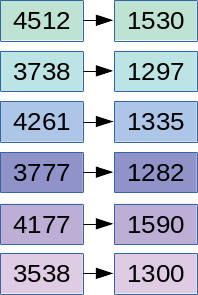

```{r setup, include = F}

library(ggplot2)
library(tidyverse)
knitr::opts_chunk$set(dpi=300, message = F, warning = F, echo = F, fig.width = 8, fig.height = 4, out.width = "80%", fig.align = "center", cache = T)
options(digits = 3)
theme_set(theme_bw())
```


# Navigation


.large[By Section]
- 10.1: [start](#3) - [end](#15)
- 10.2: [start](#16) - [end](#36)
- 10.3: [start](#37) - [end](#49)
- 10.4: [start](#50) - [end](#51)
- 10.5: [start](#52) - [end](#53)

???

We've worked our way up from one categorical variable to one quantitative variable, then we made it harder by adding another variable (two categorical variables, a categorical variable and a quantitative variable). For the final chapter in this class, we're going to look at what happens when we have two quantitative variables... we're going to talk about correlation first, and  then regression.

---
class:inverse,middle,center
# 10.1: Two Quantitative Variables
## Scatterplots and Correlation

```{r brain-data}
brain <- read_table("http://users.stat.ufl.edu/~winner/data/brainhead.dat", col_names = c("Gender", "Age", "HeadSize", "BrainWeight"))

lreg <- lm(BrainWeight~HeadSize, data = brain)

```

---
## Graphical Summaries of Quantitative Variables

.pull-left[
.small[[R.J. Gladstone (1905). "A Study of the Relations of the Brain to the Size of the Head", Biometrika, Vol. 4, p 105-123. ](https://www.jstor.org/stable/pdf/2331533.pdf)]

Data collected during 237 autopsies at Middlesex Hospital in London, excluding cases "in which the brain showed a distinctly pathological condition which would have obviously affected its weight"

Variables:
- Gender
- Age (20 - 45 or 46+)
- Brain Weight (g)
- Head Size (cubic cm)
.small[the smallest rectangular block which could contain the head]

].pull-right[
<!--  -->

]
???

Early statisticians were very interested in the natural world - in addition to quantifying traits of plants, they also conducted extensive studies of human anatomy and physiology, looking at the relationship between various traits, how those traits might be inherited, and more. 

One of these studies looked at people brought into the Middlesex hospital morgue for autopsy, examining the relationship between head size and brain weight. They examined everyone who was brought in who didn't have an obvious brain pathology.

---
## Graphical Summaries of Quantitative Variables

A single quantitative variable can be summarized visually using a histogram or a bar chart:

```{r, fig.width = 8, fig.height = 4, out.width = "100%"}
d1 <- brain %>%
  pivot_longer(names_to = "Variable", values_to = "Value", HeadSize:BrainWeight) %>%
  mutate(Variable = str_replace_all(Variable, c("BrainWeight" = "Brain Weight, grams", "HeadSize" = "Head Size, cm^3")))

p1 <- ggplot(d1, aes(x = Value)) + facet_wrap(~Variable, scale = "free") + geom_histogram(fill = "grey", color = "black") + ylab("Count") + theme(axis.title.x = element_blank(), axis.ticks = element_blank(), axis.text = element_blank(), axis.title = element_blank())

p2 <- ggplot(d1, aes(x = 1, y = Value)) + facet_wrap(~Variable, scale = "free") + geom_boxplot(fill = "grey", color = "black") + ylab("Count") + theme(axis.title.x = element_blank(), axis.ticks.y = element_blank(), axis.text.y = element_blank(), axis.title.y = element_blank(), strip.background = element_blank(), strip.text = element_blank(), panel.spacing.y = unit(0, "cm")) + coord_flip()

# p2 <- brain %>%
#   ggplot(aes(x = I(1), y = BrainWeight)) + geom_boxplot(fill = "grey", color = "black") + theme(axis.title = element_blank(), axis.ticks.y = element_blank(), axis.text.y = element_blank()) + coord_flip() 
# 
# p3 <- brain %>%
#   ggplot(aes(x = I(1), y = HeadSize)) + geom_boxplot(fill = "grey", color = "black") + theme(axis.title = element_blank(), axis.ticks.y = element_blank(), axis.text.y = element_blank()) + coord_flip()
gridExtra::grid.arrange(p1, p2, layout_matrix = matrix(c(1, 1, 1, 1, 2, 2), nrow = 3, byrow = T))

```

???

In Ch 6, we learned how to interpret a histogram or a bar chart to describe the distribution of quantitative variables. Now that we have two variables, we can make a histogram and a bar chart for each one of them. Is there a relationship between the two variables?

We don't actually know. That's because "univariate" (one variable) summaries of "bivariate" (two variable) data don't actually tell us about the relationship between variables. To show that, we have to use a different type of plot.

---
## Graphical Summaries of Quantitative Variables

But, summarizing each variable separately doesn't tell us how the two variables might be related.

Is there a relationship between brain weight and head size? How do you know?

--

```{r}
brain %>%
  ggplot(aes(y = BrainWeight, x = HeadSize)) + geom_point() + 
  ylab("Brain Weight, grams") + xlab("Head Size, cm^3") + ggtitle("A Study of the Relations of the Brain to the Size of the Head") + coord_fixed(ratio = 1.5)
```

A **scatterplot** is a plot with the explanatory variable on the x-axis, and the response variable on the y-axis. Observations are shown as points corresponding to a set of quantitative measurements.

???

I'm sure you've seen scatterplots before. A scatterplot has the explanatory variable on the x-axis, the response variable on the y-axis, and each observation is a point on the graph (x,y). Looking at this plot, what would you say about the relationship between brain weight and head size?

It looks like the bigger your head, the more your brain is likely to weigh. So if your head is relatively small, 3000 cubic cm, then your brain weight will also be relatively small, around 1100 grams. 

How do we describe the relationship between brain weight and head size? We can use direction, shape, strength...

---
## Describing Variable Relationships: Direction

```{r, fig.width = 8, fig.height = 4, out.width = "100%"}
set.seed(20200404)
dat <- tibble(Direction = rep(c("Positive", "Negative"), each = 100),
              x = rep(rnorm(100, seq(-5, 5, length.out = 100), sd = .2), times = 2),
              sign = ifelse(Direction == "Positive", 1, -1),
              y = rnorm(200, x, .5)*sign) %>%
  mutate(Direction = factor(Direction, levels = unique(Direction)))

txt <- tibble(Direction = c("Positive", "Negative"),
              x = c(-2, 2), y = c(5.5, 5.5), label = c("Low values of x -> Low values of y\nHigh values of x -> High values of y", "Low values of x -> High values of y\nHigh values of x -> Low values of y")) %>%
  mutate(Direction = factor(Direction, levels = unique(Direction)))

ggplot() + 
  geom_point(data = dat, aes(x = x, y = y)) + 
  geom_text(data = txt, aes(x = x, y = y, label = label), inherit.aes = F) + 
  facet_wrap(~Direction, labeller = label_both) + 
  theme(axis.title = element_blank())
```

Positive slope: as $x$ increases, $y$ increases too.

???

When we talk about the direction of a relationship, we're looking for some assessment of whether when x increases, y increases; or when x increases, y gets smaller. If as x increases, y increases, we say that's a positive relationship; if as x increases, y decreases, we say that's a negative relationship. 

---
## Describing Variable Relationships: Form

The **form** of an association is whether it follows a linear pattern, or some sort of more complicated pattern - periodic, polynomial (quadratic, cubic, etc.)

```{r, fig.width = 8, fig.height = 2.5, out.width = "100%"}
set.seed(20200404)
d2 <- read_csv("../data/Datasaurus_data.csv", col_names = FALSE) %>% set_names(c("x", "y"))
dat <- tibble(Form = rep(c("Linear", "Quadratic", "Periodic"), each = 100),
              x = rep(rnorm(100, seq(-5, 6, length.out = 100), sd = .2), times = 3),
              y = rnorm(300, ifelse(Form == "Linear", x, ifelse(Form == "Quadratic", x^2 * 1/6 - 3, 5*sin(x))), 1)) %>%
  bind_rows(mutate(d2, Form = "Dinosaur")) %>%
  group_by(Form) %>%
  mutate(x = scale(x), y = scale(y)) %>%
  ungroup() %>%
  mutate(Form = factor(Form, levels = c("Linear", "Quadratic", "Periodic", "Dinosaur")))

ggplot() + 
  geom_point(data = dat, aes(x = x, y = y)) + 
  facet_wrap(~Form, labeller = label_both, ncol = 4) + 
  theme(axis.title = element_blank()) + coord_fixed(xlim = c(-2, 2), ylim = c(-2, 2))
```

???

Another way to describe relationships is to talk about the shape, or the form of a relationship. So far, you've seen linear relationships - that is, a straight line, but there are other options. You might see a u-shape, which is quadratic, or a seasonal relationship (like the average daily temperature throughout the year). It's unlikely, but you may see even stranger relationships... but mostly, I just wanted an excuse to plot a dinosaur. 

---
## Describing Variable Relationships: Strength

The **strength** of an association indicates how well the value of one variable can be predicted if you know the value of the other variable.

```{r, fig.width = 8, fig.height = 4, out.width = "100%"}
set.seed(20200403)
library(MASS)
dat <- tibble(Strength = c("No Assoc", "Very Weak", "Weak", "Moderate", "Strong", "Very Strong"), p = c(0, .2, .4, .65, .85, .99), 
              dat = purrr::map(p, ~mvrnorm(75, c(0, 0), matrix(c(1, ., ., 1), nrow = 2)) %>% as.data.frame() %>% set_names(c("x", "y")))) %>%
  mutate(Strength = factor(Strength, levels = Strength)) %>%
  unnest("dat") %>%
  group_by(Strength) %>%
  mutate(x = scale(x), y = scale(y))

ggplot(data = dat) + 
  geom_point(aes(x = x, y = y)) + 
  facet_wrap(~Strength, labeller = label_both, ncol = 3) + 
  theme(axis.title = element_blank(), axis.ticks = element_blank(), axis.text = element_blank())
```

--

We can describe the strength and direction of a *linear* relationship using the **correlation coefficient**

???

Another way we describe relationships is to talk about how closely the points adhere to our imaginary "form". That is, if we know the value of x, how much certainty do we have about the value of y? If the association is weak, we don't know that much about the value of y, but if it is strong, we can narrow down a prediction for y pretty well.

If in addition we have a linear relationship, then we can actually describe the strength and direction using a value called the "correlation coefficient". It's a number between -1 and 1 that tells us both the direction and the strength of a correlation, but it only really works for linear relationships. So once we know we have a linear relationship, we can describe the other features with a single number.

---
## Correlation Coefficient

The **correlation coefficient**, $r$, is always between -1 and 1. 

.small[
-1 | -0.5 | 0  | 0.5 | 1 
:--: | :---: | :--: | :---: | :--:
perfect negative correlation | moderate negative correlation | no correlation | moderate positive correlation | perfect positive correlation
]


```{r, fig.width = 8, fig.height = 4, out.width = "100%"}
dat <- tibble(Strength = c("No Assoc", "Very Weak", "Weak", "Moderate", "Strong", "Very Strong"), r = c(0, .2, .4, .6, .8, 1), 
              dat = purrr::map(r, ~mvrnorm(75, c(0, 0), matrix(c(1, ., ., 1), nrow = 2)) %>% as.data.frame() %>% set_names(c("x", "y")))) %>%
  mutate(Strength = factor(Strength, levels = Strength)) %>%
  unnest("dat") %>%
  group_by(Strength)

ggplot(data = dat) + 
  geom_point(aes(x = x, y = y)) + 
  facet_wrap(~r, labeller = partial(label_both, sep = "="), ncol = 3) + 
  theme(axis.title = element_blank(), axis.ticks = element_blank(), axis.text = element_blank())
```

???

For positive values of $r$ (the correlation coefficient), we can see that as r increases, we can predict y better and better if we know x. when r=1, we exactly know the value of y.

---
## Correlation Coefficient

The **correlation coefficient**, $r$, is always between -1 and 1. 

.small[
-1 | -0.5 | 0  | 0.5 | 1 
:--: | :---: | :--: | :---: | :--:
perfect negative correlation | moderate negative correlation | no correlation | moderate positive correlation | perfect positive correlation
]


```{r, fig.width = 8, fig.height = 4, out.width = "100%"}
dat <- tibble(Strength = c("No Assoc", "Very Weak", "Weak", "Moderate", "Strong", "Very Strong"), r = -c(0, .2, .4, .6, .8, 1), 
              dat = purrr::map(r, ~mvrnorm(75, c(0, 0), matrix(c(1, ., ., 1), nrow = 2)) %>% as.data.frame() %>% set_names(c("x", "y")))) %>%
  mutate(Strength = factor(Strength, levels = Strength)) %>%
  unnest("dat") %>%
  group_by(Strength)

ggplot(data = dat) + 
  geom_point(aes(x = x, y = y)) + 
  facet_wrap(~r, labeller = partial(label_both, sep = "="), ncol = 3) + 
  theme(axis.title = element_blank(), axis.ticks = element_blank(), axis.text = element_blank())
```

???

Similarly, if the correlation coefficient is negative, the magnitude tells us how strong the correlation is, but the negative sign tells us the direction of the line. 

---
## Correlation Coefficient


???

It's pretty hard to tell when r is weak whether the association is positive or negative. Instead, like XKCD recommends, you might have more luck drawing new constellations :). 

---
## Correlation Coefficient

Get a feel for it by 
[playing the correlation guessing game!](https://www.rossmanchance.com/applets/GuessCorrelation.html)


???

With that said, it's worth taking 15 minutes or so to get a sense of how the correlation coefficient works and what different r-values end up looking like in practice. Pause the video and go play the correlation guessing game for a few minutes. It will benefit you later.

---
## Correlation Coefficient

The correlation coefficient is only useful for showing the strength of .underline[linear relationships]. 

```{r, fig.width = 6, fig.height = 6, out.width = "50%",  ffmpeg.format='gif', fig.show='animate', dev = "jpeg", dpi = 300, interval=1, aniopts = "controls"}
dsd <- read_tsv("../data/DatasaurusDozen.tsv") %>%
  mutate(x = x - 7)

plot_dsd <- function(name) {
  df <- dsd %>% filter(dataset == name)
  p <- ggplot(df, aes(x = x, y = y)) + 
    geom_point() + 
    coord_cartesian(xlim = c(0, 100), ylim = c(0, 100)) + 
    theme(axis.text = element_blank(), axis.title = element_blank(), axis.ticks = element_blank()) +
    ggtitle(sprintf("X: %.2f (SD = %.2f), Y: %.2f (SD = %.2f), r = %.2f", mean(df$x), sd(df$x), mean(df$y), sd(df$y), cor(df$x, df$y)))
  print(p)
}

purrr::walk(unique(dsd$dataset), plot_dsd)


```

All of these plots have essentially the same correlation coefficient, but in some cases there are very clear associations between $x$ and $y$

???

As I mentioned before, the correlation coefficient doesn't really help you if you have a relationship between x and y that is obviously not linear. All of these different plots have about the same mean, standard deviation, and correlation coefficient for x and y, but they all have obviously different shapes. You'll need to know this particular quirk on the final. 

<!-- See the animation [here](https://twitter.com/maartenzam/status/770723795518812160) -->

---
## Correlation Coefficient

(From Calculation Details in the Appendix)

$$r = \frac{1}{n-1}\sum_{i=1}^n \left(\frac{x_i - \overline x}{s_x}\right)\left(\frac{y_i-\overline y}{s_y}\right)$$
???

You will not have to calculate this from scratch on an exam, but it helps to know how it is being calculated, if only so that you know that I'm not just pulling this magical number out of thin air.

For each observation, we look at the deviation from the mean in x, divide by the variability of x; we do the same thing for y, and then we multiply them together. So if my point is above the mean of x, and above the mean of y, I'm adding a positive number to the total. If my point is below the mean of x and above the mean of y, I'm adding a negative number to the total. So looking at the formula, we see that the correlation coefficient is a measure of how associated x and y are - big values at the ends of the distribution of x and y will vastly outweigh any values close to the middle. 


---
## Correlation is not Causation

Just in case you haven't heard this chant yet, "correlation is not causation". Say it a few times. 

It's important to remember that correlation is a measure of association, but that doesn't mean there's any causal factors involved. In some cases, the choice of explanatory and response variables are arbitrary.

---
## Outliers and Influential Observations


With one variable, outliers are fairly easy to spot

???

A final important characteristic to describe is to talk about any outliers. With one dimension, outliers are pretty easy - they're either realy big or really small. When you have two variables, though, there are new ways to be an outlier that also cause trouble. We call these collectively "influential observations"

--

When there are two variables, we don't just have to worry about outliers in one dimension; we also have to worry about **influential observations**


---
## Outliers and Influential Observations

Influential observations are observations which, if included, change our understanding of the relationship between two variables.

```{r,  ffmpeg.format='gif', fig.show='animate', dev = "jpeg", dpi = 300, interval=2, aniopts = "controls"}
set.seed(2304732)
dat <- tibble(x = rnorm(50, mean = seq(-5, 5, length.out = 50), sd = .25),
              y = rnorm(50, mean = c(2*x[49:50], x[3:48], 2*x[1:2]), sd = rep(c(1, 2, 1), c(2, 46, 2))),
              Influential = rep(c(T, F, T), c(2, 46, 2)))

ggplot(dat[!dat$Influential,], aes(x = x, y = y)) + geom_point() + 
  ggtitle(sprintf("r = %.2f", cor(filter(dat, !Influential)$x, filter(dat, !Influential)$y)))

ggplot(dat, aes(x = x, y = y, color = Influential)) + geom_point() + scale_color_manual("Influential", values = c("black", "red")) + 
  theme(legend.position = c(.5, 1), legend.justification = c(.5, 1), legend.direction = "horizontal", legend.background = element_rect(fill = "transparent")) + 
  ggtitle(sprintf("r = %.2f", cor(dat$x, dat$y)))
```

???

Influential observations can be at the edges of x or y, but they don't have to be. In this case, the red points aren't actually outliers in x or y, but they stick out because they don't follow the same relationship that the rest of the points do - they change what we think about the relationship between x and y... and the corresponding correlation coefficient!

---
## Outliers and Influential Observations

Influential observations are observations which, if included, change our understanding of the relationship between two variables.


```{r, ffmpeg.format='gif', fig.show='animate', dev = "jpeg", dpi = 300, interval=2, aniopts = "controls"}
set.seed(2304732)
dat <- tibble(x = rnorm(53, mean = c(seq(0, 5, length.out = 50), 
                                     seq(5, 6, length.out = 3)), sd = .25),
              y = rnorm(53, mean = c(rep(0, 50), rep(5, 3))),
              Influential = rep(c(F, T), c(50, 3)))
xrange <- range(dat$x)
yrange <- range(dat$y)

ggplot(dat[!dat$Influential,], aes(x = x, y = y)) + geom_point() + 
  ggtitle(sprintf("r = %.2f", cor(filter(dat, !Influential)$x, filter(dat, !Influential)$y))) + 
  coord_cartesian(xlim = xrange, ylim = yrange)

ggplot(dat, aes(x = x, y = y, color = Influential)) + geom_point() + scale_color_manual("Influential", values = c("black", "red")) + 
  theme(legend.position = c(.5, 1), legend.justification = c(.5, 1), legend.direction = "horizontal", legend.background = element_rect(fill = "transparent")) + 
  ggtitle(sprintf("r = %.2f", cor(dat$x, dat$y))) + 
  coord_cartesian(xlim = xrange, ylim = yrange)
```

???

Sometimes, influential observations are actually outliers in either x or y, and including them can cause a correlation value to be unreasonably high. So when you're describing the relationship between two sets of points, be sure to talk about the outliers as well, if there are any (and there aren't always major outliers)


---
## Exploration 10.1

Work through Exploration 10.1 to get a chance to put the material in this section into practice. You can turn it in for 10 points of extra credit in the "Assignment" category.

???

I think it would be helpful to work through Exploration 10.1 on your own. If you do so, and turn the answers in, you can get extra credit on other assignments/homework, but I'm not requiring it because there's enough crazy happening without me piling more on.


---
class:middle,inverse,center
# 10.2: Inference for the Correlation Coefficient
## Simulation Based Approach

???

In this section, we're going to talk about how to do simulation based inference to test whether there is a linear relationship between two variables. But I want to start things off in a way that's going to seem a bit weird... but will hopefully make sense soon.

---
## One of these things is not like the others

<iframe width="90%" height="500px" src="https://www.youtube.com/embed/rsRjQDrDnY8" frameborder="0" allow="accelerometer; autoplay; encrypted-media; gyroscope; picture-in-picture" allowfullscreen></iframe>

???

Relax, because this next part is basically going to be like Sesame-street level of easy statistics. This is also part of my research, which means that basically I'm using class to talk about one of my favorite things. But, it also helps with motivating simulation-based inference.

---
## Which one of these things is not like the others?

```{r fig.width = 8, fig.height = 6}
library(nullabor)
set.seed(2401834)
lineup(null_permute("BrainWeight"), brain, n = 20, pos = 12) %>%
  ggplot(aes(x = HeadSize, y = BrainWeight)) + 
  geom_point(shape = 1, alpha = .5, size = .5) + 
  facet_wrap(~.sample)

```

???

In this set of 20 plots, which one is different?

I'm guessing that you all picked plot #12. Now, think about why that is. Is it because there's a linear relationship between x and y there, but the rest of the plots look like random blobs of points?

Congratulations, you've just done what's called "visual inference" - you looked at a set of plots and picked one out that was different, then tried to describe why you picked that particular plot. 

Hold on to that picture for a minute - we're going to go back to regularly scheduled programming temporarily. 

---
## Simulation-based Inference for Correlation Coefficient

Our null hypothesis is $H_0:$ No relationship between $x$ and $y$

How can we simulate this?

.center[

]

???

When we have two quantitative variables, our general null hypothesis is that x is not related to y in any way.  What does that mean for simulation?

---
## Simulation-based Inference for Correlation Coefficient

Our null hypothesis is $H_0:$ No relationship between $x$ and $y$

How can we simulate this?

.center[

]

If there's no relationship between $x$ and $y$, then it doesn't really matter what $x$ value is paired with a given $y$ value... so we can just change which values are paired together.

???

If x and y aren't related, and the value of x doesn't tell us anything about the value of y, then we can just connect x's and ys at random, right?

---
## Simulation-based Inference for Correlation Coefficient

Our null hypothesis is $H_0:$ No relationship between $x$ and $y$

How can we simulate this?

.center[

]

This is equivalent to shuffling the order of $y$ and creating a new regression

???

This is essentially equivalent to shuffling the y's and keeping the order of the x's the same.

Once we've shuffled the points, we calculate a new correlation coefficient for our simulated data. Then we compare the simulated correlation coefficients to the coefficient from our sample... and if our sample correlation coefficient is more extreme, we know that there is a linear association between x and y!

---
## Summary of Simulation Model

- Null hypothesis: No association between $x$ and $y$ variables    
The population symbol for $r$ is $\rho$, so $H_0: \rho = 0$

- One repetition: Re randomizing the response outcomes to the explanatory variable values (randomize $y$ values)

- Statistic: Correlation coefficient, $r$

???

If we start with the null hypothesis that there's no association between x and y, and one repetition is re-randomizing the values of y to correspond to values of x, we have one repetition is essentially "collecting" a whole new set of data. Just like every other time, right?

The statistic is the correlation coefficient, which only measures linear association. So our statistic might be an imperfect measure of the association between x and y - and we need to be careful to remember that, because if there's some other association between x and y that isn't linear, it might not show up using the correlation coefficient. 

---
## Which one of these things is not like the others?

```{r fig.width = 8, fig.height = 6}
library(nullabor)
set.seed(2401834)
lineup(null_permute("BrainWeight"), brain, n = 20, pos = 12) %>%
  ggplot(aes(x = HeadSize, y = BrainWeight)) + 
  geom_point(shape = 1, alpha = .5, size = .5) + 
  facet_wrap(~.sample)

```

Here, our $y$ values have been shuffled for each sub-plot that isn't plot 12.    
Plot 12 contains the original data.

???

In the "lineup plot" I showed you earlier, this is exactly what happened. So all 19 of the plots that look like blobs of points are actually resampled exactly as I just described. Only plot 12, which is the original data, has any appearance of a relationship between x and y.

---
## Hypotheses for Correlation Coefficient

$H_0:$ There is no relationship between $x$ and $y$ $(\rho = 0)$

$H_A:$ There is a relationship between $x$ and $y$ $(\rho \neq 0)$

***

$\rho$ (pronounced "row", spelled "rho") is the population version of $r$ 

**Caution** $\rho$ is not $p$ and is NOT a p-value. 

???

To recap, when we're doing simulation-based inference for the correlation coefficient, our null hypothesis is that there's no linear relationship between x and y. Our alternative hypothesis is that there is a linear relationship between x and y, which means that r is going to be something other than zero. 

Remember, we can't measure nonlinear relationships with the correlation coefficient, so be careful about that. 

In symbols, we would write this as $\rho = 0$ and $\rho \neq 0$ - we have to use the greek version of the letter r, which is pronounced row and looks something like a p. But be careful!!! $\rho$ is not a p-value, so please don't get confused on the test!


---
## Example: Head Size and Brain Weight

```{r}
sse <- function(x) sum((x - mean(x))^2)

# text <- sprintf("\n Sx = %.2f\n Sy = %.2f\n SSE(x)=%.2f\n SSE(y)=%.2f", sd(brain$HeadSize), sd(brain$BrainWeight), sse(brain$HeadSize), sse(brain$BrainWeight))
text2 <- sprintf("r=%.4f \n", cor(brain$HeadSize, brain$BrainWeight))

brain %>%
  ggplot(aes(y = BrainWeight, x = HeadSize)) + geom_point() + 
  ylab("Brain Weight, grams") + xlab("Head Size, cm^3") + ggtitle("A Study of the Relations of the Brain to the Size of the Head") + coord_fixed(ratio = 1.5) +
  # annotate("text", x = -Inf, y = Inf, label = text, hjust = 0, vjust = 1) + 
  annotate("text", x = Inf, y = -Inf, label = text2, hjust = 1, vjust = 0)
```

$H_0:$ No linear relationship between head size and brain weight $(\rho = 0)$

$H_A:$ There is a linear relationship between head size and brain weight $(\rho \neq 0)$

???

So if we work a hypothesis test through as an example... we start out assuming there is no linear relationship between head size and brain weight, or $\rho = 0$. Our alternative hypothesis is that there is a linear relationship between head size and brain weight, that is, $\rho \neq 0$


---
## Example: Head Size and Brain Weight

1. **Statistic** - correlation coefficient from the sample
2. **Simulate**
    - Assume there is no relationship between head size $(x)$ and brain weight $(y)$
    - Shuffle the values of $y$ 
    - Calculate the correlation coefficient $r^\ast$ from the simulated data
3. **Strength of evidence** - in how many simulated samples did we get a correlation coefficient $r^\ast$ with magnitude greater than our sample correlation coefficient $r$?

```{r}
sim_fn <- function(x, y) {
  cor(x, sample(y, length(y), replace = F))
}

actual_cor <- cor(brain$HeadSize, brain$BrainWeight)
sim_res <- tibble(sim_cor = replicate(1000, sim_fn(x = brain$HeadSize, y = brain$BrainWeight)),
                  extreme = abs(sim_cor) >= abs(actual_cor))

ggplot(sim_res, aes(x = sim_cor, fill = extreme)) + 
  geom_histogram(fill = "grey", color = "black", binwidth = .025) + 
  annotate("segment", x = actual_cor, xend = actual_cor, y = 0, yend = Inf, color = "red") + 
  annotate("segment", x = actual_cor + .02, xend = 1, y = 150, yend = 150, color = "red", arrow = arrow(length = unit(.25, "cm"))) + 
  annotate("segment", x = -actual_cor, xend = -actual_cor, y = 0, yend = Inf, color = "red") + 
  annotate("segment", x = -actual_cor - .02, xend = -1, y = 150, yend = 150, color = "red", arrow = arrow(length = unit(.25, "cm"))) + 
  xlab("Simulated Correlation") + ylab("# Simulations")

```

In 0 samples out of 1000, $|r^\ast| > .7996$, so $p < 0.001$ 

???

To sum this up, if we go to our 3s strategy, we start with a statistic - the correlation coefficient, r. We simulate by shuffling the y variable values around, and come up with a simulated distribution of the correlation coefficient under the null hypothesis that x and y don't have a linear relationship. Then, we compare our statistic to that distribution to get an assessment of the strength of the evidence.

So when I did 1000 simulations of the correlation coefficient for our brain and head size data, I got a distribution that looked like this... basically, there is no way that our linear relationship that was observed in the data could have arisen by chance. It's just not possible - p is too small, and even if we ran a million simulations, we still wouldn't get a nonzero p. 

---
## Example: Head Size and Brain Weight

Conclusion: 

I reject $H_0$ that there is no linear relationship between head size and brain weight with $p < 0.001$. There is very strong evidence that the linear relationship observed between the variables did not occur due to random chance, thus, we must conclude that there is a linear relationship between head size and brain weight, that is, that $\rho \neq 0$.


---
class:middle,center,inverse
# 10.3: Least Squares Regression

---
## Motivation

In the last two sections, we've talked about the Brain weight vs. Head size data:

```{r}
brain %>%
  ggplot(aes(y = BrainWeight, x = HeadSize)) + geom_point() + 
  ylab("Brain Weight, grams") + xlab("Head Size, cm^3") + ggtitle("A Study of the Relations of the Brain to the Size of the Head") + coord_fixed(ratio = 1.5)
```

???

It's very convenient to be able to visually see the relationship, or even to assess the amount of linear association using the correlation coefficient. But if I measure my husband's head, and find that it's 4700 cm^3, how do I estimate his brain weight? It's generally not acceptable to decapitate someone to collect data, but I don't have a data point at 4700 cm^3, so what do I do?


---
## Regression Line


```{r}

brain %>%
  ggplot(aes(y = BrainWeight, x = HeadSize)) + geom_point() + 
  ylab("Brain Weight, grams") + xlab("Head Size, cm^3") + ggtitle("A Study of the Relations of the Brain to the Size of the Head") + coord_fixed(ratio = 1.5) + 
  geom_smooth(method = "lm", se = F)
```

General equation: $\hat y = a + b x$ where
  - $x$ is the explanatory variable 
  - $\hat y$ is the response variable
  - $a$ is the **y-intercept** (the predicted value when $x=0$)
  - $b$ is the **slope**

???

Using my data, I fit a linear "trend line" to the data that I've collected. The line gives me the best estimate of the linear relationship between x and y, and also allows me to predict y from a given x value. 


The equation of a line has the form y = a + b x, but when we talk about data, we say $\hat y$ (y hat) = a + b x because we're making it clear that we're predicting y (which is why y gets a hat). 

$a$ is the y-intercept - the value of $\hat y$ when $x = 0$. 

$b$ is the slope - when x increases by 1, the slope describes the change in $\hat y$

---
## Regression Line

The equation of the regression line in the picture on the last slide is:
$$\hat y = `r lreg$coefficients[1]` + `r lreg$coefficients[2]` x$$

What does that mean?

- With a head size of 0 $cm^3$, we would expect a brain weight of ...    
325.57 g (on average)    
.small[Sometimes, the interpretation of the intercept doesn't make a lot of sense in context.]

- An increase in head size of 1 $cm^3$ leads to a predicted change in average brain weight of 0.2634 grams

Note that the sign of the slope is the same as the sign of the correlation coefficient, because both indicate the direction of the association.


---
## Extrapolation


Predicting values for the response variable for explanatory variable values outside the range of the original data is known as **extrapolation** and can lead to very misleading predictions.


---
## Extrapolation

Predicting values for the response variable for explanatory variable values outside the range of the original data is known as **extrapolation** and can lead to very misleading predictions.

For instance, if we try to predict the brain weight of a 2.5 month old child included in the original brain weight publication (but not in our dataset)...

$x = 1212$, so $\hat y = ?$

--

$325.573 + 0.263 (1212) = 644.850$

Our model would predict that the child's brain would weigh about 645 grams, on average. In fact, it weighted 490 grams. 

Our prediction had an error of $490 - 644.850 = -154.850$

--

This error is called a **residual**

???

That's actually not horrible prediction-wise, but our model probably is not a good predictor of the brain weight of children, who have a different head-to-body size ratio and may have brain tissue which is much more dense and highly connected.

More importantly, the lowest observation we have is 2720 cm3, which is more than twice what we just tried to predict. So we're really far outside the bounds of what's a reasonable prediction based on the data that we have.

---
## Extrapolation

Extrapolation is sometimes reasonable, but often is ill-advised. 

- I have data on the foot length and height of 58 people, ranging from 4'10 to 6'1. I want to predict the foot length of someone who is 
    - 4'2 : 
.hidden[not a good idea - most adults are taller, the relationship may not hold for children]
    - 6'3 : 
.hidden[probably fine - we're extrapolating by 2", and someone who is 6'1 is probably not so different from someone who is 6'3]
    - 7': 
.hidden[not a good idea, only a few people have gotten to be that tall, and the general population may not represent them well]
    
- I have data on the number of ice cream cones sold at a shop and the temperature for January - April. I want to predict how many cones will be sold at a shop per day during 
    - July : 
.hidden[not a good idea (much higher avg. temp)]
    - early May : 
.hidden[probably fine (avg temp approximately same as late April)]
    - April 30, in a similarly sized midwestern town : 
.hidden[may be reasonable, but use caution]
    - in Saudi Arabia during May : 
.hidden[not a good idea (much, much higher avg. temp, different location that is not similar)]

???

There are plenty of cases where extrapolation is necessary, but you should also get a sense of when it's a problem. 

Think through these scenarios, and decide whether you're comfortable extrapolating or not, based on the data. 

---
## Extrapolation

Extrapolation is sometimes reasonable, but often is ill-advised. 

- I have data on the foot length and height of 58 people, ranging from 4'10 to 6'1. I want to predict the foot length of someone who is 
    - 4'2 : 
.red[not a good idea - most adults are taller, the relationship may not hold for children]
    - 6'3 : 
.red[probably fine - we're extrapolating by 2", and someone who is 6'1 is probably not so different from someone who is 6'3]
    - 7': 
.red[not a good idea, only a few people have gotten to be that tall, and the general population may not represent them well]
    
- I have data on the number of ice cream cones sold at a shop and the temperature for January - April. I want to predict how many cones will be sold at a shop per day during 
    - July : 
.red[not a good idea (much higher avg. temp)]
    - early May : 
.red[probably fine (avg temp approximately same as late April)]
    - April 30, in a similarly sized midwestern town : 
.red[may be reasonable, but use caution]
    - in Saudi Arabia during May : 
.red[not a good idea (much, much higher avg. temp, different location that is not similar)]
    
---
## Least Squares Regression

How do we get our regression line?

```{r}
set.seed(40238792)
brain_sample <- brain[sample(1:nrow(brain), 20, replace = F),] %>%
mutate(predict = predict(lreg, .))

lpred <- tibble(HeadSize = seq(min(brain$HeadSize), max(brain$HeadSize))) %>%
  mutate(predicted = predict(lreg, .))


brain_sample %>%
  ggplot(aes(y = BrainWeight, x = HeadSize)) + geom_point() + 
  ylab("Brain Weight, grams") + xlab("Head Size, cm^3") + ggtitle("A Study of the Relations of the Brain to the Size of the Head") + coord_fixed(ratio = 1.5) + 
  # geom_segment(aes(x = HeadSize, xend = HeadSize, y = BrainWeight, yend = predict), linetype = "dotted", color = "red") + 
  geom_line(data = lpred, aes(y = predicted), color = "blue")
```

???

At this point, you may be wondering how we get the values $a$ and $b$ that correspond to the slope and intercept. Now that we know what a residual is, we can talk about how we use residuals to estimate $a$ and $b$.

---
## Least Squares Regression

How do we get our regression line?

```{r}

brain_sample %>%
  ggplot(aes(y = BrainWeight, x = HeadSize)) + geom_point() + 
  ylab("Brain Weight, grams") + xlab("Head Size, cm^3") + ggtitle("A Study of the Relations of the Brain to the Size of the Head") + coord_fixed(ratio = 1.5) + 
  geom_segment(aes(x = HeadSize, xend = HeadSize, y = BrainWeight, yend = predict), linetype = "dotted", color = "red") + 
  geom_line(data = lpred, aes(y = predicted), color = "blue")
```

The least-squares regression line minimizes the sum of the squared residuals from the line - 
the sum of $(y - \hat y)^2$

You can get a feel for what this means [here](https://setosa.io/ev/ordinary-least-squares-regression/) - play with the first two charts.    
.small[(this page has regression with multiple variables as well, but ignore that part unless you're interested - this class only does single-variable regression.)]

???

We want the best possible line, which we'll define as the line that minimizes the errors. Now, it's equally bad to have a negative residual (to predict a value higher than what we actually see) and a positive residual (predicting less than what we see), so we have to somehow get rid of the sign issues. Early on, statisticians decided just squaring everything would be the easiest way to do that (it makes derivations easier). 

Because we square things, large residuals have a lot of influence over the "best fit" line. What that means in practice is that outliers can have a big effect on the parameters of the regression line, because big residuals are more damaging than many small residuals.

---
## Least Squares Regression

How do we get our regression line? 

From the computational details section of the appendix:

$$b = r \frac{s_y}{s_x}$$
where $r$ is the correlation coefficient.

Then, $$a = \overline y - b \overline x$$


---
## Example: Head Size and Brain Weight

```{r}
sse <- function(x) sum((x - mean(x))^2)

text <- sprintf("\n Mean(x) = %.2f, Sx = %.2f\n Mean(y) = %.2f, Sy = %.2f", mean(brain$HeadSize), sd(brain$HeadSize), mean(brain$BrainWeight), sd(brain$BrainWeight))
text2 <- sprintf("Reg. Line: %.2f + %.2f x \nr=%.4f \n", lreg$coefficients[1], lreg$coefficients[2], cor(brain$HeadSize, brain$BrainWeight))

brain %>%
  ggplot(aes(y = BrainWeight, x = HeadSize)) + geom_point() + 
  ylab("Brain Weight, grams") + xlab("Head Size, cm^3") + ggtitle("A Study of the Relations of the Brain to the Size of the Head") + coord_fixed(ratio = 1.5) +
  annotate("text", x = -Inf, y = Inf, label = text, hjust = 0, vjust = 1) + 
  annotate("text", x = Inf, y = -Inf, label = text2, hjust = 1, vjust = 0)
```

We can compute $b$ and $a$ from the other information given on the graph:

$$b = r \frac{s_x}{s_y} = `r cor(brain$HeadSize, brain$BrainWeight)` \times \frac{`r sd(brain$BrainWeight)`}{`r sd(brain$HeadSize)`} = `r cor(brain$HeadSize, brain$BrainWeight)*sd(brain$BrainWeight)/sd(brain$HeadSize)`$$


$$a = \overline y - b\overline x = `r mean(brain$BrainWeight)` - `r cor(brain$HeadSize, brain$BrainWeight)*sd(brain$BrainWeight)/sd(brain$HeadSize)` (`r mean(brain$HeadSize)`) = `r mean(brain$BrainWeight) - cor(brain$HeadSize, brain$BrainWeight)*sd(brain$BrainWeight)/sd(brain$HeadSize)*mean(brain$HeadSize)`$$

---
## Coefficient of Determination $(R^2)$

We can measure how well our data fit our regression line with $R^2$ (which is literally the correlation value, squared). 

$R^2$ is between 0 and 1, where 1 = perfect predictions and 0 = no relationship at all. 

```{r}
brain %>%
  ggplot(aes(y = BrainWeight, x = HeadSize)) + geom_point() + 
  ylab("Brain Weight, grams") + xlab("Head Size, cm^3") + ggtitle("A Study of the Relations of the Brain to the Size of the Head") + coord_fixed(ratio = 1.5) + 
  geom_smooth(method = "lm", se = F)
```

The $R^2$ for this plot is `r summary(lreg)$r.squared`

???

In Section 10.1, we talked about the correlation coefficient, $r$, which was a measure of how strong the linear association between two variables is. 

Now that we have a regression line, we can talk a bit more about how to characterize $r$ in relation to the linear regression line. Specifically, we're going to talk about $R^2$, which is literally $r$ squared. We also call $R^2$ the coefficient of determination, and what it tells us is specifically how much our regression line describes the data. 

Notice that r provides us with the direction of the relationship, but because it's squared, $R^2$ does not - it is strictly between 0 and 1.

---
## Coefficient of Determination $(R^2)$


```{r, fig.width = 8, fig.height = 4, out.width = "100%"}
set.seed(34259028)
dat <- tibble(r = seq(0, .95, length.out = 6), 
              dat = purrr::map(r, ~mvrnorm(75, c(0, 0), matrix(c(1, ., ., 1), nrow = 2)) %>% as.data.frame() %>% set_names(c("x", "y")))) %>%
  unnest("dat") %>%
  group_by(r) %>%
  mutate(Rsq = sprintf("R^2=%.3f", cor(x, y)^2))

ggplot(data = dat, aes(x = x, y = y)) + 
  geom_point() + 
  facet_wrap(~Rsq, ncol = 3, scales = "free") + 
  theme(axis.title = element_blank(), axis.ticks = element_blank(), axis.text = element_blank()) + 
  geom_smooth(method = "lm")
```

???

Here are a selection of different randomly generated data sets with different R^2 values. You can see that (other than having a slope) the slope of the line through the point cloud doesn't really matter - what matters is the clustering of points around that line. 


---
## Coefficient of Determination $(R^2)$

$R^2$ can be interpreted as the percentage of variability in $y$ which is explained by the regression line.


```{r, ffmpeg.format='gif', fig.show='animate', dev = "jpeg", dpi = 300, interval=5, aniopts = "controls"}
brain_sample %>%
  ggplot(aes(y = BrainWeight, x = HeadSize)) + 
  geom_line(data = lpred, aes(y = predicted), color = "white") + 
  # geom_point(data = brain, shape = NA) + 
  geom_point() + 
  ylab("Brain Weight, grams") + xlab("Head Size, cm^3") +
  coord_fixed(ratio = 1.5) + 
  geom_segment(aes(x = HeadSize, xend = HeadSize, y = mean(BrainWeight), yend = BrainWeight), linetype = "dotted", color = "blue") + 
  ggtitle("1. Total Variability in y") + 
  geom_line(aes(y = mean(BrainWeight)), color = "blue")

brain_sample %>%
  ggplot(aes(y = BrainWeight, x = HeadSize)) + geom_point() + 
  ylab("Brain Weight, grams") + xlab("Head Size, cm^3") +
  coord_fixed(ratio = 1.5) + 
  # geom_segment(aes(x = HeadSize, xend = HeadSize, y = BrainWeight, yend = predict), linetype = "dotted", color = "red") + 
  geom_segment(aes(x = HeadSize, xend = HeadSize, y = mean(BrainWeight), yend = predict), linetype = "dotted", color = "black") + 
  ggtitle("2. Variability Explained by Linear Regression") + 
  geom_line(data = lpred, aes(y = predicted), color = "red") + 
  geom_line(aes(y = mean(BrainWeight)), color = "blue")

brain_sample %>%
  ggplot(aes(y = BrainWeight, x = HeadSize)) + geom_point() + 
  ylab("Brain Weight, grams") + xlab("Head Size, cm^3") +
  coord_fixed(ratio = 1.5) + 
  # geom_segment(aes(x = HeadSize, xend = HeadSize, y = BrainWeight, yend = predict), linetype = "dotted", color = "red") + 
  geom_segment(aes(x = HeadSize, xend = HeadSize, y =BrainWeight, yend = predict), linetype = "dotted", color = "red") + 
  ggtitle("3. Unexplained Variability") + 
  geom_line(data = lpred, aes(y = predicted), color = "red") + 
  geom_line(aes(y = mean(BrainWeight)), color = "blue")

```

---
## Coefficient of Determination $(R^2)$

In math, the last series of graphs can be shown like this: 

$$\underbrace{SSE(y - \overline y)}_\text{total error} = \underbrace{SSE(y - \hat y)}_{\text{residual error}} + \underbrace{SSE(\hat y - \overline y)}_\text{explained by regression}$$
.small[This is slightly different than the book's notation, where 
$SSE(y - \overline y) = SSE(\overline y)$ and $SSE(\hat y - \overline y)$ 
is written as SSE(regression line)]


In math, then, we can write $R^2$ as $$R^2 =  100\times\left(1 - \frac{SSE(y - \hat y)}{SSE(y-\overline y)}\right) = 100\times \left(1 - \frac{\text{residual std error}}{\text{total std error}}\right)$$

Notice that this equation works out to equal the proportion of the total error in $y$ explained by the regression.

???

The pictures on the last slide show that you can take the total variability in $y$ and split it into two pieces - the errors explained by the regression, and the errors that aren't explained by the regression. This equation basically says the same thing - we split the total variability (or error) in y into a "regression" piece and a "residual" piece. Then, we can use these pieces to write out a mathematical equation for R^2 - we say that it's the variability explained by the regression as a percent of the total. It's often easier to calculate the residual error, though, so another common form is to say 1 - the percent of the variance remaining (the residuals). 


---
## Example: Head Size and Brain Weight

```{r}
sse <- function(x) sum((x - mean(x))^2)

meansd <- sprintf("\n Mean(x) = %.2f, Sx = %.2f\n Mean(y) = %.2f, Sy = %.2f", mean(brain$HeadSize), sd(brain$HeadSize), mean(brain$BrainWeight), sd(brain$BrainWeight))

ssetxt <- sprintf("\n SSE(y)=%.2f\n SSReg=%.2f\n SSError=%.2f", sse(brain$BrainWeight), sse(brain$BrainWeight) - sse(lreg$residuals), sum(lreg$residuals^2))

text <- ssetxt
text2 <- sprintf("r=%.4f \n", cor(brain$HeadSize, brain$BrainWeight))

brain %>%
  ggplot(aes(y = BrainWeight, x = HeadSize)) + geom_point() + 
  ylab("Brain Weight, grams") + xlab("Head Size, cm^3") + ggtitle("A Study of the Relations of the Brain to the Size of the Head") + coord_fixed(ratio = 1.5) +
  annotate("text", x = -Inf, y = Inf, label = text, hjust = 0, vjust = 1) + 
  annotate("text", x = Inf, y = -Inf, label = text2, hjust = 1, vjust = 0)
```

Let's compute $R^2$ using the SSE formula and check that it's the same as the value of $r$, squared.

???

Pause this video and try to use the formula on the previous slide to compute R^2 given the information on the chart.

---
## Example: Head Size and Brain Weight

$$R^2 = \frac{SS(\hat y - \overline y)}{SS(y - \overline y)} = \frac{\text{SSReg}}{SSE(y)} = \frac{`r sse(brain$BrainWeight)-sse(lreg$residuals)`}{`r sse(brain$BrainWeight)`} = `r (sse(brain$BrainWeight)-sse(lreg$residuals))/sse(brain$BrainWeight)`$$

<br/><br/>

$$R^2 = r^2 = (.7996)^2 = `r .7996^2`$$

???

You should have taken SSreg (sum of squares regression) and divided by the total sum of squares, then multiplied by 100. Alternately, you could do 100 times 1 - sse (sum of squared errors)/total sum of squares, which would get you the same thing. 

If we then just square the correlation, we get again, the same value for R^2. 

---
## Exploration 10.3

Work through Exploration 10.3 (ignoring the parts which say compare with classmates) to review the concepts covered in this lecture. 

Upload your answers to Canvas for extra credit.

---
class:center,middle,inverse
# 10.4: Inference for the Regression Slope: 
## Simulation-Based Approach

---
## Review

Regression equation: $\hat y = a + b x$
- $\hat y$ is the 
.hidden[response variable]

- $a$ is the 
.hidden[intercept]

- $b$ is the 
.hidden[slope]

- $\hat x$ is the 
.hidden[explanatory variable]

???

As a review from 10.3, let's look at the equation for a linear regression. yhat = a + b x and remind ourselves what each of these symbols means. 

yhat is the thing we're predicting - the response variable. 

a is the intercept - so when x = 0, we would predict that the response is equal to a. This may or may not make sense in the context of the problem.

b is the slope - so when x increases by 1, our prediction changes by b units.

x is the explanatory variable - this is the thing we want to use to predict y. 

---
## Review

Regression equation: $\hat y = a + b x$
- $\hat y$ is the 
.red[response variable]

- $a$ is the 
.red[intercept]

- $b$ is the 
.red[slope]

- $\hat x$ is the 
.red[explanatory variable]

---
## Inference for Regression Slope

To test whether two variables are linearly associated, we usually want to know if $b = 0$.

If $b = 0$ then $\hat y = a + 0 x = a$... That is, $x$ doesn't affect $y$ at all.

What happens if we estimate a $b \neq 0$ by chance? 

???

If $b = 0$ then we know that x and y don't appear to be linearly associated. That's because if $b = 0$, our regression equation boils down to $\hat y = a$, which doesn't involve x. 

We can use simulation based inference to test the probability of that occurring, using exactly the same method we used back in 10.2 for the correlation. This is just a different statistic that may be a bit more useful to interpret than the correlation coefficient.


---
## Simulation-based Inference for the Slope

Our null hypothesis is $H_0:$ No relationship between $x$ and $y$, that is, $\beta = 0$    
$\beta$ is the greek letter corresponding to $b$ - the "true/population slope"

How can we simulate this?

.center[

]

???

When we have two quantitative variables, our general null hypothesis is that x is not related to y in any way, which means our slope is 0. What does that mean for simulation?

It means we simulate exactly the same way as we did for the correlation coefficient, but instead of computing $r$ we compute $b$ as our summary statistic. Then, we interpret $b$ instead of $r$. If you remember what we did with two proportions, the same concept applies - we can compute the difference or the relative risk, but the underlying simulation process is the same.

---
## Simulation-based Inference for the Slope

Our null hypothesis is $H_0:$ No relationship between $x$ and $y$, that is, $\beta = 0$    
$\beta$ is the greek letter corresponding to $b$ - the "true/population slope"

How can we simulate this?

.center[

]

If there's no relationship between $x$ and $y$, then it doesn't really matter what $x$ value is paired with a given $y$ value... so we can just change which values are paired together.

???

If x and y aren't related, and the value of x doesn't tell us anything about the value of y, then we can just connect x's and ys at random, right?

---
## Simulation-based Inference for the Slope

Our null hypothesis is $H_0:$ No relationship between $x$ and $y$, that is, $\beta = 0$    
$\beta$ is the greek letter corresponding to $b$ - the "true/population slope"

How can we simulate this?

.center[

]

This is equivalent to shuffling the order of $y$ and creating a new regression

???

This is essentially equivalent to shuffling the y's and keeping the order of the x's the same.

Once we've shuffled the points, we calculate a new slope for our simulated data. Then we compare the simulated slope values to the coefficient from our sample... and if our sample slope is more extreme than most randomly occurring values, we know that there is a linear association between x and y that is unlikely to occur by chance alone

---
## Summary of Simulation Model

- Null hypothesis: No association between $x$ and $y$ variables ($\beta = 0$)

- One repetition: Re randomizing the response outcomes to the explanatory variable values (randomize $y$ values)

- Statistic: Slope, $b$

???

If we start with the null hypothesis that there's no association between x and y, and one repetition is re-randomizing the values of y to correspond to values of x, we have one repetition is essentially "collecting" a whole new set of data. Just like every other time, right?

The statistic is the slope, the change in y corresponding to a 1-unit change in x. So our statistic might be an imperfect measure of the association between x and y - and we need to be careful to remember that, because if there's some other association between x and y that isn't linear, it might not show up using the slope. 


---
## Example: Head Size and Brain Weight

```{r}
sse <- function(x) sum((x - mean(x))^2)

# text <- sprintf("\n Sx = %.2f\n Sy = %.2f\n SSE(x)=%.2f\n SSE(y)=%.2f", sd(brain$HeadSize), sd(brain$BrainWeight), sse(brain$HeadSize), sse(brain$BrainWeight))
text2 <- sprintf("r=%.4f \n", cor(brain$HeadSize, brain$BrainWeight))

brain %>%
  ggplot(aes(y = BrainWeight, x = HeadSize)) + geom_point() + 
  ylab("Brain Weight, grams") + xlab("Head Size, cm^3") + ggtitle("A Study of the Relations of the Brain to the Size of the Head") + coord_fixed(ratio = 1.5) +
  # annotate("text", x = -Inf, y = Inf, label = text, hjust = 0, vjust = 1) + 
  annotate("text", x = Inf, y = -Inf, label = text2, hjust = 1, vjust = 0)
```

$H_0:$ No linear relationship between head size and brain weight $(\beta = 0)$

$H_A:$ There is a linear relationship between head size and brain weight $(\beta \neq 0)$

???

So if we work a hypothesis test through as an example... we start out assuming there is no linear relationship between head size and brain weight, or $\beta = 0$. Our alternative hypothesis is that there is a linear relationship between head size and brain weight, that is, $\beta \neq 0$


---
## Example: Head Size and Brain Weight

1. **Statistic** - slope computed from the sample
2. **Simulate**
3. **Strength of evidence** - in how many simulated samples did we get a slope $b^\ast$ with magnitude greater than our sample slope $b$?

```{r, fig.width = 8, fig.height = 4}
sim_fn <- function(x, y) {
  cor(x, sample(y, length(y), replace = F)) * sd(y)/sd(x)
}

actual_cor <- cor(brain$HeadSize, brain$BrainWeight) * sd(brain$BrainWeight)/sd(brain$HeadSize)
sim_res <- tibble(sim_cor = replicate(1000, sim_fn(x = brain$HeadSize, y = brain$BrainWeight)),
                  extreme = abs(sim_cor) >= abs(actual_cor))

ggplot(sim_res, aes(x = sim_cor, fill = extreme)) + 
  geom_histogram(fill = "grey", color = "black", binwidth = .025) + 
  annotate("segment", x = actual_cor, xend = actual_cor, y = 0, yend = Inf, color = "red") + 
  annotate("segment", x = actual_cor + .02, xend = .5, y = 150, yend = 150, color = "red", arrow = arrow(length = unit(.25, "cm"))) + 
  annotate("segment", x = -actual_cor, xend = -actual_cor, y = 0, yend = Inf, color = "red") + 
  annotate("segment", x = -actual_cor - .02, xend = -.5, y = 150, yend = 150, color = "red", arrow = arrow(length = unit(.25, "cm"))) + 
  xlab("Simulated Slope") + ylab("# Simulations")

```

In 0 samples out of 1000, $|b^\ast| > 0.263$, so $p < 0.001$ 

???

If we go to our 3s strategy, we start with a statistic - the slope, b. We simulate by shuffling the y variable values around, and come up with a simulated distribution of the correlation coefficient under the null hypothesis that x and y don't have a linear relationship. Then, we compare our statistic to that distribution to get an assessment of the strength of the evidence.

So when I did 1000 simulations of the correlation coefficient for our brain and head size data, I got a distribution that looked like this... basically, there is no way that our linear relationship that was observed in the data could have arisen by chance. It's just not possible - p is too small, and even if we ran a million simulations, we still wouldn't get a nonzero p. 

---
## Example: Head Size and Brain Weight

Conclusion: 

I reject $H_0$ that there is no linear relationship between head size and brain weight with $p < 0.001$. There is very strong evidence that the linear relationship observed between the variables did not occur due to random chance, thus, we must conclude that there is a linear relationship between head size and brain weight, that is, that $\beta \neq 0$.

--

Note that this is the same interpretation (word for word) as we used in Section 10.2 (with the parameter changed)


---
class:center,middle,inverse
# 10.5: Inference for the Regression Slope: 
## Theory-Based Approach

---
## Requirements for Theory-Based Inference

### Validity conditions:

- general pattern of the points should follow a linear trend (no curved or nonlinear patterns)
- about the same number of points above and below the regression line (symmetry)
- variability of points around the regression line should be similar regardless of the value of $x$ (equal variance)

???

As in the past, to do theory-based inference, we'll need a few additional things: validity conditions and a way to get the standard error. 

For linear regression, the validity conditions are basically that: 1. the relationship is linear, 2. the data is distributed approximately symmetrically above and below the regression line, and 3. the variability is consistent across the range of $x$. 

Let's look at what that means.

---
## Requirements for Theory-Based Inference


- general pattern of the points should follow a linear trend (no curved or nonlinear patterns)

```{r, fig.width = 8, fig.height = 2.5, out.width = "100%"}
set.seed(20200404)
d2 <- read_csv("../data/Datasaurus_data.csv", col_names = FALSE) %>% set_names(c("x", "y"))
dat <- tibble(Form = rep(c("Linear", "Quadratic", "Periodic"), each = 100),
              x = rep(rnorm(100, seq(-5, 6, length.out = 100), sd = .2), times = 3),
              y = rnorm(300, ifelse(Form == "Linear", x, ifelse(Form == "Quadratic", x^2 * 1/6 - 3, 5*sin(x))), 1)) %>%
  bind_rows(mutate(d2, Form = "Dinosaur")) %>%
  group_by(Form) %>%
  mutate(x = scale(x), y = scale(y)) %>%
  ungroup() %>%
  mutate(Form = factor(Form, levels = c("Linear", "Quadratic", "Periodic", "Dinosaur"), 
                       labels = c("Linear (ok)", "Quadratic (no)", "Periodic (no)", "Dinosaur (no)")))

ggplot() + 
  geom_point(data = dat, aes(x = x, y = y)) + 
  facet_wrap(~Form, labeller = label_both, ncol = 4) + 
  theme(axis.title = element_blank()) + coord_fixed(xlim = c(-2, 2), ylim = c(-2, 2)) 
```

???
Here, you can only use theory-based inference on the first of the 4 plots. Really, even simulation-based inference isn't going to actually tell you that much (because the interesting part is the not-linear part of all of these plots) but you definitely can't use theory-based inference safely.

---
## Requirements for Theory-Based Inference


```{r, fig.width = 6, fig.height = 4, out.width = "60%"}
set.seed(20200404)
dat <- tibble(Form = rep(c("Symmetric", "Asymmetric"), each = 200),
              x = rep(rnorm(200, seq(-5, 6, length.out = 100), sd = .2), times = 2),
              offset = c(rep(0, 200), sample(c(-5, 0), size = 200, replace = T, prob = c(0.1, .9))),
              y = rnorm(400, x, 0.5) + offset) %>%
  # group_by(Form) %>%
  # mutate(x = scale(x), y = scale(y)) %>%
  # ungroup() %>%
  mutate(Form = factor(Form, levels = c("Symmetric", "Asymmetric"), 
                       labels = c("Symmetric (ok)", "Asymmetric (no)")))

ggplot(data = dat, aes(x = x, y = y)) + 
  geom_point() + 
  facet_wrap(~Form, ncol = 2) + 
  theme(axis.title = element_blank()) + 
  geom_smooth(method = "lm", se = F)
```

???

One big concern is that your data might be unbalanced. That is, a few points that maybe don't even belong would be messing up your ability to conduct inference. 

More specifically, here, we're assuming that your errors have a mean of 0, and are symmetrically distributed. So this is essentially the equivalent of the Ch. 6 assumption that you either have symmetry or at least 20 observations, but in this case, we're requiring symmetry.


---
## Requirements for Theory-Based Inference


```{r, fig.width = 6, fig.height = 4, out.width = "60%"}
set.seed(20200404)
dat <- tibble(Form = rep(c("Equal Variance", "Changing Variance"), each = 200),
              x = rep(rnorm(200, seq(-5, 6, length.out = 100), sd = .2), times = 2),
              sd = ifelse(Form == "Equal Variance", 0.5, .5*(x - min(x))),
              y = rnorm(400, x, sd)) %>%
  # group_by(Form) %>%
  # mutate(x = scale(x), y = scale(y)) %>%
  # ungroup() %>%
  mutate(Form = factor(Form, levels = c("Equal Variance", "Changing Variance"), 
                       labels = c("Equal Variance (ok)", "Changing Variance (not ok)")))

ggplot(data = dat, aes(x = x, y = y)) + 
  geom_point() + 
  facet_wrap(~Form, ncol = 2) + 
  theme(axis.title = element_blank()) + 
  geom_smooth(method = "lm", se = F)
```

???

Finally, we need to know that no matter where in $x$ we are, our errors  are uniformly distributed - they have the same mean (0) and the same variance. In the plot on the right, however, it's clear that we don't have the same variance. 


---
## Requirements for Theory-Based Inference

Looking at the residuals from your regression can be more useful:
```{r, fig.width = 6, fig.height = 4, out.width = "60%"}
set.seed(20200404)
dat <- tibble(Form = rep(c("Equal Variance", "Changing Variance"), each = 200),
              x = rep(rnorm(200, seq(-5, 6, length.out = 100), sd = .2), times = 2),
              sd = ifelse(Form == "Equal Variance", 0.5, .5*(x - min(x))),
              y = rnorm(400, 0, sd)) %>%
  # group_by(Form) %>%
  # mutate(x = scale(x), y = scale(y)) %>%
  # ungroup() %>%
  mutate(Form = factor(Form, levels = c("Equal Variance", "Changing Variance"), 
                       labels = c("Equal Variance (ok)", "Changing Variance (not ok)")))

ggplot(data = dat, aes(x = x, y = y)) + 
  geom_point() + 
  facet_wrap(~Form, ncol = 2) + 
  theme(axis.title = element_blank())
```

???

One area that I do research in is how people perceive statistical charts and graphics, and from some of the work I did during my dissertation, I can tell you that it's often easier to see patterns from residual plots - that is, instead of plotting y against x, we plot the residual against x instead. That allows us to see patterns more clearly - in this case, you can see a "fan" shape in the residual plot on the right, which indicates that the variability in the residuals is not constant. 

---
## Theory-Based Inference

We also need a formula for the standard error of our statistic, $r$

$$SE(r) = \sqrt{\frac{1-r^2}{n-2}}$$

Then, $$t = \frac{r}{SE(r)}$$

Because $t$ can be calculated from either the slope or the correlation coefficient, the test results will be identical. 

We could also make a theory-based confidence interval for $r$ using the standard error.

???

Now that we know our validity conditions, we have to figure out how to get the standard error. If we're doing our test on the correelation coefficient, the formula for the standard error is the square root of 1 - r^2 divided by n-2. Then you just divide r by that SE to get the t-value. 

It's not as common to make a confidence interval for the correlation coefficient, but it's doable - you just use the 2sd method and the standard error formula to get an interval. 

---
## Theory-Based Inference

If we work with $b$, we will be given $SE(b)$ by statistical software:

```{r, results = 'markup'}
coef(summary(lreg))
```


Then, $$t = \frac{b - 0}{SE(b)}$$

.small[Or, just get t (and the corresponding p-value) from the table...]

Because $t$ can be calculated from either the slope or the correlation coefficient, the tests are identical. 

We could also make a theory-based confidence interval for $t$ using the standard error.

???

This class doesn't cover the formula for the standard error of the slope, but you'll often see it provided in the output of almost any statistical software. Usually the regression results will be reported as in the table shown here - you'll have the intercept and the slope on separate rows, and then the estimate, standard error, t value, and corresponding p-value as columns. Sometimes, they'll even provide you some signal that the effect is significant.

All you have to do is read the correct mean and standard error from the table, and combine them using the t value formula or the 2SD confidence interval formula. Nice and simple.


---
## Interpretations - Slope

Hypothesis test interpretation:

With .underline[t = ...], I have .underline[(strength)] evidence to suggest that there is a linear relationship between 
.underline[(explanatory variable)] and .underline[(response variable)]. I .underline[(accept/reject)] 
$H_0$ 
and conclude that .underline[(conclusion in context of the problem)]

<br/><br/>

Confidence interval interpretation:

I am 95% confident that as .underline[explanatory variable] increases by 1 unit, the predicted population average value of .underline[response variable] will change by between .underline[(lower bound of b interval)] and .underline[(upper bound of b interval)]

???

The next thing is to figure out how we'd interpret these tests and intervals. If we're working with the slope, we'd say ... if we're doing a hypothesis test, and ... if we're interpreting a confidence interval. You need to customize the underlined parts to match your problem.

---
## Example: Head Size and Brain Weight


```{r, results = 'markup'}
coef(summary(lreg))
```

We can see that the t value is `r coef(summary(lreg))[2,3]`, which corresponds to extremely strong evidence that there is a relationship between head size and brain weight.

???

For example, if we go back to the now-very-boring example of head size and brain weight, we can see that our t-value is more than 20, so we have extremely strong evidence that there is a relationship between head size and brain weight. Our interpretation would be...

With t > 20, I have extremely strong evidence to suggest that there is a linear relationship between head size and brain weight (p < 0.0001). I reject $H_0$ and conclude that there is a positive association between brain weight and head size: specifically, that as head size increases by 1 cubic centimeter, we would expect the predicted average brain weight to increase by 0.263 grams.

Note that for the first time, we can easily get a theory-based p-value.

If we wanted to make a confidence interval, we would instead use the 2SD method. Before we do that, though, what do we know about our interval?

We know that it's not going to contain zero, and since our estimate is positive, we know that the upper and lower bound are both going to be positive as well. 


---
## Example: Head Size and Brain Weight


```{r, results = 'markup'}
coef(summary(lreg))
```


If we wanted to make a 95% CI for the slope of the line (e.g. for the increase in brain weight when head size increases by 1 cm^3), we could use the 2*SE method:

$$0.263 \pm 2 * 0.0129 = (0.237, 0.289)$$

I am 95% confident that the population average brain weight will increase by between 0.237 and 0.289 grams for each additional cubic centimeter of head size.

???

So it's easy to make our CI, we just take 2 * the standard error in the table (0.0129) and add and subtract that from our estimate. Then, the interpretation is something like...


---
## Interpretations - Correlation Coefficient

Hypothesis test interpretation:

With .underline[t = ...], I have .underline[(strength)] evidence to suggest that there is a linear relationship between 
.underline[(explanatory variable)] and .underline[(response variable)]. I .underline[(accept/reject)] 
$H_0$ 
and conclude that .underline[(conclusion in context of the problem)]

<br/><br/>

Confidence interval interpretation:

I am 95% confident that the population correlation between .underline[explanatory variable] and .underline[response variable] is between .underline[lower bound] and .underline[upper bound]

???

If we were to instead work with the correlation coefficient, we could do the same tests and get the same exact p-value. Our interpretation might change a bit because we don't have the slope to interpret; instead, we can just say that 


With t > 20, I have extremely strong evidence to suggest that there is a linear relationship between head size and brain weight (p < 0.0001). I reject $H_0$ and conclude that there is a positive association between brain weight and head size: specifically, that the correlation between brain weight and head size is positive.

