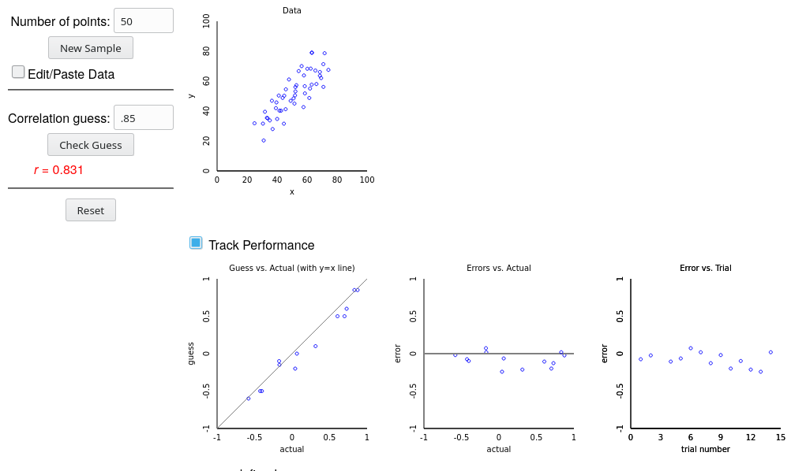
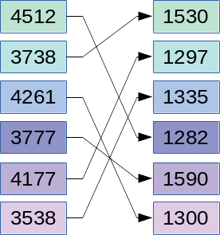
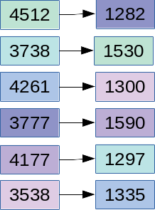

```{r setup, include = F}

library(ggplot2)
library(tidyverse)
knitr::opts_chunk$set(dpi=300, message = F, warning = F, echo = F, fig.width = 8, fig.height = 4, out.width = "80%", fig.align = "center", cache = T)
theme_set(theme_bw())
```


# Navigation


.large[By Section]
- 10.1: [start](#3) - [end](#15)
- 10.2: [start](#16) - [end](#36)
- 10.3: [start](#37) - [end](#49)
- 10.4: [start](#50) - [end](#51)
- 10.5: [start](#52) - [end](#53)

???

We've worked our way up from one categorical variable to one quantitative variable, then we made it harder by adding another variable (two categorical variables, a categorical variable and a quantitative variable). For the final chapter in this class, we're going to look at what happens when we have two quantitative variables... we're going to talk about correlation first, and  then regression.

---
class:inverse,middle,center
# 10.1: Two Quantitative Variables
## Scatterplots and Correlation

```{r brain-data}
brain <- read_table("http://users.stat.ufl.edu/~winner/data/brainhead.dat", col_names = c("Gender", "Age", "HeadSize", "BrainWeight"))

```

---
## Graphical Summaries of Quantitative Variables

.pull-left[
.small[[R.J. Gladstone (1905). "A Study of the Relations of the Brain to the Size of the Head", Biometrika, Vol. 4, p 105-123. ](https://www.jstor.org/stable/pdf/2331533.pdf)]

Data collected during 237 autopsies at Middlesex Hospital in London, excluding cases "in which the brain showed a distinctly pathological condition which would have obviously affected its weight"

Variables:
- Gender
- Age (20 - 45 or 46+)
- Brain Weight (g)
- Head Size (cubic cm)
.small[the smallest rectangular block which could contain the head]

].pull-right[
<!--  -->

]
.bottom[]
???

Early statisticians were very interested in the natural world - in addition to quantifying traits of plants, they also conducted extensive studies of human anatomy and physiology, looking at the relationship between various traits, how those traits might be inherited, and more. 

One of these studies looked at people brought into the Middlesex hospital morgue for autopsy, examining the relationship between head size and brain weight. They examined everyone who was brought in who didn't have an obvious brain pathology.

---
## Graphical Summaries of Quantitative Variables

A single quantitative variable can be summarized visually using a histogram or a bar chart:

```{r, fig.width = 8, fig.height = 4, out.width = "100%"}
d1 <- brain %>%
  pivot_longer(names_to = "Variable", values_to = "Value", HeadSize:BrainWeight) %>%
  mutate(Variable = str_replace_all(Variable, c("BrainWeight" = "Brain Weight, grams", "HeadSize" = "Head Size, cm^3")))

p1 <- ggplot(d1, aes(x = Value)) + facet_wrap(~Variable, scale = "free") + geom_histogram(fill = "grey", color = "black") + ylab("Count") + theme(axis.title.x = element_blank(), axis.ticks = element_blank(), axis.text = element_blank(), axis.title = element_blank())

p2 <- ggplot(d1, aes(x = 1, y = Value)) + facet_wrap(~Variable, scale = "free") + geom_boxplot(fill = "grey", color = "black") + ylab("Count") + theme(axis.title.x = element_blank(), axis.ticks.y = element_blank(), axis.text.y = element_blank(), axis.title.y = element_blank(), strip.background = element_blank(), strip.text = element_blank(), panel.spacing.y = unit(0, "cm")) + coord_flip()

# p2 <- brain %>%
#   ggplot(aes(x = I(1), y = BrainWeight)) + geom_boxplot(fill = "grey", color = "black") + theme(axis.title = element_blank(), axis.ticks.y = element_blank(), axis.text.y = element_blank()) + coord_flip() 
# 
# p3 <- brain %>%
#   ggplot(aes(x = I(1), y = HeadSize)) + geom_boxplot(fill = "grey", color = "black") + theme(axis.title = element_blank(), axis.ticks.y = element_blank(), axis.text.y = element_blank()) + coord_flip()
gridExtra::grid.arrange(p1, p2, layout_matrix = matrix(c(1, 1, 1, 1, 2, 2), nrow = 3, byrow = T))

```

???

In Ch 6, we learned how to interpret a histogram or a bar chart to describe the distribution of quantitative variables. Now that we have two variables, we can make a histogram and a bar chart for each one of them. Is there a relationship between the two variables?

We don't actually know. That's because "univariate" (one variable) summaries of "bivariate" (two variable) data don't actually tell us about the relationship between variables. To show that, we have to use a different type of plot.

---
## Graphical Summaries of Quantitative Variables

But, summarizing each variable separately doesn't tell us how the two variables might be related.

Is there a relationship between brain weight and head size? How do you know?

--

```{r}
brain %>%
  ggplot(aes(y = BrainWeight, x = HeadSize)) + geom_point() + 
  ylab("Brain Weight, grams") + xlab("Head Size, cm^3") + ggtitle("A Study of the Relations of the Brain to the Size of the Head") + coord_fixed(ratio = 1.5)
```

A **scatterplot** is a plot with the explanatory variable on the x-axis, and the response variable on the y-axis. Observations are shown as points corresponding to a set of quantitative measurements.

???

I'm sure you've seen scatterplots before. A scatterplot has the explanatory variable on the x-axis, the response variable on the y-axis, and each observation is a point on the graph (x,y). Looking at this plot, what would you say about the relationship between brain weight and head size?

It looks like the bigger your head, the more your brain is likely to weigh. So if your head is relatively small, 3000 cubic cm, then your brain weight will also be relatively small, around 1100 grams. 

How do we describe the relationship between brain weight and head size? We can use direction, shape, strength...

---
## Describing Variable Relationships: Direction

```{r, fig.width = 8, fig.height = 4, out.width = "100%"}
set.seed(20200404)
dat <- tibble(Direction = rep(c("Positive", "Negative"), each = 100),
              x = rep(rnorm(100, seq(-5, 5, length.out = 100), sd = .2), times = 2),
              sign = ifelse(Direction == "Positive", 1, -1),
              y = rnorm(200, x, .5)*sign) %>%
  mutate(Direction = factor(Direction, levels = unique(Direction)))

txt <- tibble(Direction = c("Positive", "Negative"),
              x = c(-2, 2), y = c(5.5, 5.5), label = c("Low values of x -> Low values of y\nHigh values of x -> High values of y", "Low values of x -> High values of y\nHigh values of x -> Low values of y")) %>%
  mutate(Direction = factor(Direction, levels = unique(Direction)))

ggplot() + 
  geom_point(data = dat, aes(x = x, y = y)) + 
  geom_text(data = txt, aes(x = x, y = y, label = label), inherit.aes = F) + 
  facet_wrap(~Direction, labeller = label_both) + 
  theme(axis.title = element_blank())
```

Positive slope: as $x$ increases, $y$ increases too.

???

When we talk about the direction of a relationship, we're looking for some assessment of whether when x increases, y increases; or when x increases, y gets smaller. If as x increases, y increases, we say that's a positive relationship; if as x increases, y decreases, we say that's a negative relationship. 

---
## Describing Variable Relationships: Form

The **form** of an association is whether it follows a linear pattern, or some sort of more complicated pattern - periodic, polynomial (quadratic, cubic, etc.)

```{r, fig.width = 8, fig.height = 2.5, out.width = "100%"}
set.seed(20200404)
d2 <- read_csv("../data/Datasaurus_data.csv", col_names = FALSE) %>% set_names(c("x", "y"))
dat <- tibble(Form = rep(c("Linear", "Quadratic", "Periodic"), each = 100),
              x = rep(rnorm(100, seq(-5, 6, length.out = 100), sd = .2), times = 3),
              y = rnorm(300, ifelse(Form == "Linear", x, ifelse(Form == "Quadratic", x^2 * 1/6 - 3, 5*sin(x))), 1)) %>%
  bind_rows(mutate(d2, Form = "Dinosaur")) %>%
  group_by(Form) %>%
  mutate(x = scale(x), y = scale(y)) %>%
  ungroup() %>%
  mutate(Form = factor(Form, levels = c("Linear", "Quadratic", "Periodic", "Dinosaur")))

ggplot() + 
  geom_point(data = dat, aes(x = x, y = y)) + 
  facet_wrap(~Form, labeller = label_both, ncol = 4) + 
  theme(axis.title = element_blank()) + coord_fixed(xlim = c(-2, 2), ylim = c(-2, 2))
```

???

Another way to describe relationships is to talk about the shape, or the form of a relationship. So far, you've seen linear relationships - that is, a straight line, but there are other options. You might see a u-shape, which is quadratic, or a seasonal relationship (like the average daily temperature throughout the year). It's unlikely, but you may see even stranger relationships... but mostly, I just wanted an excuse to plot a dinosaur. 

---
## Describing Variable Relationships: Strength

The **strength** of an association indicates how well the value of one variable can be predicted if you know the value of the other variable.

```{r, fig.width = 8, fig.height = 4, out.width = "100%"}
set.seed(20200403)
library(MASS)
dat <- tibble(Strength = c("No Assoc", "Very Weak", "Weak", "Moderate", "Strong", "Very Strong"), p = c(0, .2, .4, .65, .85, .99), 
              dat = purrr::map(p, ~mvrnorm(75, c(0, 0), matrix(c(1, ., ., 1), nrow = 2)) %>% as.data.frame() %>% set_names(c("x", "y")))) %>%
  mutate(Strength = factor(Strength, levels = Strength)) %>%
  unnest("dat") %>%
  group_by(Strength) %>%
  mutate(x = scale(x), y = scale(y))

ggplot(data = dat) + 
  geom_point(aes(x = x, y = y)) + 
  facet_wrap(~Strength, labeller = label_both, ncol = 3) + 
  theme(axis.title = element_blank(), axis.ticks = element_blank(), axis.text = element_blank())
```

--

We can describe the strength and direction of a *linear* relationship using the **correlation coefficient**

???

Another way we describe relationships is to talk about how closely the points adhere to our imaginary "form". That is, if we know the value of x, how much certainty do we have about the value of y? If the association is weak, we don't know that much about the value of y, but if it is strong, we can narrow down a prediction for y pretty well.

If in addition we have a linear relationship, then we can actually describe the strength and direction using a value called the "correlation coefficient". It's a number between -1 and 1 that tells us both the direction and the strength of a correlation, but it only really works for linear relationships. So once we know we have a linear relationship, we can describe the other features with a single number.

---
## Correlation Coefficient

The **correlation coefficient**, $r$, is always between -1 and 1. 

.small[
-1 | -0.5 | 0  | 0.5 | 1 
:--: | :---: | :--: | :---: | :--:
perfect negative correlation | moderate negative correlation | no correlation | moderate positive correlation | perfect positive correlation
]


```{r, fig.width = 8, fig.height = 4, out.width = "100%"}
dat <- tibble(Strength = c("No Assoc", "Very Weak", "Weak", "Moderate", "Strong", "Very Strong"), r = c(0, .2, .4, .6, .8, 1), 
              dat = purrr::map(r, ~mvrnorm(75, c(0, 0), matrix(c(1, ., ., 1), nrow = 2)) %>% as.data.frame() %>% set_names(c("x", "y")))) %>%
  mutate(Strength = factor(Strength, levels = Strength)) %>%
  unnest("dat") %>%
  group_by(Strength)

ggplot(data = dat) + 
  geom_point(aes(x = x, y = y)) + 
  facet_wrap(~r, labeller = partial(label_both, sep = "="), ncol = 3) + 
  theme(axis.title = element_blank(), axis.ticks = element_blank(), axis.text = element_blank())
```

???

For positive values of $r$ (the correlation coefficient), we can see that as r increases, we can predict y better and better if we know x. when r=1, we exactly know the value of y.

---
## Correlation Coefficient

The **correlation coefficient**, $r$, is always between -1 and 1. 

.small[
-1 | -0.5 | 0  | 0.5 | 1 
:--: | :---: | :--: | :---: | :--:
perfect negative correlation | moderate negative correlation | no correlation | moderate positive correlation | perfect positive correlation
]


```{r, fig.width = 8, fig.height = 4, out.width = "100%"}
dat <- tibble(Strength = c("No Assoc", "Very Weak", "Weak", "Moderate", "Strong", "Very Strong"), r = -c(0, .2, .4, .6, .8, 1), 
              dat = purrr::map(r, ~mvrnorm(75, c(0, 0), matrix(c(1, ., ., 1), nrow = 2)) %>% as.data.frame() %>% set_names(c("x", "y")))) %>%
  mutate(Strength = factor(Strength, levels = Strength)) %>%
  unnest("dat") %>%
  group_by(Strength)

ggplot(data = dat) + 
  geom_point(aes(x = x, y = y)) + 
  facet_wrap(~r, labeller = partial(label_both, sep = "="), ncol = 3) + 
  theme(axis.title = element_blank(), axis.ticks = element_blank(), axis.text = element_blank())
```

???

Similarly, if the correlation coefficient is negative, the magnitude tells us how strong the correlation is, but the negative sign tells us the direction of the line. 

---
## Correlation Coefficient


???

It's pretty hard to tell when r is weak whether the association is positive or negative. Instead, like XKCD recommends, you might have more luck drawing new constellations :). 

---
## Correlation Coefficient

Get a feel for it by 
[playing the correlation guessing game!](https://www.rossmanchance.com/applets/GuessCorrelation.html)




???

With that said, it's worth taking 15 minutes or so to get a sense of how the correlation coefficient works and what different r-values end up looking like in practice. Pause the video and go play the correlation guessing game for a few minutes. It will benefit you later.

---
## Correlation Coefficient

The correlation coefficient is only useful for showing the strength of .underline[linear relationships]. 

```{r, fig.width = 6, fig.height = 6, out.width = "50%",  ffmpeg.format='gif', fig.show='animate', dev = "jpeg", dpi = 300, interval=1, aniopts = "controls"}
dsd <- read_tsv("../data/DatasaurusDozen.tsv") %>%
  mutate(x = x - 7)

plot_dsd <- function(name) {
  df <- dsd %>% filter(dataset == name)
  p <- ggplot(df, aes(x = x, y = y)) + 
    geom_point() + 
    coord_cartesian(xlim = c(0, 100), ylim = c(0, 100)) + 
    theme(axis.text = element_blank(), axis.title = element_blank(), axis.ticks = element_blank()) +
    ggtitle(sprintf("X: %.2f (SD = %.2f), Y: %.2f (SD = %.2f), r = %.2f", mean(df$x), sd(df$x), mean(df$y), sd(df$y), cor(df$x, df$y)))
  print(p)
}

purrr::walk(unique(dsd$dataset), plot_dsd)


```

All of these plots have essentially the same correlation coefficient, but in some cases there are very clear associations between $x$ and $y$

???

As I mentioned before, the correlation coefficient doesn't really help you if you have a relationship between x and y that is obviously not linear. All of these different plots have about the same mean, standard deviation, and correlation coefficient for x and y, but they all have obviously different shapes. You'll need to know this particular quirk on the final. 

<!-- See the animation [here](https://twitter.com/maartenzam/status/770723795518812160) -->


---
## Outliers and Influential Observations


With one variable, outliers are fairly easy to spot

???

A final important characteristic to describe is to talk about any outliers. With one dimension, outliers are pretty easy - they're either realy big or really small. When you have two variables, though, there are new ways to be an outlier that also cause trouble. We call these collectively "influential observations"

--

When there are two variables, we don't just have to worry about outliers in one dimension; we also have to worry about **influential observations**


---
## Outliers and Influential Observations

Influential observations are observations which, if included, change our understanding of the relationship between two variables.

```{r,  ffmpeg.format='gif', fig.show='animate', dev = "jpeg", dpi = 300, interval=2, aniopts = "controls"}
set.seed(2304732)
dat <- tibble(x = rnorm(50, mean = seq(-5, 5, length.out = 50), sd = .25),
              y = rnorm(50, mean = c(2*x[49:50], x[3:48], 2*x[1:2]), sd = rep(c(1, 2, 1), c(2, 46, 2))),
              Influential = rep(c(T, F, T), c(2, 46, 2)))

ggplot(dat[!dat$Influential,], aes(x = x, y = y)) + geom_point() + 
  ggtitle(sprintf("r = %.2f", cor(filter(dat, !Influential)$x, filter(dat, !Influential)$y)))

ggplot(dat, aes(x = x, y = y, color = Influential)) + geom_point() + scale_color_manual("Influential", values = c("black", "red")) + 
  theme(legend.position = c(.5, 1), legend.justification = c(.5, 1), legend.direction = "horizontal", legend.background = element_rect(fill = "transparent")) + 
  ggtitle(sprintf("r = %.2f", cor(dat$x, dat$y)))
```

???

Influential observations can be at the edges of x or y, but they don't have to be. In this case, the red points aren't actually outliers in x or y, but they stick out because they don't follow the same relationship that the rest of the points do - they change what we think about the relationship between x and y... and the corresponding correlation coefficient!

---
## Outliers and Influential Observations

Influential observations are observations which, if included, change our understanding of the relationship between two variables.


```{r, ffmpeg.format='gif', fig.show='animate', dev = "jpeg", dpi = 300, interval=2, aniopts = "controls"}
set.seed(2304732)
dat <- tibble(x = rnorm(53, mean = c(seq(0, 5, length.out = 50), 
                                     seq(5, 6, length.out = 3)), sd = .25),
              y = rnorm(53, mean = c(rep(0, 50), rep(5, 3))),
              Influential = rep(c(F, T), c(50, 3)))
xrange <- range(dat$x)
yrange <- range(dat$y)

ggplot(dat[!dat$Influential,], aes(x = x, y = y)) + geom_point() + 
  ggtitle(sprintf("r = %.2f", cor(filter(dat, !Influential)$x, filter(dat, !Influential)$y))) + 
  coord_cartesian(xlim = xrange, ylim = yrange)

ggplot(dat, aes(x = x, y = y, color = Influential)) + geom_point() + scale_color_manual("Influential", values = c("black", "red")) + 
  theme(legend.position = c(.5, 1), legend.justification = c(.5, 1), legend.direction = "horizontal", legend.background = element_rect(fill = "transparent")) + 
  ggtitle(sprintf("r = %.2f", cor(dat$x, dat$y))) + 
  coord_cartesian(xlim = xrange, ylim = yrange)
```

???

Sometimes, influential observations are actually outliers in either x or y, and including them can cause a correlation value to be unreasonably high. So when you're describing the relationship between two sets of points, be sure to talk about the outliers as well, if there are any (and there aren't always major outliers)


---
## Exploration 10.1

Work through Exploration 10.1 to get a chance to put the material in this section into practice. You can turn it in for 10 points of extra credit in the "Assignment" category.

???

I think it would be helpful to work through Exploration 10.1 on your own. If you do so, and turn the answers in, you can get extra credit on other assignments/homework, but I'm not requiring it because there's enough crazy happening without me piling more on.


---
class:middle,inverse,center
# 10.2: Inference for the Correlation Coefficient
## Simulation Based Approach

???

In this section, we're going to talk about how to do simulation based inference to test whether there is a linear relationship between two variables. But I want to start things off in a way that's going to seem a bit weird... but will hopefully make sense soon.

---
## One of these things is not like the others

<iframe width="90%" height="500px" src="https://www.youtube.com/embed/rsRjQDrDnY8" frameborder="0" allow="accelerometer; autoplay; encrypted-media; gyroscope; picture-in-picture" allowfullscreen></iframe>

???

Relax, because this next part is basically going to be like Sesame-street level of easy statistics. This is also part of my research, which means that basically I'm using class to talk about one of my favorite things. But, it also helps with motivating simulation-based inference.

---
## Which one of these things is not like the others?

```{r fig.width = 8, fig.height = 6}
library(nullabor)
set.seed(2401834)
lineup(null_permute("BrainWeight"), brain, n = 20, pos = 12) %>%
  ggplot(aes(x = HeadSize, y = BrainWeight)) + 
  geom_point(shape = 1, alpha = .5, size = .5) + 
  facet_wrap(~.sample)

```

???

In this set of 20 plots, which one is different?

I'm guessing that you all picked plot #12. Now, think about why that is. Is it because there's a linear relationship between x and y there, but the rest of the plots look like random blobs of points?

Congratulations, you've just done what's called "visual inference" - you looked at a set of plots and picked one out that was different, then tried to describe why you picked that particular plot. 

Hold on to that picture for a minute - we're going to go back to regularly scheduled programming temporarily. 

---
## Simulation-based Inference for Correlation Coefficient

Our null hypothesis is $H_0:$ No relationship between $x$ and $y$

How can we simulate this?

.center[

]

???

When we have two quantitative variables, our general null hypothesis is that x is not related to y in any way.  What does that mean for simulation?

---
## Simulation-based Inference for Correlation Coefficient

Our null hypothesis is $H_0:$ No relationship between $x$ and $y$

How can we simulate this?

.center[

]

If there's no relationship between $x$ and $y$, then it doesn't really matter what $x$ value is paired with a given $y$ value... so we can just change which values are paired together.

???

If x and y aren't related, and the value of x doesn't tell us anything about the value of y, then we can just connect x's and ys at random, right?

---
## Summary of Simulation Model

- Null hypothesis: No association between $x$ and $y$ variables

- One repetition: Re randomizing the response outcomes to the explanatory variable values (randomize $y$ values)

- Statistic: Correlation coefficient, $r$

???

If we start with the null hypothesis that there's no association between x and y, and one repetition is re-randomizing the values of y to correspond to values of x, we have one repetition is essentially "collecting" a whole new set of data. Just like every other time, right?

The statistic is the correlation coefficient, which only measures linear association. So our statistic might be an imperfect measure of the association between x and y - and we need to be careful to remember that, because if there's some other association between x and y that isn't linear, it might not show up using the correlation coefficient. 

---
## Simulation-based Inference for Correlation Coefficient

Our null hypothesis is $H_0:$ No relationship between $x$ and $y$

How can we simulate this?

.center[

]

This is equivalent to shuffling the order of $y$ and creating a new regression

???

This is essentially equivalent to shuffling the y's and keeping the order of the x's the same.

Once we've shuffled the points, we calculate a new correlation coefficient for our simulated data. Then we compare the simulated correlation coefficients to the coefficient from our sample... and if our sample correlation coefficient is more extreme, we know that there is a linear association between x and y!

---
## Which one of these things is not like the others?

```{r fig.width = 8, fig.height = 6}
library(nullabor)
set.seed(2401834)
lineup(null_permute("BrainWeight"), brain, n = 20, pos = 12) %>%
  ggplot(aes(x = HeadSize, y = BrainWeight)) + 
  geom_point(shape = 1, alpha = .5, size = .5) + 
  facet_wrap(~.sample)

```

Here, our $y$ values have been shuffled for each sub-plot that isn't plot 12.    
Plot 12 contains the original data.

???

In the "lineup plot" I showed you earlier, this is exactly what happened. So all 19 of the plots that look like blobs of points are actually resampled exactly as I just described. Only plot 12, which is the original data, has any appearance of a relationship between x and y.

---
## 3 S strategy

1. **Statistic** - correlation coefficient from the sample
2. **Simulate**
    - Assume there is no relationship between $x$ and $y$
    - Shuffle the values of $y$ 
    - Calculate the correlation coefficient from the simulated date
3. **Strength of evidence** - in how many simulated samples did we get a correlation coefficient with magnitude greater than our sample correlation coefficient?

```{r}
sim_fn <- function(x, y) {
  cor(x, sample(y, length(y), replace = F))
}

actual_cor <- cor(brain$HeadSize, brain$BrainWeight)
sim_res <- tibble(sim_cor = replicate(1000, sim_fn(x = brain$HeadSize, y = brain$BrainWeight)),
                  extreme = abs(sim_cor) >= abs(actual_cor))

ggplot(sim_res, aes(x = sim_cor, fill = extreme)) + 
  geom_histogram(fill = "grey", color = "black", binwidth = .025) + 
  annotate("segment", x = actual_cor, xend = actual_cor, y = 0, yend = Inf, color = "red") + 
  annotate("segment", x = actual_cor + .02, xend = 1, y = 150, yend = 150, color = "red", arrow = arrow(length = unit(.25, "cm"))) + 
  annotate("segment", x = -actual_cor, xend = -actual_cor, y = 0, yend = Inf, color = "red") + 
  annotate("segment", x = -actual_cor - .02, xend = -1, y = 150, yend = 150, color = "red", arrow = arrow(length = unit(.25, "cm"))) + 
  xlab("Simulated Correlation") + ylab("# Simulations")

```

???

To sum this up, if we go to our 3s strategy, we start with a statistic - the correlation coefficient, r. We simulate by shuffling the y variable values around, and come up with a simulated distribution of the correlation coefficient under the null hypothesis that x and y don't have a linear relationship. Then, we compare our statistic to that distribution to get an assessment of the strength of the evidence.

So when I did 1000 simulations of the correlation coefficient for our brain and head size data, I got a distribution that looked like this... basically, there is no way that our linear relationship that was observed in the data could have arisen by chance. It's just not possible - p is too small, and even if we ran a million simulations, we still wouldn't get a nonzero p. 

---
## Hypotheses for Correlation Coefficient

$H_0:$ There is no relationship between $x$ and $y$ ($r = 0$)

$H_A:$ There is a relationship between $x$ and $y$ ($r \neq 0$)

???

To recap, when we're doing simulation-based inference for the correlation coefficient, our null hypothesis is that there's no linear relationship between x and y. Our alternative hypothesis is that there is a linear relationship between x and y, which means that r is going to be something other than zero. 

Remember, we can't measure nonlinear relationships with the correlation coefficient, so be careful about that. 

---
# 10.3: Least Squares Regression
