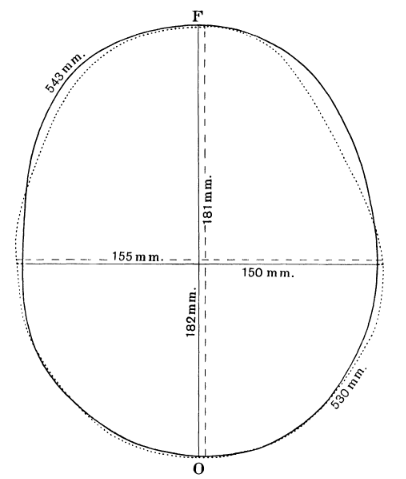

```{r setup, include = F}

library(ggplot2)
library(tidyverse)
knitr::opts_chunk$set(dpi=300, message = F, warning = F, echo = F, fig.width = 8, fig.height = 4, out.width = "80%", fig.align = "center", cache = T)
theme_set(theme_bw())
```


# Navigation


.large[By Section]
- 10.1: [start](#3) - [end](#15)
- 10.2: [start](#16) - [end](#36)
- 10.3: [start](#37) - [end](#49)
- 10.4: [start](#50) - [end](#51)
- 10.5: [start](#52) - [end](#53)

???

We've worked our way up from one categorical variable to one quantitative variable, then we made it harder by adding another variable (two categorical variables, a categorical variable and a quantitative variable). For the final chapter in this class, we're going to look at what happens when we have two quantitative variables... we're going to talk about correlation and regression.

---
class:inverse,middle,center
# 10.1: Two Quantitative Variables
## Scatterplots and Correlation

```{r brain-data}
brain <- read_table("http://users.stat.ufl.edu/~winner/data/brainhead.dat", col_names = c("Gender", "Age", "HeadSize", "BrainWeight"))

```

---
## Graphical Summaries of Quantitative Variables

.pull-left[
.small[[R.J. Gladstone (1905). "A Study of the Relations of the Brain to the Size of the Head", Biometrika, Vol. 4, p 105-123. ](https://www.jstor.org/stable/pdf/2331533.pdf)]

Data collected during 237 autopsies at Middlesex Hospital in London, excluding cases "in which the brain showed a distinctly pathological condition which would have obviously affected its weight"

Variables:
- Gender
- Age (20 - 45 or 46+)
- Brain Weight (g)
- Head Size (cubic cm)
.small[the smallest rectangular block which could contain the head]

].pull-right[
<!--  -->

]
.bottom[]
???

Early statisticians were very interested in the natural world - in addition to quantifying traits of plants, they also conducted extensive studies of human anatomy and physiology, looking at the relationship between various traits, how those traits might be inherited, and more. 

One of these studies looked at people brought into the Middlesex hospital morgue for autopsy, examining the relationship between head size and brain weight. They examined everyone who was brought in who didn't have an obvious brain pathology.

---
## Graphical Summaries of Quantitative Variables

A single quantitative variable can be summarized visually using a histogram or a bar chart:

```{r, fig.width = 8, fig.height = 4, out.width = "100%"}
d1 <- brain %>%
  pivot_longer(names_to = "Variable", values_to = "Value", HeadSize:BrainWeight) %>%
  mutate(Variable = str_replace_all(Variable, c("BrainWeight" = "Brain Weight, grams", "HeadSize" = "Head Size, cm^3")))

p1 <- ggplot(d1, aes(x = Value)) + facet_wrap(~Variable, scale = "free") + geom_histogram(fill = "grey", color = "black") + ylab("Count") + theme(axis.title.x = element_blank(), axis.ticks = element_blank(), axis.text = element_blank(), axis.title = element_blank())

p2 <- ggplot(d1, aes(x = 1, y = Value)) + facet_wrap(~Variable, scale = "free") + geom_boxplot(fill = "grey", color = "black") + ylab("Count") + theme(axis.title.x = element_blank(), axis.ticks.y = element_blank(), axis.text.y = element_blank(), axis.title.y = element_blank(), strip.background = element_blank(), strip.text = element_blank(), panel.spacing.y = unit(0, "cm")) + coord_flip()

# p2 <- brain %>%
#   ggplot(aes(x = I(1), y = BrainWeight)) + geom_boxplot(fill = "grey", color = "black") + theme(axis.title = element_blank(), axis.ticks.y = element_blank(), axis.text.y = element_blank()) + coord_flip() 
# 
# p3 <- brain %>%
#   ggplot(aes(x = I(1), y = HeadSize)) + geom_boxplot(fill = "grey", color = "black") + theme(axis.title = element_blank(), axis.ticks.y = element_blank(), axis.text.y = element_blank()) + coord_flip()
gridExtra::grid.arrange(p1, p2, layout_matrix = matrix(c(1, 1, 1, 1, 2, 2), nrow = 3, byrow = T))

```

---
## Graphical Summaries of Quantitative Variables

But, summarizing each variable separately doesn't tell us how the two variables might be related.

Is there a relationship between brain weight and head size? How do you know?

--

```{r}
brain %>%
  ggplot(aes(x = BrainWeight, y = HeadSize)) + geom_point() + 
  xlab("Brain Weight, grams") + ylab("Head Size, cm^3") + ggtitle("A Study of the Relations of the Brain to the Size of the Head") + coord_fixed(ratio = 1/6)
```

A **scatterplot** is a plot with the explanatory variable on the x-axis, and the response variable on the y-axis. Observations are shown as points corresponding to a set of quantitative measurements.


---
## Describing Variable Relationships: Direction

```{r, fig.width = 8, fig.height = 4, out.width = "100%"}
set.seed(20200404)
dat <- tibble(Direction = rep(c("Positive", "Negative"), each = 100),
              x = rep(rnorm(100, seq(-5, 5, length.out = 100), sd = .2), times = 2),
              sign = ifelse(Direction == "Positive", 1, -1),
              y = rnorm(200, x, .5)*sign) %>%
  mutate(Direction = factor(Direction, levels = unique(Direction)))

txt <- tibble(Direction = c("Positive", "Negative"),
              x = c(-2, 2), y = c(5.5, 5.5), label = c("Low values of x -> Low values of y\nHigh values of x -> High values of y", "Low values of x -> High values of y\nHigh values of x -> Low values of y")) %>%
  mutate(Direction = factor(Direction, levels = unique(Direction)))

ggplot() + 
  geom_point(data = dat, aes(x = x, y = y)) + 
  geom_text(data = txt, aes(x = x, y = y, label = label), inherit.aes = F) + 
  facet_wrap(~Direction, labeller = label_both) + 
  theme(axis.title = element_blank())
```

Positive slope: as $x$ increases, $y$ increases too.


---
## Describing Variable Relationships: Form

The **form** of an association is whether it follows a linear pattern, or some sort of more complicated pattern - periodic, polynomial (quadratic, cubic, etc.)

```{r, fig.width = 8, fig.height = 2.5, out.width = "100%"}
set.seed(20200404)
d2 <- read_csv("../data/Datasaurus_data.csv", col_names = FALSE) %>% set_names(c("x", "y"))
dat <- tibble(Form = rep(c("Linear", "Quadratic", "Periodic"), each = 100),
              x = rep(rnorm(100, seq(-5, 6, length.out = 100), sd = .2), times = 3),
              y = rnorm(300, ifelse(Form == "Linear", x, ifelse(Form == "Quadratic", x^2 * 1/6 - 3, 5*sin(x))), 1)) %>%
  bind_rows(mutate(d2, Form = "Dinosaur")) %>%
  group_by(Form) %>%
  mutate(x = scale(x), y = scale(y)) %>%
  ungroup() %>%
  mutate(Form = factor(Form, levels = c("Linear", "Quadratic", "Periodic", "Dinosaur")))

ggplot() + 
  geom_point(data = dat, aes(x = x, y = y)) + 
  facet_wrap(~Form, labeller = label_both, ncol = 4) + 
  theme(axis.title = element_blank()) + coord_fixed(xlim = c(-2, 2), ylim = c(-2, 2))
```

---
## Describing Variable Relationships: Strength

The **strength** of an association indicates how well the value of one variable can be predicted if you know the value of the other variable.

```{r, fig.width = 8, fig.height = 4, out.width = "100%"}
set.seed(20200403)
library(MASS)
dat <- tibble(Strength = c("No Assoc", "Very Weak", "Weak", "Moderate", "Strong", "Very Strong"), p = c(0, .2, .4, .65, .85, .99), 
              dat = purrr::map(p, ~mvrnorm(75, c(0, 0), matrix(c(1, ., ., 1), nrow = 2)) %>% as.data.frame() %>% set_names(c("x", "y")))) %>%
  mutate(Strength = factor(Strength, levels = Strength)) %>%
  unnest("dat") %>%
  group_by(Strength) %>%
  mutate(x = scale(x), y = scale(y))

ggplot(data = dat) + 
  geom_point(aes(x = x, y = y)) + 
  facet_wrap(~Strength, labeller = label_both, ncol = 3) + 
  theme(axis.title = element_blank(), axis.ticks = element_blank(), axis.text = element_blank())
```

--

We can describe the strength and direction of a *linear* relationship using the **correlation coefficient**

---
## Correlation Coefficient

The **correlation coefficient**, $r$, is always between -1 and 1. 

.small[
-1 | -0.5 | 0  | 0.5 | 1 
:--: | :---: | :--: | :---: | :--:
perfect negative correlation | moderate negative correlation | no correlation | moderate positive correlation | perfect positive correlation
]


```{r, fig.width = 8, fig.height = 4, out.width = "100%"}
dat <- tibble(Strength = c("No Assoc", "Very Weak", "Weak", "Moderate", "Strong", "Very Strong"), r = c(0, .2, .4, .6, .8, 1), 
              dat = purrr::map(r, ~mvrnorm(75, c(0, 0), matrix(c(1, ., ., 1), nrow = 2)) %>% as.data.frame() %>% set_names(c("x", "y")))) %>%
  mutate(Strength = factor(Strength, levels = Strength)) %>%
  unnest("dat") %>%
  group_by(Strength)

ggplot(data = dat) + 
  geom_point(aes(x = x, y = y)) + 
  facet_wrap(~r, labeller = partial(label_both, sep = "="), ncol = 3) + 
  theme(axis.title = element_blank(), axis.ticks = element_blank(), axis.text = element_blank())
```

---
## Correlation Coefficient

The **correlation coefficient**, $r$, is always between -1 and 1. 

.small[
-1 | -0.5 | 0  | 0.5 | 1 
:--: | :---: | :--: | :---: | :--:
perfect negative correlation | moderate negative correlation | no correlation | moderate positive correlation | perfect positive correlation
]


```{r, fig.width = 8, fig.height = 4, out.width = "100%"}
dat <- tibble(Strength = c("No Assoc", "Very Weak", "Weak", "Moderate", "Strong", "Very Strong"), r = -c(0, .2, .4, .6, .8, 1), 
              dat = purrr::map(r, ~mvrnorm(75, c(0, 0), matrix(c(1, ., ., 1), nrow = 2)) %>% as.data.frame() %>% set_names(c("x", "y")))) %>%
  mutate(Strength = factor(Strength, levels = Strength)) %>%
  unnest("dat") %>%
  group_by(Strength)

ggplot(data = dat) + 
  geom_point(aes(x = x, y = y)) + 
  facet_wrap(~r, labeller = partial(label_both, sep = "="), ncol = 3) + 
  theme(axis.title = element_blank(), axis.ticks = element_blank(), axis.text = element_blank())
```

---
## Correlation Coefficient


---
## Correlation Coefficient

Get a feel for it by 
[playing the correlation guessing game!](https://www.rossmanchance.com/applets/GuessCorrelation.html)


---
## Correlation Coefficient

The correlation coefficient is only useful for showing the strength of .underline[linear relationships]. 

```{r, fig.width = 6, fig.height = 6, out.width = "50%",  ffmpeg.format='gif', fig.show='animate', dev = "jpeg", dpi = 300, interval=1, aniopts = "controls"}
dsd <- read_tsv("../data/DatasaurusDozen.tsv") %>%
  mutate(x = x - 7)

plot_dsd <- function(name) {
  df <- dsd %>% filter(dataset == name)
  p <- ggplot(df, aes(x = x, y = y)) + 
    geom_point() + 
    coord_cartesian(xlim = c(0, 100), ylim = c(0, 100)) + 
    theme(axis.text = element_blank(), axis.title = element_blank(), axis.ticks = element_blank()) +
    ggtitle(sprintf("X: %.2f (SD = %.2f), Y: %.2f (SD = %.2f), r = %.2f", mean(df$x), sd(df$x), mean(df$y), sd(df$y), cor(df$x, df$y)))
  print(p)
}

purrr::walk(unique(dsd$dataset), plot_dsd)


```
All of these plots have essentially the same correlation coefficient, but in some cases there are very clear associations between $x$ and $y$

<!-- See the animation [here](https://twitter.com/maartenzam/status/770723795518812160) -->


---
## Outliers and Influential Observations


With one variable, outliers are fairly easy to spot

--

When there are two variables, we don't just have to worry about outliers in one dimension; we also have to worry about **influential observations**

---
## Outliers and Influential Observations

Influential observations are observations which, if included, change our understanding of the relationship between two variables.

```{r,  ffmpeg.format='gif', fig.show='animate', dev = "jpeg", dpi = 300, interval=2, aniopts = "controls"}
set.seed(2304732)
dat <- tibble(x = rnorm(50, mean = seq(-5, 5, length.out = 50), sd = .25),
              y = rnorm(50, mean = c(2*x[49:50], x[3:48], 2*x[1:2]), sd = rep(c(1, 2, 1), c(2, 46, 2))),
              Influential = rep(c(T, F, T), c(2, 46, 2)))

ggplot(dat[!dat$Influential,], aes(x = x, y = y)) + geom_point() + 
  ggtitle(sprintf("r = %.2f", cor(filter(dat, !Influential)$x, filter(dat, !Influential)$y)))

ggplot(dat, aes(x = x, y = y, color = Influential)) + geom_point() + scale_color_manual("Influential", values = c("black", "red")) + 
  theme(legend.position = c(.5, 1), legend.justification = c(.5, 1), legend.direction = "horizontal", legend.background = element_rect(fill = "transparent")) + 
  ggtitle(sprintf("r = %.2f", cor(dat$x, dat$y)))
```

---
## Outliers and Influential Observations

Influential observations are observations which, if included, change our understanding of the relationship between two variables.


```{r}
set.seed(2304732)
dat <- tibble(x = rnorm(53, mean = c(seq(0, 5, length.out = 50), 
                                     seq(5, 6, length.out = 3)), sd = .25),
              y = rnorm(53, mean = c(rep(0, 50), rep(5, 3))),
              Influential = rep(c(F, T), c(50, 3)))
xrange <- range(dat$x)
yrange <- range(dat$y)

ggplot(dat[!dat$Influential,], aes(x = x, y = y)) + geom_point() + 
  ggtitle(sprintf("r = %.2f", cor(filter(dat, !Influential)$x, filter(dat, !Influential)$y))) + 
  coord_cartesian(xlim = xrange, ylim = yrange)

ggplot(dat, aes(x = x, y = y, color = Influential)) + geom_point() + scale_color_manual("Influential", values = c("black", "red")) + 
  theme(legend.position = c(.5, 1), legend.justification = c(.5, 1), legend.direction = "horizontal", legend.background = element_rect(fill = "transparent")) + 
  ggtitle(sprintf("r = %.2f", cor(dat$x, dat$y))) + 
  coord_cartesian(xlim = xrange, ylim = yrange)
```
