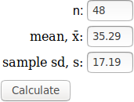
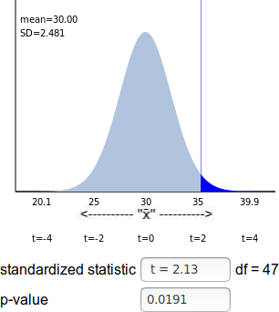
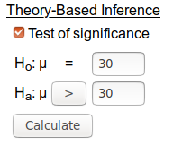

<script type="text/x-mathjax-config">
  MathJax.Hub.Config({ TeX: { extensions: ["color.js"] }});
</script>

```{r setup, include = F}

library(ggplot2)
library(tidyverse)
knitr::opts_chunk$set(dpi=300, message = F, warning = F, echo = F, fig.width = 8, fig.height = 4, out.width = "80%", fig.align = "center", cache = T)
theme_set(theme_bw())
```

# Navigation

.pull-left[
.large[By Date]

- February 4: [start](#4) - [end](#19)

- February 6: [start](#20) - [end](#33)

- February 11: [start](#34) - [end](#62)

]
.pull-right[
.large[By Section]

- [Section 2.1](#4)

- [Section 2.2](#28)

- [Section 2.3](#39)
]

---
## Ch 2 Goals and Overview

- Explain when and why you can (sometimes) think of choosing your sample as a random process
  - When you can, Ch 1 applies
  - When you can't, use caution

- Sections:
  1. How sampling works in practice:    
  Either from a process or a population
  
  2. Quantitative data:    
  how processes work for means
  
  3. Errors and significance:    
  Controlling how often we make a mistake

---
class: inverse,middle,center
# 2.1: Sampling From A Finite Population

---
## Review

**population** - The entire collection of observational units we are interested in

.center[.large[population -> parameter]]
<br/><br/>
**sample** - The subset of the population on which we record data


.center[.large[sample -> statistic]]

--
***

Up until now, we have sampled data using a **process** (coin flips, etc.). 

Now, we're going to be sampling from a **population** of individuals; we'll record data about those individuals instead of the outcome of the process.

---
## Example 2.1 - Sampling Students

Data from "College of the Midwest" for all students enrolled in Spring 2011. 

Table 2.1: Data table of College of the Midwest

Student ID | Cumulative GPA | On campus?
---------- | -------------- | ----------
1 | 3.92 | Yes
2 | 2.80 | Yes
3 | 3.08 | Yes
4 | 2.71 | No
5 | 3.31 | Yes
6 | 3.83 | Yes
7 | 3.80 | No
8 | 3.58 | Yes
... | ... | ...

What type of data is this?

---
## Example 2.1 - Sampling Students

Data from "College of the Midwest" for **all students** enrolled in Spring 2011.     
.red[*=> Population data*]

Student ID | Cumulative GPA | On campus?
---------- | -------------- | ----------
 | .red[*quantitative*] | .red[*binary*]
1 | 3.92 | Yes
2 | 2.80 | Yes
3 | 3.08 | Yes
4 | 2.71 | No
5 | 3.31 | Yes
6 | 3.83 | Yes
... | ... | ...

A **data table** stores each observation in one row, and each variable in a separate column.


---
## Example 2.1 - Sampling Students

The entire **population** for College of the Midwest is 2919 students. We can use the data from these students to examine the distribution using an applet.

.center[http://www.math.hope.edu/isi/applets.html]

**Histogram** - a graph that summarizes the distribution of a quantitative variable
  - separate the data into bins
  - bar height = number of observations in the bin. 
  - bar width = limits of the bin

**Parameters** - numerical summaries of the population

---
## Sampling Methods

We usually don't get to conduct a census (e.g. collect data from the whole population). Instead, statisticians sample from the population.

A **representative sample** is a sample collected that is similar to the results we would find in the entire population

--

****
Suppose the researcher only has time to collect data on a sample of students. The researcher asks the first 30 students he finds on campus one morning whether he or she lives on campus.

Is this sample **representative**? Discuss in your groups.


---
## Sampling Methods

A **convenience sample** is a nonrandom sample of a population

What could the researcher have done instead to obtain a representative sample?

Why should we worry about whether or not the sample is not representative?

--

**Bias**: A sampling method is biased if the statistics from the samples consistently over-estimates or consistently under-estimates the population parameter of interest.

---
## Biased Sampling

In 1948, major polling operations were using a technique called "quota sampling", where each interviewer was given a certain number of individuals in a demographic to interview (e.g. 7 white men living in rural areas). Interviewers were free to choose anyone who met the criteria to be part of the sample. 

Data were collected until the amount of data collected matched statistics about the nation as a whole (race, gender, above/below 40, etc.).

Is this sampling method representative? Is it random?

---
## Biased Sampling

Gallup conducted a poll on the presidential election using this method and determined that approximately 50% of the vote was for Thomas Dewey, 44% for Harry Truman, and 6% for third-party candidates Strom Thurmond and Henry Wallace.

The lead in the polls was so big, the Chicago Daily Tribune printed the headlines before the election results were in.

.center[

]

---
## Biased Sampling

Later investigations of quota sampling found that there were two main problems with the method:

1. Interviewers could choose the people who they interviewed    
.red[lack of randomness]

2. You can always add more demographic characteristics, leading to ever more strict rules for who can be sampled.    
.red[hard to get a truly representative sample]

The biggest problem, however, was that quota sampling had a clear tendency to overestimate the Republican vote.    
.red[The quota sampling method was **biased** in favor of Republicans.]


---
## Sampling Methods

A **simple random sample** is a sample that ensures that every group of size $n$ is equally likely to be the sample selected from the population

How do you take a simple random sample from a population?

- Sampling Frame: a list of all individuals (observational units) in a population

- Computer randomly selects $n$ individuals in the sampling frame

If not all individuals in the population can be included in the sampling frame, the resulting random sampling can be biased.

***
Bias in random sampling methods:
- 2010 Pew Research Study: [Landline only polls](https://www.pewresearch.org/2010/11/22/the-growing-gap-between-landline-and-dual-frame-election-polls/) are biased
- 2017 Pew Research Study: [Low response rates](https://www.pewresearch.org/methods/2017/05/15/what-low-response-rates-mean-for-telephone-surveys/) cause bias on some topics, but not others

***

In both cases, not all individuals in the population are equally likely to be included in the sample.

---
## Example 2.1: Simple Random Sample
A simple random sample of 30 students gives us the following data:

```{r, results = 'asis'}
set.seed(1987082111)
pop_data <- read_tsv("http://www.isi-stats.com/isi/data/chap3/CollegeMidwest.txt") %>%
  mutate(ID = 1:n()) %>% select(ID, GPA=CumGpa, OnCampus)
sample <- sample_n(pop_data, 30) %>%
  mutate(blank = "   ")
sample_format <- bind_cols(sample[1:10,], sample[11:20,], sample[21:30,]) %>%
  set_names(rep(names(sample), times = 3)%>% str_remove_all("blank") )
knitr::kable(sample_format[,1:11], "html", table.attr="class='small'")
```

Statistics: 
- Sample average of cumulative GPA $\overline{x} = `r mean(sample$GPA)`$
- Sample proportion of on-campus students $\hat p=`r sprintf("%.03f", mean(sample$OnCampus == "Y"))`$

---
## Sampling

**Sampling Variability** - variability from sample to sample

What if we take multiple samples of size 30 from the  population?

- Each SRS will give us different values for the statistics

- What happens if we take 1000 different SRS? (long run pattern)

---
## Exploration 2.1 - Sampling Words

Select a representative set of 10 words from the passage by circling them with your pen or pencil

.small[
> Four score and seven years ago our fathers brought forth on this continent a new nation, conceived in liberty, and dedicated to the proposition that all men are created equal.
Now we are engaged in a great civil war, testing whether that nation, or any nation so conceived and so dedicated, can long endure. We are met on a great battlefield of that war. We have come to dedicate a portion of that field, as a final resting place for those who here gave their lives that that nation might live. It is altogether fitting and proper that we should do this.

> But, in a larger sense, we cannot dedicate, we cannot consecrate, we cannot hallow this ground. The brave men, living and dead, who struggled here, have consecrated it, far above our poor power to add or detract. The world will little note, nor long remember what we say here, but it can never forget what they did here. 

> It is for us the living, rather, to be dedicated here to the unfinished work which they who fought here have thus far so nobly advanced. It is rather for us to be here dedicated to the great task remaining before us that from these honored dead we take increased devotion to that cause for which they gave the last full measure of devotion that we here highly resolve that these dead shall not have died in vain that this nation, under God, shall have a new birth of freedom and that government of the people, by the people, for the people, shall not perish from the earth.

]

---
## Exploration 2.1 - Sampling Words

Record each word from your sample and indicate the length of the word (# letters) and whether or not it contains at least one letter $e$.

<table width="100%">
<tr><th></th><th>Word</th><th>Length</th><th>Contains e? (Y/N)</th></tr>
<tr><td>1</td><td></td><td></td><td></td></tr>
<tr><td>2</td><td></td><td></td><td></td></tr>
<tr><td>3</td><td></td><td></td><td></td></tr>
<tr><td>4</td><td></td><td></td><td></td></tr>
<tr><td>5</td><td></td><td></td><td></td></tr>
<tr><td>6</td><td></td><td></td><td></td></tr>
<tr><td>7</td><td></td><td></td><td></td></tr>
<tr><td>8</td><td></td><td></td><td></td></tr>
<tr><td>9</td><td></td><td></td><td></td></tr>
<tr><td>10</td><td></td><td></td><td></td></tr>
</table>

---
## Exploration 2.1 - Sampling Words

Individually, do questions 4-9 before Thursday. Upload your answers to Canvas by Thursday at 3:30 pm. 

We will use google sheets on Thursday to collect and combine your results

---
class:center,middle,inverse
## Review

---
## Review - Section 2.1

- **population** - entire collection of observational units

- **sample** - subset of data

- **parameters** - numerical summary of the population

- **statistics** - numerical summary of the sample

---
## Review
- What is sampling?
<br/><br/>

- Why do we sample? What is the goal?
<br/><br/>

- What makes a sample good or bad?

---
## Review

- **Representative** - data from a sample will be similar to results from the population

- **Bias** - statistics that consistently over/under estimate the population parameter, based on sampling method; occurs when not taking a representative sample

---
## Review

- **Convenience sample** - a nonrandom sample of a population

- **Simple Random Sample** - every member of the population has equal probability of being chosen. To do this, you have to define (and list) the entire population.

- **Sampling frame** - List of individuals in a population, used when choosing a random sample
  - What might be the sampling frame to sample UNL students?

  - How might we select a SRS of everyone in the entire state?
  
---
## Exploration 2.1

Answer Question 10 here: https://forms.gle/8vCzyVAxLGLx84hH6

---
## Exploration 2.1

Answer Question 17 here: https://forms.gle/UxaVigrMn1gpVpaD7

Turn in answers to 10-19 on Canvas by Monday at 6pm. I will post the graphs shown in class on Canvas.

---
## Review
### New Symbols

- Sample mean: .underline[.hidden[xbarx]]

- Sample standard deviation: .underline[.hidden[sxxxx]]

- Population mean: .underline[.hidden[muxxx]]

- Population standard deviation: .underline[.hidden[sigma]]

---
## Review
### New Symbols

- Sample mean: $\overline{x}$

- Sample standard deviation: $s$

- Population mean: $\mu$

- Population standard deviation: $\sigma$

---


class:center,middle,inverse
# 2.2: Inference on a Single Quantitative Variable

---
## Introduction
In Ch 1, we used categorical/binary data...

Inference: 
- Simulation (3 S's strategy)
- Standardized Statistics / p-values
- Theory based approximations

Now, we're going to shift to **quantitative** variables with the hopes of learning about the **population mean**


---
## Testing with means

Variable of interest is now **quantitative**
  - number of emails in a day
  - amount of money spent Christmas shopping
  - temperature

Parameter is the population mean $\mu$

Null and Alternative Hypotheses:
<br/><br/>
$H_0: \mu = a$    
$H_A: \mu > a \text{, or } H_A: \mu < a \text{, or } H_A: \mu \neq a$

Tests have the same interpretation and conclusions using p-values and standardized statistics

---
## Describing Distributions

Quantitative variables can be distributed in more interesting ways...

### Shape
Rounding effects (very common in human-recorded data)

```{r rounding}
tbl <- tibble(x = runif(100, 0, 10), y = rbernoulli(100, .6), z = ifelse(y, round(x), x))
ggplot(tbl, aes(x = z)) + geom_histogram(binwidth = .25) + scale_x_continuous("", breaks = 0:10) + 
  scale_y_continuous("# samples") + theme(axis.title.x = element_blank())
```


---
## Describing Distributions

Quantitative variables can be distributed in more interesting ways...

### Shape


---
## Describing Distributions
### Center

If skew is shifting the mean, we might use another measure of center

- **median** - the middle number when the data values are sorted from smallest to largest

- **mode** - the most common value

We usually use the median when the mean is not appropriate

---
## Describing Distributions
### Variability

The standard deviation of a binary variable is generally fixed; with quantitative variables, there is much more freedom.

```{r}
if ("DAAG" %in% installed.packages()) {
  data(cerealsugar, package = "DAAG")
data(cuckoos, package = "DAAG")
data(Fair, package = "Ecdat")
data(measles, package = "DAAG")
} else {
  cerealsugar <- read_csv("../data/cerealsugar.csv")$x
  measles <- read_csv("../data/measles.csv")$x
  cuckoos <- read_csv("../data/cuckoos.csv")
  Fair <- read_csv("../data/fair.csv")
}

tbl <- bind_rows(
  tibble(x = cerealsugar, set = "% Sugar in  Breakfast Cereal"),
  tibble(x = filter(cuckoos, species == "meadow.pipit")$length, set = "Length of Meadow Pipit"),
  tibble(x = Fair$nbaffairs, set = "Number of Extramarital Affairs"),
  tibble(x = as.numeric(measles) %>% ifelse(is.na(.), 0, .), set = "Deaths in London from Measles")
)
ggplot(data = tbl, aes(x = x)) + facet_wrap(~set, scales = "free") + geom_histogram() 
```

---
## Describing Distributions
### Unusual Observations

- Unusual observations are called **outliers**

- Some extreme values can impact our summary statistics (e.g. mean, standard deviation)

- A summary statistic is called **resistant** if its value does not change much when extreme observations are removed from the data set

- The median is a resistant summary statistic

---
## Describing Distributions
## Example

```{r}
df <- tibble(n_states = 0:43,
    count = c(0, 2, 1, 5, 2, 10, 5, 5, 3, 3, 1, 4, 1, 1, 3, 1, rep(0, 9), 1, 0, 0, 0, 0, 1, rep(0, 12), 1)) %>%
  filter(count > 0) %>%
  mutate(lines = purrr::map(count, ~rep(1, .))) %>%
  unnest(lines)

df %>%
  ggplot(aes(x = n_states)) + geom_dotplot(binwidth = 1, dotsize = .8) + 
  theme(axis.title.y = element_blank(), axis.ticks.y = element_blank(), axis.text.y = element_blank()) + 
  scale_x_continuous("Number of US states visited")
```

This distribution is skewed right

Median is .underline[.hidden[`r median(df$n_states)`]]

What if 43 is a typo and it should be 34?

---
## Inference of Quantitative Data

- Simulations
  - Get many samples of the same sample size from the population
  - Create a null distribution using the average of each simulated sample
  
- Find p-value by evaluating how our sample statistic relates to the null distribution
  
- Null distribution is centered at the value of the population mean according to the null hypothesis

- Review how the sample size affected the null distribution

- Simulations are difficult


---
## Theory-Based Inference for Quantitative Data
- The principles from categorical data carry over to quantitative data

- Using theory-based methods, the standard deviation of the sample mean is calculated to be 
$$s = \frac{\sum_{i=1}^n{(x_i-\overline x)^2}}{n-1}$$


Remember, $\sigma$ is the standard deviation of the population

$\sigma$ is a parameter


---
## Standardized Statistic

Remember, the general template is

$\displaystyle z = \frac{statistic - parameter_{H_0}}{\sigma}$

Oftentimes, we don't know $\sigma$, which is fine because we can rely on $s$

We can use the standard error in place of $\sigma$

$\displaystyle \frac{s}{\sqrt{n}}$ is the **standard error** (measure of the accuracy of an estimate) of the sample mean

**Standardized Statistic for Chapter 2**

$\displaystyle t = \frac{\overline{x} - \mu_{0}}{\frac{s}{\sqrt{n}}}$

---
## T-statistics vs. Z-statistics
- As with normal approximation, we need a reference distribution
  - Categorical data: find $z$ and compare to a normal distribution
  - Quantitative: use $s$ in place of $\sigma$ -> we can't compare to a normal distribution    
  Instead, we use the $t$ distribution, which is very similar
  
```{r}
tibble(x = seq(-4, 4, .01), z = dnorm(x), t = dt(x, df = 5)) %>%
  pivot_longer(cols = z:t, names_to = "dist", values_to = "dens") %>%
  mutate(dist = str_replace_all(dist, c("z" = "normal"))) %>%
  ggplot(aes(x = x, y = dens, color = dist)) + geom_line() + 
  scale_color_discrete("Distribution") + 
  theme(legend.position = c(1, 1), legend.justification = c(1, 1), legend.background = element_rect(fill = "transparent")) + 
  xlab("Score") + ylab("Density")

```
**Interpretations and conclusions are still the same**

---
## Distributions

Z-Distribution | T-Distribution 
-------------- | ---------------
Categorical data - falls into specific groups; corresponding probabilities | Quantitative Data - numerical values, with mean/averages
Test estimates of population proportions | Test estimates of population mean
**Theory Validity Conditions** <br/> 10 successes and 10 failures | **Theory Validity Conditions** <br/> $n \geq 20$ (sample size)
Can simulate because we have finite groups and/or a known process | Cannot simulate


---
## Significance test - Example 2.2 (Sleep)

From the Theory Based Inference Applet:
- Sample size: $n=21$
- Sample mean: $\overline x=6.69$
- Sample standard deviation: $s = 1.295$

**On a quiz or exam, values or data will be given**

Hypotheses:
- To see if the population average hours of sleep is 8 or is less than 8

Using our sample, we need to find a p-value and a standardized statistic

P-value from Theory based inference Applet: .underline[.hidden[p = 0.0001]]

---
## Significance test - Example 2.2 (Sleep)

**Interpretation** With our p-value of .underline[.hidden[p = 0.0001]], we (reject/fail to reject), because the p-value is (less/greater) than 0.05.

**Conclusion** From our p-value we (do/do not) have enough evidence to conclude that the average hours slept per night for UNL students is significantly below  8 hours.

---
## Standardized Statistic - Example 2.2 (Sleep)

Calculation with Applet values:
- Sample size: $n=21$
- Sample mean: $\overline x=6.69$
- Sample standard deviation: $s = 1.295$

1. Find the standard error: $$\frac{\text{sample std.dev.}}{{\sqrt{\text{sample size}}}} = $$    
We are trying to use the **standard deviation from our one sample** to estimate the standard deviation of the mean for **many samples** of size $n$

2. Input values into S.S. formula
$$t = \frac{\overline x - \mu_0}{\text{standard error}} = $$

---
## Standardized Statistic - Example 2.2 (Sleep)
1. Find the standard error
2. Input values into S.S. formula

3. **Interpretation**: We will .underline[.hidden[reject]] the null because our standardized statistic is .underline[.hidden[-4.635]], which is .underline[.hidden[extremely low]] and provides .underline[.hidden[extremely strong evidence]] to suggest that UNL students get .underline[.hidden[less than]] 8 hours of sleep per night.

4. **Conclusion**: We can use the same conclusion as before, but with the standardized statistic as our reasoning.

---
## Example: Sunscreen
Most dermatologists recommend using sunscreens that have a sun protection factor (SPF) of at least 30. One of the authors wanted to find out whether the SPF of sunscreens used by students at her school (which is in a very sunny part of the US) exceeds this value, on average?

- Identify the variable of interest and whether the variable is categorical or quantitative.

- Describe the author's parameter of interest and assign an appropriate symbol to denote it.

- Write the appropriate hypothesis using symbols


---
## Example: Sunscreen
Most dermatologists recommend using sunscreens that have a sun protection factor (SPF) of at least 30. One of the authors wanted to find out whether the SPF of sunscreens used by students at her school (which is in a very sunny part of the US) exceeds this value, on average?

- Identify the variable of interest and whether the variable is categorical or quantitative.    
.red[SPF of sunscreen used by students at the school]

- Describe the author's parameter of interest and assign an appropriate symbol to denote it.    
.red[average SPF of sunscreen used by all students at the school; $\mu$]

- Write the appropriate hypotheses using symbols
$$H_0: \mu = 30\\H_A: \mu > 30$$

---
## Example: Sunscreen

To collect data, the author surveyed students in her introductory statistics course and found that in a sample of 48 students the average SPF was 35.29 and the standard deviation of the SPF was 17.19

- Assign appropriate symbols to the numbers: 
$$\;\;\;=48\;\;\;\;\;\;\;\;=35.29\;\;\;\;\;\;\;\;=17.19$$

- Is the theory-based approach (one-sample t-test) valid to find a p-value to investigate whether the data provide evidence that the average SPF of sunscreens used by the students at this school exceeds 30? Explain

- Find and report a standardized statistic (t-statistic)

- Use the Theory-Based Inference applet to conduct a one-sample t-test and find a p-value

- State your conclusion from this study based on the p-value, being sure to provide justification for your conclusion.


---
## Example: Sunscreen

To collect data, the author surveyed students in her introductory statistics course and found that in a sample of 48 students the average SPF was 35.29 and the standard deviation of the SPF was 17.19

- Assign appropriate symbols to the numbers: $$n=48\;\;\;\;\;\overline{x}=35.29\;\;\;\;\;s=17.19$$

- Is the theory-based approach (one-sample t-test) valid to find a p-value to investigate whether the data provide evidence that the average SPF of sunscreens used by the students at this school exceeds 30? Explain    
.red[Yes, the theory-based approach is valid. We have more than 20 observations in our sample, which means that we can expect our sample mean to be normally distributed thanks to the central limit theorem.]

- Find and report a standardized statistic (t-statistic) $$t = \frac{\overline{x} - \mu}{\frac{s}{\sqrt{n}}} = \frac{35.29 - 30}{\frac{17.19}{\sqrt{48}}} = `r round((35.29-30)/(17.19/sqrt(48)), 3)`$$

---
## Example: Sunscreen

- Use the Theory-Based Inference applet to conduct a one-sample t-test and find a p-value

.center[
<table class="blank" width="80%"><tr><td></td><td rowspan=2></td></tr><tr><td></td><td></td></tr></table>
]

---
## Example: Sunscreen

- State your conclusion from this study based on the p-value, being sure to provide justification for your conclusion.    
    
.red[We reject the null hypothesis, because p-value = 0.0191 is less than 0.05. We have evidence that the average SPF of sunscreen used by students at this college is higher than 30. ]

---
class:center,middle,inverse
# 2.3: Errors and Significance

---
## Introduction

So far:    
Significance tests are for examining the **strength of evidence** against $H_0$

<br/><br/>
Another approach:    
Significance tests are used to **make a decision** about whether the data provide enough evidence to reject $H_0$

--
***
But decisions imply making mistakes...


---
## Significance and Errors

- How extreme is extreme enough?
  - Changes with the study: the consequences may be different for different types of errors<br/><br/>
  Criminal justice system: 
  > It is better that ten guilty persons escape than that one innocent suffer - William Blackstone
  
- In statistics, we control "extreme enough" with the value where we reject the null, aka. **significance level** or **alpha** ( $\alpha$ )

- Changing $\alpha$ has consequences: 
  - if we increase it (lowering the level of "extreme" necessary to reject), we might find evidence of an effect even though there is only chance. 
  - if we decrease it (we need more evidence to reject), we might fail to reject an effect that is actually there
  
---
## Errors

- Any time we make a decision based on data, a mistake is possible

- In significance tests, there are two types of mistakes we can make:
  - (The effect is really there) and we fail to reject $H_0$
  - (The effect is really not there) and we reject $H_0$

<br/><br/>
  
  <table style="text-align:center;"> <tr><td></td><td></td><td  colspan=2>Reality</td></tr>
  <tr><td style="background-color:#FFFFFF;"></td><td style="background-color:#FFFFFF;"></td><td> $H_0$ is true </td><td> $H_A$ is true </td></tr>
  <tr><td rowspan=2>What we say</td><td> Fail to reject $H_0$ </td><td> Correct decision! </td><td> Missed opportunity<br/>(Type 2 error) </td></tr>
  <tr><td>Reject $H_0$ </td> <td> False alarm<br/>(Type 1 error)</td><td> Correct decision!</td></tr></table>
  
---
## Errors
- Helper toy example: Do more than half the babies pick the helper toy? 
$$H_0: \pi = 0.5 \;\;\;\; H_A: \pi > 0.5$$

- We can simulate 100 reps of 16 babies assuming the null:
```{r, fig.width = 8, fig.height = 4}
tbl <- tibble(helper = rbinom(100, 16, .5), extreme = helper >= 14)
ggplot(tbl, aes(x = helper, fill = extreme)) + geom_dotplot(method="dotdensity", binwidth = 1, dotsize = 0.8) + coord_flip() + annotate("segment", x = 13.5, xend = 13.5, y = 0, yend = 1) + scale_x_continuous(breaks = (0:8)*2) + theme(axis.title.x = element_blank(), axis.ticks.x = element_blank(), axis.text.x = element_blank())
```

- Is this strong evidence against the null?

- Enough evidence to reject?

  
---
## Errors

- Usual threshold is $\alpha = 0.05$    
**What that actually means**: we are ok with making a type 1 error 5% of the time

- We can choose something other than 5% $(\alpha = 0.05)$

- What if $\alpha = .10$?
  - 10% of the time we will reject a true null hypothesis (in the long run)

- The only thing that changes in our procedure is that we're deciding the cutoff for rejecting; it might be something other than 5%.

- Where do we draw the line?
  - How small does $p$ have to be?
  - Field dependent
  - Consequences dependent: Would you want a lower p-value for 
      - deciding whether someone should be executed,     
      or for 
      - deciding whether someone should get a sticker?
  
---
## Types of Error

**Type 1 Error** - reject the null hypothesis when $H_0$ is actually true
- False alarm - believe we have discovered a difference when no difference exists
- i.e. Students at UNL use sunscreen that is on average 30 spf, but we said it was more.

**Type 2 Error** - fail to reject $H_0$, but in reality, $H_0$ is actually false
- Missed opportunity - failing to detect a difference that is there
- i.e. UNL students use sunscreen that is over 30 spf, but we did not reject the null hypothesis of $\mu = 30$

---
## Reality
- We never actually know whether we've made an error

- We can control what we want to happen (depending on discipline)

- **Significance level** is the probability of Type 1 error
  - Smaller $\alpha$ = less likely to make a Type 1 error
  - Trade off: more likely to make a Type 2 error

- **Power** is the probability of rejecting a false null hypothesis
  - We want to reject when the null is not true
  - We want our tests to be as powerful as possible

---
## Reality
  <table style="text-align:center;"> <tr><td></td><td></td><td  colspan=2>Reality</td></tr>
  <tr><td style="background-color:#FFFFFF;"></td><td style="background-color:#FFFFFF;"></td><td> $H_0$ is true </td><td> $H_A$ is true </td></tr>
  <tr><td rowspan=2>What we say</td><td> Fail to reject $H_0$ </td><td> Correct decision! </td><td> Missed opportunity<br/>(Type 2 error) </td></tr>
  <tr><td>Reject $H_0$ </td> <td> False alarm<br/> 
<span style="font-weight:bold;">(Type 1 error)</span> </td><td> Correct decision!<br/> 
<span style="font-weight:bold;">Power</span> </td></tr></table>

---
## Example

You are sitting on a jury and must decide whether the defendant is innocent or guilty. If they are guilty, they will go to jail.

- Hypothesis (in words):
  - $H_0:$
  - $H_A:$

- Errors:
  - Type 1: 
  - Type 2: 

- Which error would be worse?

- Significance level: 

- How should we adjust our significance level?

---
## Example

You are sitting on a jury and must decide whether the defendant is innocent or guilty. If they are guilty, they will go to jail.

- Hypothesis (in words):
  - $H_0:$ .red[The defendant is innocent]
  - $H_A:$ .red[The defendant is guilty]

- Errors:
  - Type 1: .red[Send the defendant to jail when they are innocent]
  - Type 2: .red[Let a guilty person go free]

- Which error would be worse? .red[In common law jurisdictions, it is seen as worse to send an innocent person to jail.]

- Significance level: .red[Percent of time that you send an innocent person to jail]

- How should we adjust our significance level? .red[(If it's worse to send an innocent person to jail) we would want to decrease our significance level] $\alpha$ .red[so that the probability of sending an innocent person to jail is lower.]

---
## Example

You need to decide whether to bring your umbrella with you tomorrow

- Hypothesis (in words):
  - $H_0:$ 
  - $H_A:$

- Errors:
  - Type 1: 
  - Type 2: 

- Which error would be worse?

- Significance level: 

- How should we adjust our significance level?

---
## Example

You need to decide whether to bring your umbrella with you tomorrow

- Hypothesis (in words):
  - $H_0:$ .red[It will not rain tomorrow (I should leave the umbrella at home)]
  - $H_A:$ .red[It will rain tomorrow (I should bring my umbrella)]

- Errors:
  - Type 1: .red[Bringing your umbrella even though you don't need it]
  - Type 2: .red[Getting rained on with no umbrella]

- Which error would be worse?

- Significance level: .red[Proportion of the time you are stuck carrying an umbrella when it's not raining?]

- How should we adjust our significance level?

---
## Errors

The most important thing about errors is when they occur

- Type 1 errors only occur if you reject $H_0$
- Type 2 errors only occur if you fail to reject $H_0$

Common quiz/test question: 

Draw a conclusion for a study and determine which type of error you may have made.
