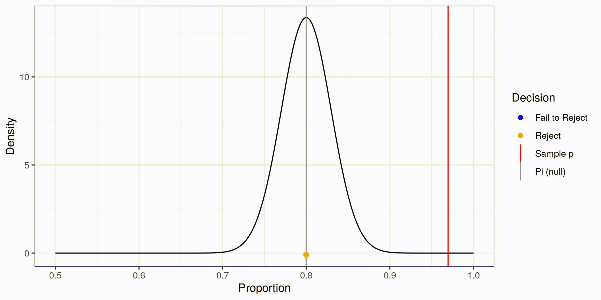
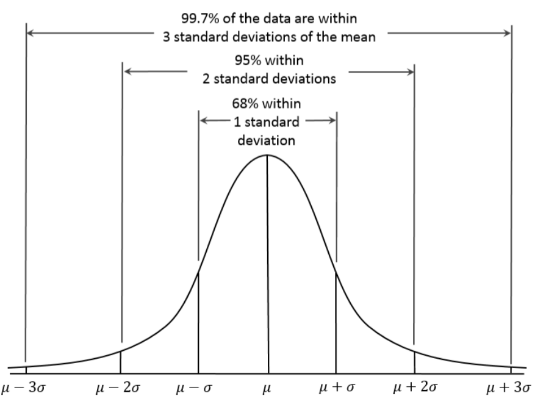
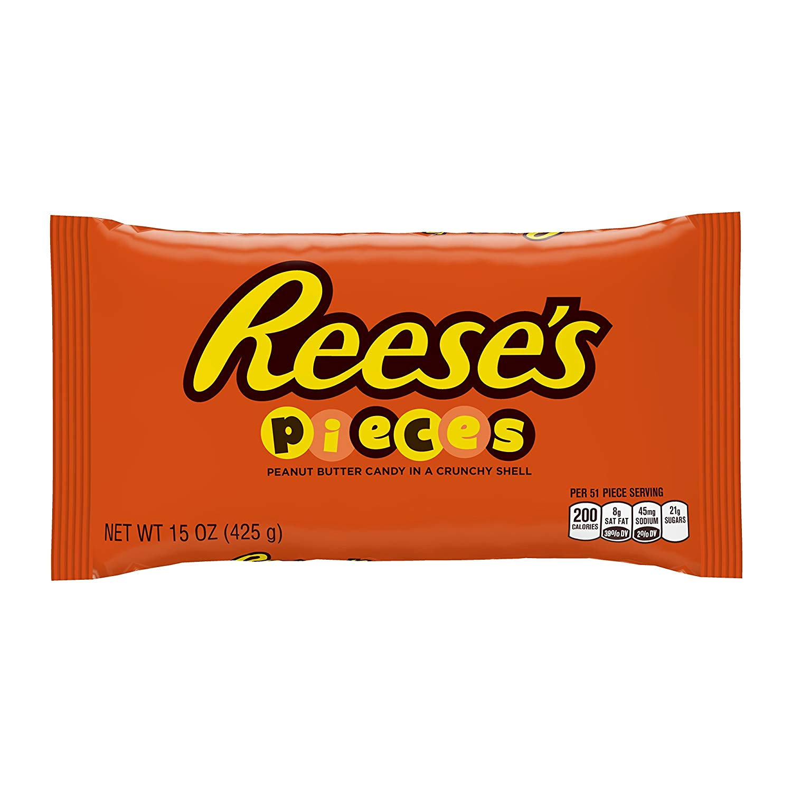

<script type="text/x-mathjax-config">
  MathJax.Hub.Config({ TeX: { extensions: ["color.js"] }});
</script>

```{r setup, include = F}

library(ggplot2)
library(tidyverse)
knitr::opts_chunk$set(dpi=300, message = F, warning = F, echo = F, fig.width = 8, fig.height = 4, out.width = "80%", fig.align = "center", cache = T)
theme_set(theme_bw())
```

# Navigation

.pull-left[
.large[By Date]

- February 18: [start](#3) - [end](#14)
- February 20: [start](#15) - [end](#31)
- February 25: [start](#32) - [end](#49)
- February 27: [start](#50) - [end](#57)

]
.pull-right[
.large[By Section]
- 3.1: [start](#3) - [end](#15)
- 3.2: [start](#16) - [end](#36)
- 3.3: [start](#37) - [end](#49)
- 3.4: [start](#50) - [end](#57)
]

---
class:inverse,middle,center
# 3.1: Statistical Inference: Confidence Intervals

---
## Introduction

- So far, we have been looking at whether our parameter may be equal to a value or if it is equal to something else

- Other ways to find the parameter?
  - Range of values?    
  <br/><br/>
  
  

---
## Confidence Intervals

When we fail to reject our null hypothesis...    
Conclusion: Null hypothesis value is .underline[.hidden[plausible]]

- We could do multiple two-sided tests to find which null hypothesis values are plausible and which are unlikely

- This sets up an interval of values that could be our parameter rather than just a single estimate

---
## Confidence Intervals

When we fail to reject our null hypothesis...    
Conclusion: Null hypothesis value is .underline[.red[plausible]]

- We could do multiple two-sided tests to find which null hypothesis values are plausible and which are unlikely

- This sets up an interval of values that could be our parameter rather than just a single estimate

.center[

]

---
## Example 3.1 - Dogs Smell Cancer

Can dogs sniff out cancer? Marine the labrador was presented with a bag breathed into by a colorectal cancer patient. Then, she was shown 5 bags, one from a colorectal cancer patient and 4 from controls who did not have cancer. This procedure was repeated 33 times. 

- What is the experimental unit?

- What is $n$?

- What are the hypotheses?

---
## Example 3.1 - Dogs Smell Cancer

Marine guessed correctly in 32/33 trials.  $\hat p = .969$ 

- Test the hypothesis that $\pi = 0.2$ (random chance)    
<br/><br/><br/>

--

- Test the hypothesis that $\pi = 0.7$    
<br/><br/><br/>


--

- Test the hypothesis that $\pi = 0.85$    
<br/><br/><br/>


---
## Example 3.1 - Dogs Smell Cancer

By row, each group should test the following value:

Row | Hypothesized value | Accept/reject
--- | ------------------ | -------------
A | 0.75 | 
B | 0.78 | 
C | 0.81 |
D | 0.84 |
E | 0.87 |
F | 0.90 |
G | 0.93 |
H | 0.96 |
 | 1.0 | 

---
## Visual Confidence Interval

```{r, ffmpeg.format='gif', fig.show='animate', dev = "jpeg", dpi = 300}

show_p_test <- function(idx, ptest, sample_p = 32/33, sample_n = 33) {
  ps <- seq(.5, 1, .001)
  se <- sqrt((sample_p*(1 - sample_p))/sample_n)
  ptestres <- pnorm(32/33, ptest, se, lower.tail = F) * 2
  ptestbin <- factor(c("Reject", "Fail to Reject")[1 + as.numeric(ptestres > 0.05)], levels = c("Reject", "Fail to Reject"))
  
  dlow <- ptest[idx] - abs(ptest[idx] - sample_p)
  dhigh <- ptest[idx] + abs(ptest[idx] - sample_p)

  plot <- ggplot() + geom_line(aes(x = ps, y = dnorm(ps, mean = ptest[idx], sd = se))) +
    geom_area(aes(x = ps[ps <= dlow], y = dnorm(ps[ps <= dlow], mean = ptest[idx], sd = se)), fill = "grey") + 
    geom_area(aes(x = ps[ps >= dhigh], y = dnorm(ps[ps >= dhigh], mean = ptest[idx], sd = se)), fill = "grey") + 
    geom_vline(aes(xintercept = ptest[idx], color = factor("Pi (null)", levels = c("Fail to Reject", "Reject", "Sample p", "Pi (null)")))) +
    geom_vline(aes(xintercept = sample_p, color = "Sample p")) +
    geom_point(aes(x = ptest[1:idx], y = -.1, color = ptestbin[1:idx]), size = 2) + 
    scale_colour_manual("Decision", values = c("Sample p" = "red", "Reject" = "orange", "Fail to Reject" = "blue", "Pi (null)" = "grey60"), na.val = "grey", drop = F) + 
    scale_y_continuous("Density") + scale_x_continuous("Proportion") + 
    guides(color = guide_legend(override.aes= list(linetype = c(0, 0, 1, 1), shape = c(16, 16, NA, NA))))
  print(plot)
}
ptest <- seq(.8, 1, .015)
steps <- length(ptest)
purrr::walk(1:steps, show_p_test, ptest = ptest)

```

- Wherever we fail to reject is an interval of plausible values for $\pi$

- 95% confidence interval for $\pi$ interpretation:    
We are 95% confident that our true parameter value falls within our confidence interval

- Found by obtaining parameter values that fail to be rejected by a two-sided test of significance with 0.05 level

---
## Changing Significance Level

- We've been rejecting tests with significance level 0.05

- If we change and reject at 0.01 instead, what happens?

  - we reject $H_0$ when it is true 1% of the time
  - p-values have to be smaller before we reject<br/><br/>
--

.red[Thus, we're rejecting] $H_0$ .red[less frequently]    
If our p-value is 0.03, we would have rejected at $\alpha = 0.05$ but now we fail to reject
<br/><br/>
--

  - What happens to the interval? <br/><br/>
--

.red[It gets wider]

---
## Changing Significance Level

- As significance level $\alpha$ goes down...
  - We reject less often
  - We fail to reject more often
  - We have more plausible values
  - Our confidence interval is wider

- As significance level $\alpha$ increases...
  - We reject more often
  - We fail to reject less often
  - We have fewer plausible values
  - Our confidence interval is narrower

- *Confidence level* **increases** when *significance level* **decreases**

---
## Example: Lottery tickets

We want to try to win the lottery and have to decide how many tickets to buy. 

To be more confident that we will win, should we buy more tickets or less tickets?

--

.red[More confidence -> need to buy more tickets to have a higher chance of winning]

--

When we're constructing a confidence interval, we need to include more values in the interval to have higher confidence.

---
## Exploration 3.1

Most people are right-dominant. In a study reported in Nature (2003), researchers showed that couples tend to lean their heads to the right while kissing. The researchers observed kissing couples in various public places and recorded which direction their heads tilted, excluding any couples who were holding objects that might affect the direction they turned. They observed that 80 of 124 couples leaned their heads to the right.

In groups, identify the observational units, variable of interest, and whether the variable is categorical or quantitative. 

Work through questions 3-13 from the exploration in groups, then discuss questions 14-18. Upload the pdf of your responses as a group.


---
## Section 3.1 Summary

- "Simulating" confidence intervals
  - Trying many different parameter values
  - Testing: which ones do we reject (not plausible), and which ones do we fail to reject? (plausible value)

- What level we reject at dictates our "Confidence Level"
  - Significance level + Confidence level = 1
  - Reject less than 0.05, 95% Confidence level
  - Reject less than 0.10, 90% Confidence level
  - Which one is wider?
  
- Connection between p-value and confidence interval
  - Significance level + Confidence level = 100%

---
class:center,middle,inverse
# 3.2: 2SD and Theory-Based Confidence Intervals For a Single Proportion


---
## Theory Based Method

- We do not want to plug in those parameter values every time we want an interval

- Method boils down to one idea:     
We're finding a set of plausible values for the parameter centered around the .underline[.hidden[sample mean]] and adding some wiggle room around it.    
<br/><br/>

- The wiggle room is known as the .underline[.hidden[margin of error]]

---
## Theory Based Method

- We do not want to plug in those parameter values every time we want an interval

- Method boils down to one idea:     
We're finding a set of plausible values for the parameter centered around the .underline[.red[sample mean]] and adding some wiggle room around it.    
<br/><br/>

- The wiggle room is known as the .underline[.red[margin of error]]

---
## Confidence Interval

So the basic set up for our confidence interval is:
$$\text{Sample statistic}\pm \text{margin of error}$$

Margin of error is based on two values:

1. The .underline[.hidden[standard deviation]] of the sample statistic    
<br/><br/>

2. A .underline[.hidden[multiplier]] reflecting the confidence level we want    
<br/><br/>

Thus the margin of error is...

---
## Confidence Interval

So the basic set up for our confidence interval is:
$$\text{Sample statistic}\pm \text{margin of error}$$

Margin of error is based on two values:

1. The .underline[.red[standard deviation]] of the sample statistic    
<br/><br/>

2. A .underline[.red[multiplier]] reflecting the confidence level we want    
<br/><br/>

Thus the margin of error is...


---
## Multiplier

- The multiplier is based on the confidence level (Sec 3.1)

- For a .underline[.hidden[higher]] confidence level, the multiplier must get bigger
  - Want a .underline[.hidden[wider]] interval to cover more plausible values

  
- For a .underline[.hidden[lower]] confidence level, the multiplier will be smaller

  - Leads to a .underline[.hidden[narrower]] interval
  
  - But we don't have as much confidence
  
---
## Multiplier

- The multiplier is based on the confidence level (Sec 3.1)

- For a .underline[.red[higher]] confidence level, the multiplier must get bigger
  - Want a .underline[.red[wider]] interval to cover more plausible values

  
- For a .underline[.red[lower]] confidence level, the multiplier will be smaller

  - Leads to a .underline[.red[narrower]] interval
  
  - But we don't have as much confidence
  
---
## Multiplier
- We will use a multiplier of $\pm 2$ in this class

- Why?
  - Bell shaped distribution
  - 95% of the distribution captured within 2 standard deviations of the center of the null distribution
  - True parameter will be within two standard deviations of the observed sample statistic in about 95% of samples

- Other confidence levels lead to different multipliers
  
---
## Standard Error in Confidence Intervals

- What standard error did we use for **proportions** within our standardized statistic?

  - But that was when we were testing a hypothesis that gave us a value for $\pi$
  
  - With a confidence interval, we are estimating where $\pi$ is between 0 and 1
  
  - What is our best guess of what $\pi$ is?
  
---
## Standard Error
The __standard error__ is the best guess for how much .underline[**variability**] we have

- SE is the measure of spread of many samples
- must account for how big of a sample we have
- Different from the standard deviation of individual observations within a sample

for proportion data with sample proportion $\hat p$, the SE is $\displaystyle\sqrt{\frac{\hat p (1-\hat p)}{n}}$

---
## Standard Error

- Larger standard error -> 
  - Less precise estimate
  - Harder to pin down "truth"
  - Wider confidence intervals

- Standard error also reflects sample size
  - as $n$  increases, we have more information about the parameter
  - narrower confidence interval
  - SE goes down as $n$ increases
  
---
## Confidence Interval for a Proportion
$$\text{Sample statistic} \pm (Multiplier)\times (\text{Standard Error})$$

- Plug in our sample statistic and standard error for the type of data we have

$$\hat p \pm 2 * \sqrt{\frac{\hat p (1-\hat p)}{n}} = $$
Interpretation: 


---
## Conclusions

- Different interpretation for confidence intervals:    
We are 95% confident that the true value of ... lies between ... and ...

- We can figure out what our p-value would be if we have a confidence interval and a set of hypotheses
  - If the null hypothesis value is INSIDE the interval...    
<br/><br/>
  - If the null hypothesis value is OUTSIDE the interval...
  
---
## Kissing Couples: Exploration 3.1

$\hat p = 0.645$

Our manual interval: (0.56, 0.72)

Standard error: 

<br/><br/>

Using the 2SE method, calculate the confidence interval:


---
## Applet

Use the Theory-Based Inference applet to check that your answer is approximately correct


---
## Comparing other Confidence Levels

Conf Level | Interval
---------- | --------
90% | (0.5745, 0.7159)
95% | (0.5610, 0.7294)
99% | (0.5345, 0.7559)

- Center: sample proportion $\hat p$
- Larger CI -> wider interval
- Notice the 95% interval is close to what we found with the 2 SE method
  - 2 is quick and easy as a multiplier
  - 95% actually uses a multiplier of 1.96

---
## Review

- Confidence Intervals
  - Purpose: to find a range of **plausible** values for our parameter
  
  - General Formula breakdown: .hidden[ $$\text{statistic}\pm \text{multiplier}\times\text{margin of error}$$ ]
  
- Concepts:
  - Where does the CI come from?    
  .hidden[many separate hypothesis tests of different values]
  
  - What affects the width?    
  .hidden[the confidence level and the margin of error]
  
  - How do we know what the p-value will be just from the confidence interval and a set of hypotheses?    
  .hidden[If the interval contains the null hypothesis value, the p-value will be above our significance level. If not, the p-value will be below our significance level.]

---
## Revivew

- Confidence Intervals
  - Purpose: to find a range of **plausible** values for our parameter
  
  - General Formula breakdown: $$\text{statistic}\pm \text{multiplier}\times\text{margin of error}$$
  
- Concepts:
  - Where does the CI come from?    
  .red[many separate hypothesis tests of different values]
  
  - What affects the width?    
  .red[the confidence level and the margin of error]
  
  - How do we know what the p-value will be just from the confidence interval and a set of hypotheses?    
  .red[If the interval contains the null hypothesis value, the p-value will be above our significance level. If not, the p-value will be below our significance level.]
    

---
## Multipliers

The multiplier is a constant that indicates the number of standard deviations in a normal curve. 

The larger the multiplier, the higher the confidence level. 

.pull-left[



].pull-right[.center[

Confidence | Multiplier
---------- | ----------
80% | `r sprintf("%.2f", qnorm(.9))`
90% | `r sprintf("%.2f", qnorm(.95))`
95% | `r sprintf("%.2f", qnorm(.975))`
99% | `r sprintf("%.2f", qnorm(.995))`

]]

The confidence level is the percentage of area under the curve between the two values.

---
## Proportions

- Validity conditions: .hidden[10 observations in each category]

- Standard error: .hidden[$$\sqrt{\frac{\hat p (1 - \hat p)}{n}}$$]

- Confidence interval: (multiplier of 2 for 95% confidence intervals) .hidden[ $$\text{statistic} \pm \text{multiplier}\times\text{standard error} = \hat p \pm 2\sqrt{\frac{\hat p (1 - \hat p)}{n}}$$]

- Interpretation: .hidden[We are 95% confident that the long run proportion of **(context)** falls between **(lower bound)** and **(upper bound)**.] 


---
## Proportions

- Validity conditions: .red[10 observations in each category]

- Standard error: $$\sqrt{\frac{\hat p (1 - \hat p)}{n}}$$

- Confidence interval: (multiplier of 2 for 95% confidence intervals) $$\text{statistic} \pm \text{multiplier}\times\text{standard error} = \hat p \pm 2\sqrt{\frac{\hat p (1 - \hat p)}{n}}$$

- Interpretation: .red[We are 95% confident that the long run proportion of **(context)** falls between **(lower bound)** and **(upper bound)**.] 


---
class:middle,center,inverse
# 3.3: 2SD and Theory-based Confidence Intervals for a Single Mean


---
## Means

- Validity conditions: .hidden[symmetric distribution OR <br/>20 observations + not strongly skewed distribution]

- Standard error: .hidden[$$\frac{s}{\sqrt{n}}$$]

- Confidence interval: (multiplier of 2 for 95% confidence intervals) .hidden[ $$\text{statistic} \pm \text{multiplier}\times\text{standard error} = \bar x \pm 2\frac{s}{\sqrt{n}}$$]

- Interpretation: .hidden[We are 95% confident that the long run average of **(context)** falls between **(lower bound)** and **(upper bound)**.] 


---
## Means

- Validity conditions: .red[symmetric distribution OR <br/>20 observations + not strongly skewed distribution]

- Standard error: $$\frac{s}{\sqrt{n}}$$

- Confidence interval: (multiplier of 2 for 95% confidence intervals) $$\text{statistic} \pm \text{multiplier}\times\text{standard error} = \bar x \pm 2\frac{s}{\sqrt{n}}$$

- Interpretation: .red[We are 95% confident that the long run average of **(context)** falls between **(lower bound)** and **(upper bound)**.] 

---
## What affects the width of a CI

- Confidence Level
  - How often do we reject/fail to reject
  - Lottery example
  - In the formula as the .underline[.hidden[multiplier]]

- Sample size
  - As you know more about the .underline[.hidden[population]], you get closer to knowing the true parameter value
  - Larger sample -> .underline[.hidden[smaller interval]]     
  Smaller sample -> .underline[.hidden[larger interval]]

- Standard error
  - Reflects .underline[.hidden[the variability]] of different samples
  - Highly variable (large SE) = harder to pin down what is "true"
  - Makes sense that **large SEs** lead to .underline[.hidden[wider]] confidence intervals


---
## What affects the width of a CI

- Confidence Level
  - How often do we reject/fail to reject
  - Lottery example
  - In the formula as the .underline[.red[multiplier]]

- Sample size
  - As you know more about the .underline[.red[population]], you get closer to knowing the true parameter value
  - Larger sample -> .underline[.red[smaller interval]]     
  Smaller sample -> .underline[.red[larger interval]]

- Standard error
  - Reflects .underline[.red[the variability]] of different samples
  - Highly variable (large SE) = harder to pin down what is "true"
  - Makes sense that **large SEs** lead to .underline[.red[wider]] confidence intervals

---
## Conclusions about hypotheses

- If the hypothesized mean is inside the interval
  - value is plausible
  - we would fail to reject $H_0$
  - p-value would be greater than significance level

- If the hypothesized mean is outside the interval
  - value is **not** plausible
  - reject $H_0$
  - p-value would be less than significance level
  
---
## Example - Textbook prices

Two Cal Poly students gathered data on prices for a random sample of 30 textbooks from the campus bookstore. They found the average price was $65.02, and the standard deviation of prices was 
$51.42.

  
---
## Example - Textbook prices

Two Cal Poly students gathered data on prices for a random sample of 30 textbooks from the campus bookstore. They found the average price was $65.02, and the standard deviation of prices was 
$51.42.

$\overline x = 65.02$

$s = 51.42$

$n = 30$

\begin{align}\text{statistic} \pm \text{multiplier}\times\text{standard error} &= \bar x \pm 2 s/\sqrt{n} \\\\
&= 65.02 \pm 2\times 51.42/\sqrt{30} \\\\
&= 65.02 \pm 18.776 \\\\
&= (46.24, 83.80)\end{align}

---
## Example - UNL Sleep Data

A 2014 study of 66 UNL students found that on average, participants slept 5.9 hours the night before, with a sample standard deviation of 1.67. 

Construct a confidence interval for the average hours all UNL students slept the night before. Is 7 a plausible value?


---
## Example - UNL Sleep Data

A 2014 study of 66 UNL students found that on average, participants slept 5.9 hours the night before, with a sample standard deviation of 1.67. 

Construct a confidence interval for the average hours all UNL students slept the night before. Is 7 a plausible value?

.red[We are 95% confident that UNL students get, on average, between 5.49 and 6.31 hours of sleep per night. <br/><br/>7 is not a plausible value.]

---
## Example - Skittles

A sample of 154 students were blindly given a single 
**strawberry** Skittles candy to eat. They were told the 5 
possible flavors and asked to identify the one they ate. 

The responses were recorded as follows: 89 strawberry, 23 lime, 
14 lemon, 17 orange, and 11 grape answer. 

Find a 95% confidence interval for the parameter (wanting to see if 
students get it right).


---
## Example - Body Temperature

Normal body temperature is often reported to be $98.6 ^\circ F$. Is that number accurate? Data from 65 healthy females between 18 and 40 years old was collected, and the mean body temperature was  $98.39^\circ F$ with a standard deviation of $1.2$. Construct a 95% confidence interval for the parameter.

---
## Example - College students

A random sample of 97 male college students found that 12 students were left-handed, and the average height was 5.9 feet with a standard deviation of 0.75 feet. Find a 99% confidence interval for the proportion of all male college students that are left-handed.

---
class:center,middle,inverse
# 3.4: Factors That Affect the Width of a Confidence Interval

---

What happens | Background Information | Wider or narrower?
------------ | ---------------------- | -------------------
Confidence level goes up<br/>Significance level goes down<br/> | <br/><br/><br/> | 
Confidence level goes down<br/>significance level goes up<br/> | <br/><br/><br/> |
Sample size goes up | <br/><br/><br/> |  
Sample size goes down | <br/><br/><br/> | 
Sample standard deviation increases | <br/><br/><br/> | 
Sample standard deviation decreases | <br/><br/><br/> |

---


What happens | Reject or Fail to Reject? | p-value is...
------------ | ---------------------- | -------------------
$H_0$ value <br/>inside the interval | <br/><br/><br/><br/><br/><br/> | .hidden[something here to force more room]
$H_0$ value <br/>outside the interval | <br/><br/><br/><br/><br/><br/> |

---
## Confidence Intervals

- Width of a CI is affected by 
  - Sample size (via standard error calculation)
  
  - Sample standard deviation (mean) or sample proportion (via standard error calculation)
  
  - Confidence level (via multiplier)
  
- **Focus**: What does the confidence level actually mean?

---
## Exploration 3.4B
What does it mean to be 95% or 99% confident?

.toprightfig[]

- Reeses candies come in orange, yellow, and brown

- We want to estimate the long-run proportion of orange candies

- **assuming** for now that this proportion, $\pi$, is 0.50

***

- **Question 1** - If you take a sample of 100 Reese's Pieces candies and find the sample proportion of orange, is there any guarantee that the sample proportion will equal 0.50? <br/><br/><br/>

- **Question 2** - Suppose we calculate a confidence interval from this sample proportion. Is there any guarantee that the interval will contain the value 0.50?

---
## Exploration 3.4B

.toprightfig[]

- **Question 3** - Suppose that you select another random sample of 100 Reese's pieces candies. Is there any guarantee that the sample proportion will be the same as for the first sample? Will the confidence interval based on the new sample necessarily be the same as the confidence interval based on the first sample? How do you think they will differ?

---
## Exploration 3.4B

.toprightfig[]

- **Question 4**: Simulating Confidence Interval Applet
  - Find one sample and the confidence interval
  - Record sample proportion, lower bound, and upper bound
  - Is the sample proportion in the interval?
  - Is the long-run proportion in the interval?

- **Question 5**: More sampling...
  - Simulate 99 more samples and intervals
  - At what value is the graph centered?
  - Click red dot, answer questions
  - Click green dot, answer questions
  - Watch what happens to the running total as the sample value goes up
  
- **Question 6**: What happens with 90% intervals? 99% intervals?

---
## Confidence Intervals

- We can take lots of samples... say, 100

- For each sample, find the 95% confidence interval

- We expect 95 of the 100 intervals will contain the true parameter

- This does **NOT** mean the probability that the true parameter is in the confidence interval is 0.95.

