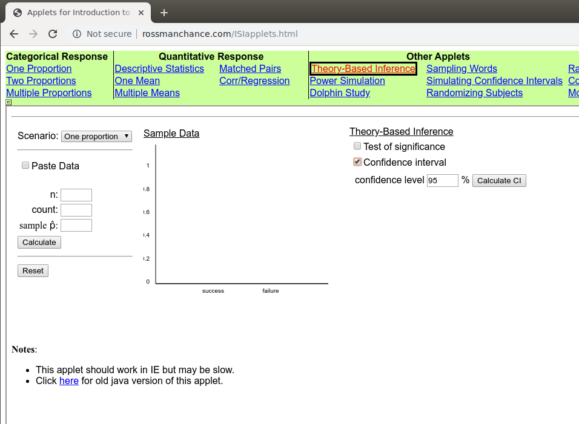

<script type="text/x-mathjax-config">
  MathJax.Hub.Config({ TeX: { extensions: ["color.js"] }});
</script>

```{r setup, include = F}

library(ggplot2)
library(tidyverse)
knitr::opts_chunk$set(dpi=300, message = F, warning = F, echo = F, fig.width = 8, fig.height = 4, out.width = "80%", fig.align = "center", cache = T)
theme_set(theme_bw())
```

# Navigation

.pull-left[
.large[By Date]

- February 18: [start](#3) - [end](#10)

]
.pull-right[
.large[By Section]

]

---
class:inverse,middle,center
# 3.1: Statistical Inference: Confidence Intervals

---
## Introduction

- So far, we have been looking at whether our parameter may be equal to a value or if it is equal to something else

- Other ways to find the parameter?
  - Range of values?    
  <br/><br/>
  
  

---
## Confidence Intervals

When we fail to reject our null hypothesis...    
Conclusion: Null hypothesis value is .underline[.hidden[plausible]]

- We could do multiple two-sided tests to find which null hypothesis values are plausible and which are unlikely
- This sets up an interval of values that could be our parameter rather than just a single estimate

---
## Example 3.1 - Dogs Smell Cancer

Can dogs sniff out cancer? Marine the labrador was presented with a bag breathed into by a colorectal cancer patient. Then, she was shown 5 bags, one from a colorectal cancer patient and 4 from controls who did not have cancer. This procedure was repeated 33 times. 

- What is the experimental unit?

- What is $n$?

- What are the hypotheses?

---
## Example 3.1 - Dogs Smell Cancer

Marine guessed correctly in 32/33 trials.  $\hat p = .909$ 

- Test the hypothesis that $\pi = 0.2$ (random chance)    
<br/><br/><br/>

--

- Test the hypothesis that $\pi = 0.7$    
<br/><br/><br/>


--

- Test the hypothesis that $\pi = 0.85$    
<br/><br/><br/>


---
## Example 3.1 - Dogs Smell Cancer

By row, each group should test the following value:

Row | Hypothesized value | Accept/reject
--- | ------------------ | -------------
A | 0.75 | 
B | 0.78 | 
C | 0.81 |
D | 0.84 |
E | 0.87 |
F | 0.90 |
G | 0.93 |
H | 0.96 |
 | 1.0 | 

---
## Visual Confidence Interval

```{r}

function(ptest) {
  ps <- seq(0, 1, .001)
  se <- sqrt((32/33*1/33)/33)
  dlow <- ptest - abs(ptest - 32/33)
  dhigh <- ptest + abs(ptest - 32/33)
  
  ggplot() + geom_line(aes(x = ps, y = dnorm(ps, mean = ptest, sd = se))) + 
    geom_area()
}

ps <- seq(0, 1, .001)
ph <- .75
se <- sqrt(32/33*1/33/33)
ggplot() + 
  geom_line(aes(x = ps, y = dnorm(ps, mean = ph, sd = se))) + 
  geom_vline(aes(xintercept = 32/33, color = "Sample prop")) +
  geom_point(aes(x = ph, y = 0, color = "reject"))

ph <- .78
ggplot() + 
  geom_line(aes(x = ps, y = dnorm(ps, mean = ph, sd = se))) + 
  geom_vline(aes(xintercept = 32/33, color = "Sample prop")) +
  geom_point(aes(x = .75, y = 0, color = "reject")) +
  geom_point(aes(x = .78, y = 0, color = "reject"))

ph <- .81
ggplot() + 
  geom_line(aes(x = ps, y = dnorm(ps, mean = ph, sd = se))) + 
  geom_vline(aes(xintercept = 32/33, color = "Sample prop")) +
  geom_point(aes(x = .75, y = 0, color = "reject")) +
  geom_point(aes(x = .78, y = 0, color = "reject")) +
  geom_point(aes(x = .81, y = 0, color = "reject"))

ph <- .81
ggplot() + 
  geom_line(aes(x = ps, y = dnorm(ps, mean = ph, sd = se))) + 
  geom_vline(aes(xintercept = 32/33, color = "Sample prop")) +
  geom_point(aes(x = .75, y = 0, color = "reject")) +
  geom_point(aes(x = .78, y = 0, color = "reject")) +
  geom_point(aes(x = .81, y = 0, color = "reject"))

xx <- c(0, 1, 32, 33)
purrr::map_df(seq(0, 1, .01), function(x) tibble(orig = x, p = mean(rbinom(1000, 33, x) %in% xx))) %>%
ggplot() + 
  geom_vline(aes(xintercept = 32/33, color = "Sample proportion")) + 
  geom_point(aes(x = orig, y = 0, color = p < 0.05)) 
  

```

---
## Exploration 3.1

Most people are right-dominant. In a study reported in Nature (2003), researchers showed that couples tend to lean their heads to the right while kissing. The researchers observed kissing couples in various public places and recorded which direction their heads tilted, excluding any couples who were holding objects that might affect the direction they turned. They observed that 80 of 124 couples leaned their heads to the right.

In groups, identify the observational units, variable of interest, and whether the variable is categorical or quantitative. 

---
## Exploration 3.1

The researchers observed that 80/124 couples leaned right.

Let $\pi$ denote the proportion of all kissing couples that turn their heads to the right.

- Is $\pi$ a parameter or a statistic?

- Do we know the value of $\pi$?

- Calculate $\hat p$

- State the hypotheses:


---
## Exploration 3.1

Conduct a simulation for the previously stated hypotheses. Report the p-value and state your conclusion.


---
## Exploration 3.1

We have evidence that the true proportion of couples who lean right is not 0.5. Maybe it's 0.6?

Test $H_0: \pi=0.6$


---
## Exploration 3.1

Suppose we want to estimate the long-run proportion of couples who lean their head to the right while kissing. 

- Would 0.5 be in your 95% confidence interval? Why or why not?

- Would 0.6 be in your 95% confidence interval? Why or why not?

- Use the applet to try different values and determine where the lower and upper cutoffs are for your confidence interval.


---
## Exploration 3.1

.pull-left[
Lower Bound: 

P under $H_0$ | 2-sided p-value | Conclusion
------------- | --------------- | ----------
0.54 | | 
0.55 | | 
0.56 | | 
0.57 | | 
0.58 | | 
0.59 | | 
]

.pull-right[
Upper Bound: 

P under $H_0$ | 2-sided p-value | Conclusion
------------- | --------------- | ----------
0.71 | |
0.72 | |
0.73 | |
0.74 | |
0.75 | |
0.76 | |
]

---
## Exploration 3.1

Interpret your confidence interval in the context of the scenario:


---
## Section 3.1 Summary

- "Simulating" confidence intervals
  - Trying many different parameter values
  - Testing: which ones do we reject (not plausible), and which ones do we fail to reject? (plausible value)

- What level we reject at dictates our "Confidence Level"
  - Significance level + Confidence level = 1
  - Reject less than 0.05, 95% Confidence level
  - Reject less than 0.10, 90% Confidence level
  - Which one is wider?
  
- Connection between p-value and confidence interval
  - Significance level + Confidence level = 100%

---
class:center,middle,inverse
# 3.2: 2SD and Theory-Based Confidence Intervals For a Single Proportion


---
## Theory Based Method

- We do not want to plug in those parameter values every time we want an interval

- Method boils down to one idea:     
We're finding a set of plausible values for the parameter centered around the .underline[.hidden[sample mean]] and adding some wiggle room around it.    
<br/><br/>

- The wiggle room is known as the .underline[.hidden[margin of error]]

---
## Confidence Interval

So the basic set up for our confidence interval is:
$$\text{Sample statistic}\pm \text{margin of error}$$

Margin of error is based on two values:

1. The .underline[.hidden[standard deviation]] of the sample statistic    
<br/><br/>

2. A .underline[.hidden[multiplier]] reflecting the confidence level we want    
<br/><br/>

Thus the margin of error is...


---
## Multiplier

- The multiplier is based on the confidence level (Sec 3.1)

- For a .underline[.hidden[higher]] confidence level, the multiplier must get bigger
  - Want a .underline[.hidden[wider]] interval to cover more plausible values

  
- For a .underline[.hidden[lower]] confidence level, the multiplier will be smaller

  - Leads to a .underline[.hidden[narrower]] interval
  
  - But we don't have as much confidence

---
## Multiplier
- We will use a multiplier of $\pm 2$ in this class

- Why?
  - Bell shaped distribution
  - 95% of the distribution captured within 2 standard deviations of the center of the null distribution
  - True parameter will be within two standard deviations of the observed sample statistic in about 95% of samples
  - Where else do we use $\pm 2$ in this class?

- Other confidence levels lead to different multipliers
  - We will always use 95% in this class
  
---
## Standard Error in Confidence Intervals

- What standard error did we use for **proportions** within our standardized statistic?

  - But that was when we were testing a hypothesis that gave us a value for $\pi$
  
  - With a confidence interval, we are estimating where $\pi$ is between 0 and 1
  
  - What is our best guess of what $\pi$ is?
  
---
## Standard Error
The __standard error__ is the best guess for how much .underline[**variability**] we have

- SE is the measure of spread of many samples
- must account for how big of a sample we have
- Different from the standard deviation of individual observations within a sample

for proportion data with sample proportion $\hat p$, the SE is $\displaystyle\sqrt{\frac{\hat p (1-\hat p)}{n}}$

---
## Standard Error

- Larger standard error -> 
  - Less precise estimate
  - Harder to pin down "truth"
  - Wider confidence intervals

- Standard error also reflects sample size
  - as $n$  increases, we have more information about the parameter
  - narrower confidence interval
  - SE goes down as $n$ increases
  
---
## Confidence Interval for a Proportion
$$\text{Sample statistic} \pm (Multiplier)\times (\text{Standard Error})$$

- Plug in our sample statistic and standard error for the type of data we have

$$\hat p \pm 2 * \sqrt{\frac{\hat p (1-\hat p)}{n}} = $$
Interpretation: 


---
## Conclusions

- Different interpretation for confidence intervals:    
We are 95% confident that the true value of ... lies between ... and ...

- We can figure out what our p-value would be if we have a confidence interval and a set of hypotheses
  - If the null hypothesis value is INSIDE the interval...    
<br/><br/>
  - If the null hypothesis value is OUTSIDE the interval...
  
---
## Kissing Couples: Exploration 3.1

$\hat p = 0.645$

Our manual interval: (0.56, 0.72)

Standard error: 

<br/><br/>

Using the 2SE method, calculate the confidence interval:


---
## Applet

Use the Theory-Based Inference applet to check that your answer is approximately correct



---
## Comparing other Confidence Levels

Conf Level | Interval
---------- | --------
90% | (0.5745, 0.7159)
95% | (0.5610, 0.7294)
99% | (0.5345, 0.7559)

- Center: sample proportion $\hat p$
- Larger CI -> wider interval
- Notice the 95% interval is close to what we found with the 2 SE method
  - 2 is quick and easy as a multiplier
  - 95% actually uses a multiplier of 1.96
  
