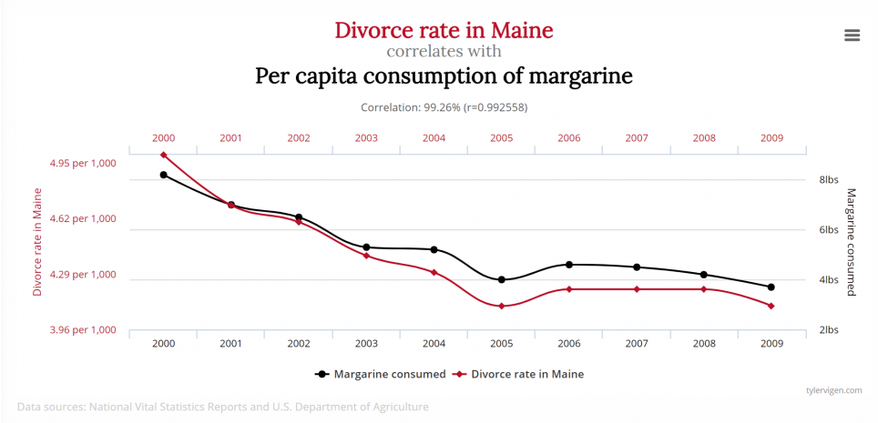
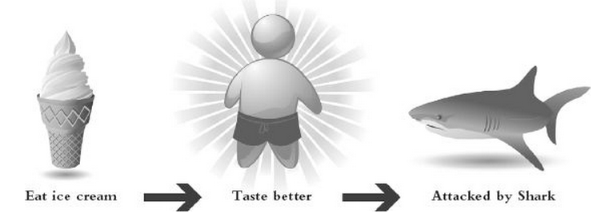
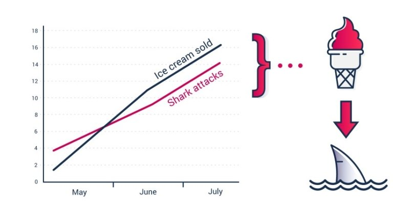
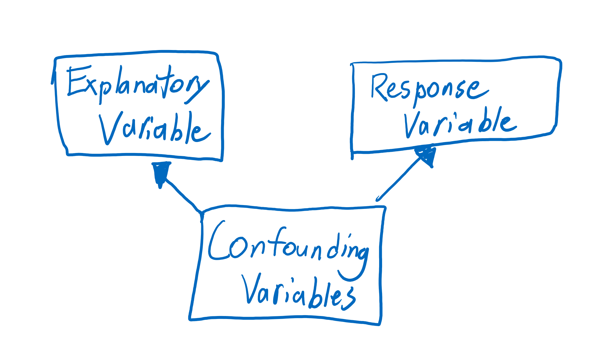
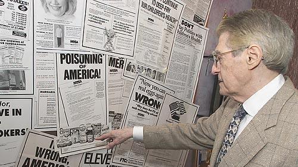
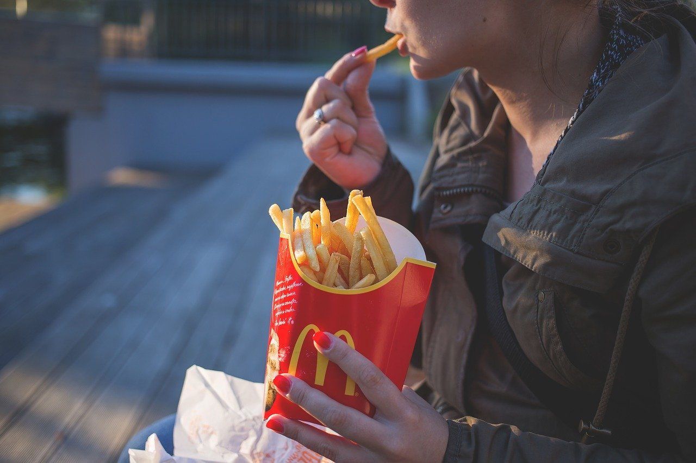

<script type="text/x-mathjax-config">
  MathJax.Hub.Config({ TeX: { extensions: ["color.js"] }});
</script>

```{r setup, include = F}

library(ggplot2)
library(tidyverse)
knitr::opts_chunk$set(dpi=300, message = F, warning = F, echo = F, fig.width = 8, fig.height = 4, out.width = "80%", fig.align = "center", cache = T)
theme_set(theme_bw())
```

# Navigation

.pull-left[
.large[By Date]

- March 3rd: [start](#3) - [end](#10)
- March 5th: [start](#11) - [end](#19)

]
.pull-right[
.large[By Section]
- 4.1: [start](#3) - [end](#10)
- 4.2: [start](#11) - [end](#19)
]

---
class:inverse,middle,center
# 4.1: Association and Confounding


---

## Introduction: Association vs. Causation

- Association (correlation): Two variables are associated, or related, if the value of one variable gives you information about the value of the other variable.

  - When comparing groups, this means that the proportions or means take on different values in the different groups.
  
  - Or as one variable decreases, the other variable may decrease too. We'll see other examples in chapter 10. 

<!-- Show some pictures of what this looks like graphically -->

```{r association-pics, fig.width = 2.5, fig.height = 2.625, out.width = "32%", fig.show = "hold", out.extra='style="display:inline-block;"'}
tibble(group = rep(c("A", "B"), each = 2),
       resp = rep(c(1, 2), times = 2),
       prop = c(.5, .5, .3, .7)) %>%
  ggplot(aes(x = group, fill = factor(resp), weight = prop)) + geom_bar(position = "stack") + theme(axis.title = element_blank(), axis.text = element_blank()) + scale_fill_manual(values = c("orange", "purple"), guide = F) + ggtitle("Difference in Proportions")
tibble(group = rep(c("A", "B"), each = 100), 
       obs = c(rnorm(100, 5, 1), rnorm(100, 3, 1))) %>%
  ggplot(aes(x = group, y = obs, color = group)) + geom_jitter() + geom_boxplot(fill = "white", alpha = .5) + theme(axis.title = element_blank(), axis.text = element_blank()) + scale_color_manual(values = c("orange", "purple"), guide = F) + ggtitle("Difference in Means")
tibble(x = seq(-5, 5, length.out = 100) + rnorm(100, 0, .2),
       y = x + rnorm(100, sd = 1)) %>%
  ggplot(aes(x = x, y = y)) + geom_point() + theme(axis.title = element_blank(), axis.text = element_blank()) + ggtitle("Linear Association")
```

---

## We Record Two Variables Now  
- Explanatory Variable(s): variable(s) that may explain the change in the variable of interest.
  - Called the independent variable. 

- Response Variable(s): variable(s) of interest we measure  on observational units.

  - Called the dependent variable. 

  - Chapter 1 and 2, we did hypothesis tests about the response variable. In chapter 3, we estimated the response variable. 
   
- We hope that changes in the explanatory variable will affect the response variable => **cause-and-effect** relationship

 - **End goal** = find cause-and-effect relationships
 
---

## Association vs. Causation

- Often in scientific studies, we see associations.

- Association, alone, is not enough to prove cause-and-effect relationships exist. 

.center[

]
.bottom[See more *spurious correlations* [here](https://www.tylervigen.com/spurious-correlations)]
---

## Try to Explain This Association

- For example, try to explain to your group how this association could be a cause-and-effect relationship. 

.center[

]


.center[

]


---

## Why Can't Associations Determine Cause-And-Effect?

- Confounding Variable(s) affect both the explanatory and response variables enough to make cause-and-effect impossible to determine.

  - These are other variables that you may not know about, or aren't measured in your study. 
  - What are possible confounding variables in the association between ice cream sales and shark attacks? 
.center[

]
  
---

## Another Example

- Phil Sokolof, an Omaha native, caused McDonalds to change their french fries. http://revisionisthistory.com/episodes/19-mcdonalds-broke-my-heart


.pull-left[

]

.pull-right[

]

---

## Possible Confounding Variables Phil Could Have Considered


<!--Other possible examples - stork population vs. babies born in europe, https://www.buzzfeednews.com/article/kjh2110/the-10-most-bizarre-correlations (I'm fond of the "using IE leads to murder" myself) -->

<!-- I'd like to give them practice with identifying and thinking critically about correlations - can we find a news article for them to analyze and respond to as an in-class/take home assignment? -->
<!-- Possibly this: https://www.business-standard.com/article/pti-stories/city-life-makes-humans-less-kind-to-strangers-study-118102400623_1.html -->
<!-- It has a ton of other issues (bad science reporting) but is fundamentally reporting on an observational study and implying causation -->

---
class:inverse,middle,center
# 4.2: Observational Studies Vs. Experiments


---

## Observational Study

- The values of the explanatory variable are simply observed. Researchers cannot change or assign them to observational units. Examples are: 

  - Does your child sleep with a night light? 
  - Which NBA team does a player play for? 
  - Which country were you born in? 
  - An animal's gender
  - Number of social media profiles
  - Amount of video games a person owns
  - Commute to work in minutes

---

## Experiment

- Researchers can assign the values of the explanatory variable to observational units. 

  - In experiments, we can say observational units are called experimental units
  
- Examples:

  - Treatment vs. Control (do nothing or give a placebo)
  - Did you use the internet to play a game or pencil and paper?
  - Amount of days a plant doesn't have any water
  
---

## Setting Up a Good Experiment

- We want to avoid two things:

  - **Sampling Bias**
  - **Confounding Variables**
  
We use two strategies in STAT 218

- Simple Random Sampling


- Random Assignment: Use a random/chance device to assign values of the explanatory variable to experimental units
    - Randomly assign groups (categorical explanatory variable)
    - Randomly assign a measurement (quantitative explanatory variable)
    
---
## Random Sampling and Random Assignment

- You can use neither, one of them, or both to do your experiment. 

.center[

]

    
---

## Example and Benefits

- I need some random students from the class...

- I will randomly assign them a group

- Benefits:
  - Random sampling gets rid of sampling bias. We can **generalize our conclusions** to the whole population.
  - Random assignment removes the effect of confounding variables. We can determine **cause-and-effect** if we have enough evidence to reject $H_0$. 
  
---

## Types of Experiments

- No random assignment

  - quasi-experiment (observational study)
  
- Random assignment

  - randomized experiment

- Random assignment and neither the researcher or experimental unit know what group or measurement they have

  - double-blind experiment
  
---

## Answer These Questions with your Group
Suppose you want to measure the average daily weight gain of steers. You assigned each steer dry-rolled corn or wet (fermented) corn. Then, you measured their average daily weight gain. You gathered a sample of 60 steers. 

- What is the explanatory variable?

- What is the response variable? 

- How could you gather a random sample of steers? 

- How would you do random assignment in this study?

- Can you identify a confounding variable? 

---

## Exploration 4.2

- Do questions 1 through 11 with your group

<!-- Let's give them a bit of periodic guidance by going over e.g. questions 1-4 after a bit of work, then 5-9, then 10-12 -->

<!--Ok. That sounds like a good plan. Kevin-->
