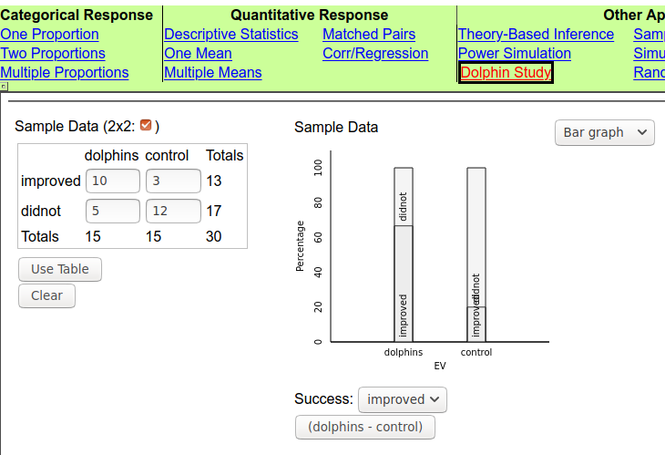
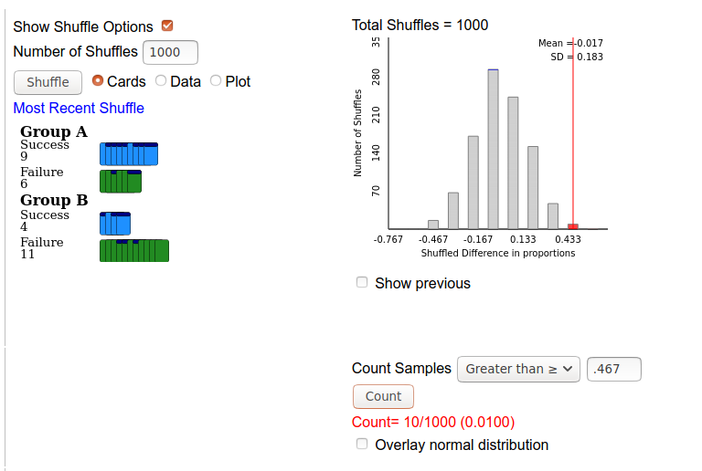
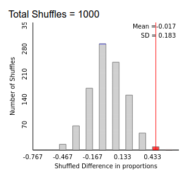
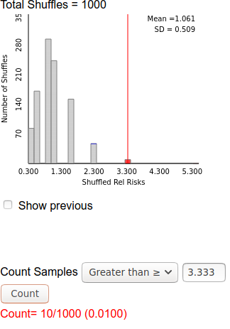

<script type="text/x-mathjax-config">
  MathJax.Hub.Config({ TeX: { extensions: ["color.js","AMSmath.js", "AMSsymbols.js"] }});
</script>

```{r setup, include = F}

library(ggplot2)
library(tidyverse)
knitr::opts_chunk$set(dpi=300, message = F, warning = F, echo = F, fig.width = 8, fig.height = 4, out.width = "80%", fig.align = "center", cache = T)
theme_set(theme_bw())
```

# Navigation

.pull-left[
.large[By Date]

- March 10: [start](#3) - [end](#13)
- March 12: [start](#14) - [end](#30)
- March 17: [start](#31) - [end](#48)

]
.pull-right[
.large[By Section]
- 5.1: [start](#3) - [end](#14)
- 5.2: [start](#15) - [end](#35)
- 5.3: [start](#36) - [end](#48)
]

---
class:inverse,middle,center
# 5.1: Comparing Two Groups

---
## Summarizing Two Categorical Variables

Quentin Tarantino's films are world-famous. A dedicated 538.com reporter watched all of the films, recording the incidence of curse words and deaths in each movie (along with the time of the occurrence, and the word) ([data](https://raw.githubusercontent.com/fivethirtyeight/data/master/tarantino/tarantino.csv)). 

You would like to know if the frequency of curse words relative to deaths is the same between *Kill Bill: Volume 1* and *Kill Bill: Volume 2*. 

```{r}
tarantino <- read_csv("https://raw.githubusercontent.com/fivethirtyeight/data/master/tarantino/tarantino.csv") %>%
  filter(str_detect(movie, "Kill Bill")) %>%
  select(-word) %>%
  set_names(c("Movie", "Type", "Time")) %>%
  arrange(Time)
knitr::kable(tarantino, format = "html", row.names = T)
```


---
## Summarizing Two Categorical Variables

- What is the observational unit?    
.hidden[.red[Each instance of an event (curse word or death) in a *Kill Bill* movie]]

- Which columns do we need?    
.hidden[.red[Movie and Type]]

- How can we summarize this data?    
.hidden[.red[For each movie, add up the total number of deaths and curse words]]


---
## Summarizing Two Categorical Variables


- What is the observational unit?    
.red[Each instance of an event (curse word or death) in a *Kill Bill* movie]

- Which columns do we need?    
.red[Movie and Type]

- How can we summarize this data?    
.red[For each movie, add up the total number of deaths and curse words]

A **two-way table** (or *contingency table*) of counts can be used when we have 2 categorical variables

```{r}
tarantino_sum <- tarantino %>% select(-Time) %>% mutate(value = 1) %>% 
  group_by(Movie, Type) %>%
  summarize(value = sum(value))

tarantino_sum_tbl <- tarantino_sum %>%
  pivot_wider(id_cols = "Movie", names_from = Type, values_from = value) %>%
  mutate(Total = word + death)
tarantino_sum_tbl <- bind_rows(
  tarantino_sum_tbl,
  tarantino_sum_tbl %>% ungroup() %>%
    mutate(Movie = "Total") %>% group_by(Movie) %>%
    summarize_each(funs(sum))) %>%
  set_names(str_to_title(names(.)))
knitr::kable(tarantino_sum_tbl, format = "html")
```


---
## Summarizing Two Categorical Variables


```{r}
knitr::kable(tarantino_sum_tbl, format = "html")
```

- Do the counts differ? Does *Kill Bill: Vol 1* have a higher death:curse word ratio than Kill Bill: Vol 2?

- Group sizes differ - 120 events in *Kill Bill: Vol 1*, 80 in *Kill Bill: Vol 2*

--

Solution: Use relative proportions

---
## Visualizing Categorical Variables
.pull-left[
```{r, fig.width = 4, fig.height = 5, out.width =  "100%"}
tarantino_sum %>%
  ggplot(aes(x = Movie, fill = Type, weight = value)) + geom_bar(position = "fill") + 
  scale_y_continuous("Proportion") + 
  scale_fill_manual("Event", values = c("death" = "grey40", "word" = "red")) + 
  ggtitle("Kill Bill curse words and deaths") + 
  theme(legend.position = "bottom")
```
]
.pull-right[
**segmented bar graphs** show the relative proportions of observational units in each category.

These relative proportions are called **conditional proportions**

- Of the events in *Kill Bill 1*, what proportion are deaths?

- Of the events in *Kill Bill 2*, what proportion are curse words?

.small[
The mathematical notation for conditional proportions looks like this:

P(death | Kill Bill 1) = `r filter(tarantino_sum, Movie == "Kill Bill: Vol. 1") %>% (function(df) df$value[1]/sum(df$value))`

Read it as "The probability of an event being a death given that the movie is *Kill Bill 1* is 0.525"
]
]

---
## Numerical Summaries of Contingency Tables

The **relative risk** is the ratio of conditional proportions between two categories.

.pull-left[
```{r}
knitr::kable(tarantino_sum_tbl, format = "html")
```
]
.pull-right[
In this case, we can calculate the relative risk of a death event in *Kill Bill 1* **relative to** the risk of a death event in *Kill Bill 2*

$$RR = \frac{\hat p_{KB1}}{\hat p_{KB2}} = \frac{63/120}{11/80} = 3.8182$$

Of observed events in the Kill Bill movies, we are 3.8182 times more likely to see a death in *Kill Bill 1* than we are in *Kill Bill 2*
]

---
## Practice: Categorical variables

The Titanic sank in 1912 after striking an iceberg, and did not have enough lifeboats on board for all passengers. The mantra of "Women and children first" is well known, but does it hold up under examination? Were women more likely to survive the Titanic disaster?

```{r}
data(Titanic)
Titanic <- as_tibble(Titanic)
SexSurvived <- Titanic %>% select(Sex, Survived, n) %>%
  group_by(Sex, Survived) %>%
  summarize_all(sum)

SexSurvived_tbl <- SexSurvived %>%
  pivot_wider(id_cols = Sex, names_from = Survived, values_from = n) %>%
  mutate(Total = No + Yes)
SexSurvived_tbl <- bind_rows(
  SexSurvived_tbl,
  SexSurvived_tbl %>% ungroup() %>%
    mutate(Sex = "Total") %>% group_by(Sex) %>%
    summarize_each(funs(sum))) %>%
  set_names(str_to_title(names(.)))
knitr::kable(SexSurvived_tbl, format = "html")
```

- What are the observational units?

- What are the two variables?

- What variable is explanatory and what is the response?

- Calculate the relative risk of dying on the titanic for men vs. women

---
## Exploration 5.1: Murderous Nurse?

For  several  years  in  the  1990s,  Kristen  Gilbert  worked  as  a  nurse  in  the  intensive  care  unit  (ICU)  of  the  Veterans  Administration  Hospital  in  Northampton,  Massachusetts.  Over  the  course of her time there, other nurses came to suspect that she was killing patients by inject-ing  them  with  the  heart  stimulant  epinephrine.  Gilbert  was  eventually  arrested  and  charged  with these murders. 

Part of the evidence presented against Gilbert at her murder trial was a statistical analysis of 1,641 eight-hour shifts during the time Gilbert worked in the ICU. For each of these shifts, researchers recorded two variables: whether or not Gilbert worked on the shift and whether or not at least one patient died during the shift.

- What are the observational units? .red[Shifts]
- Classify each variable as categorical or quantitative: 
  - Whether or not Gilbert worked on the shift: .red[categorical]
  - Whether or not at least one patient died during the shift: .red[categorical]
- Which variable is the:
  - Explanatory variable: .red[Whether or not Gilbert worked on the shift]
  - Response variable: .red[Whether or not a patient died during the shfit]


---
## Exploration 5.1: Murderous Nurse?

&nbsp;    | working | not working | Total
--- | ------- | ----------- | -------
Death | 40 | 34 | 74 
No Death | 217 | 1350 | 1567 
Total | 257 | 1384 | 1641

Using this data (from question 7), work through Exploration 5.1 in your groups

---
class:middle,center,inverse
# 2.2: Comparing Two Proportions (Simulation-Based Approach)

---
## Example 5.2 - Swimming with Dolphins

Is swimming with dolphins therapeutic for patients suffering from clinical depression?

- 30 subjects (18-65) with mild to moderate depression
- Randomly assigned to one of two treatment groups: 
  - 1 hour of swimming and snorkeling each day
  - 1 hour of swimming and snorkeling each day with dolphins
- Evaluate depression at the end of two weeks:     
(yes/no) did subjects experience a significant decline in depression

***

- Observational unit? .hidden[the patient]
- Experiment or Observational study?    
.hidden[Experiment - random assignment to treatment groups]
- Variables:
  - Explanatory: .hidden[treatment groups (dolphins/no dolphins)]
  - Response: .hidden[depression status (substantial improvement/no substantial improvement)]
  
---
## Example 5.2 - Swimming with Dolphins

Is swimming with dolphins therapeutic for patients suffering from clinical depression?

- 30 subjects (18-65) with mild to moderate depression
- Randomly assigned to one of two treatment groups: 
  - 1 hour of swimming and snorkeling each day
  - 1 hour of swimming and snorkeling each day with dolphins
- Evaluate depression at the end of two weeks:     
(yes/no) did subjects experience a significant decline in depression

***

- Observational unit? .red[the patient]
- Experiment or Observational study?     
.red[Experiment - random assignment to treatment groups]
- Variables:
  - Explanatory: .red[treatment groups (dolphins/no dolphins)]
  - Response: .red[depression status (substantial improvement/no substantial improvement)]

---
## Example 5.2 - Swimming with Dolphins

- Null hypothesis (in words)    
.hidden[Whether or not someone swims with dolphins has no association with whether or not someone shows substantial improvement]

- Alt hypothesis (in words)    
.hidden[Swimming with dolphins increases the probability of substantial improvement in depression symptoms (there is an association)]

- In symbols:     
.hidden[
$$\begin{align}H_0: \pi_{dolphins} - \pi_{control} & = 0\\H_A: \pi_{dolphins} - \pi_{control} & > 0\end{align}$$
]

- Parameter of interest (in words and symbols):    
.hidden[The difference in the two probabilities ($\pi_{dolphins} - \pi_{control}$)]


---
## Example 5.2 - Swimming with Dolphins

- Null hypothesis (in words)    
.red[Whether or not someone swims with dolphins has no association with whether or not someone shows substantial improvement]

- Alt hypothesis (in words)    
.red[Swimming with dolphins increases the probability of substantial improvement in depression symptoms (there is an association)]

- In symbols:    
.red[
$$\begin{align}H_0: \pi_{dolphins} - \pi_{control} & = 0\\H_A: \pi_{dolphins} - \pi_{control} & > 0\end{align}$$
]

- Parameter of interest (in words and symbols):    
.red[The difference in the two probabilities    
$\pi_{dolphins} - \pi_{control}$
]

---
## Example 5.2 - Swimming with Dolphins

&nbsp; | Dolphin therapy | Control group | Total
------ | --------------- | ------------- | -----
Substantial Improvement | 10 | 3 | 13 
No Substantial Improvement | 5 | 12 | 17 
Total | 15 | 15 | 30

```{r}
tribble(~group, ~improvement, ~count,
        "dolphin", "substantial improvement", 10,
        "control", "substantial improvement", 3,
        "dolphin", "no substantial improvement", 5,
        "control", "no substantial improvement", 12) %>%
  ggplot(aes(x = group, fill = improvement, weight = count)) + 
  geom_bar(position = "fill") + coord_flip() + 
  scale_fill_manual("Results", values = c("steelblue", "orange")) + 
  ylab("Proportion") + 
  ggtitle("Swimming with Dolphins") + 
  theme(axis.text.y = element_text(angle = 90, hjust = .5, vjust = .5),
        axis.title.y = element_blank(), legend.position = "bottom")
```


---
## Example 5.2 - Swimming with Dolphins

$$\begin{align}\hat p_{dolphins} &= 10/15 = 0.6667\\\hat p_{control} &= 3/15 = 0.2\end{align}$$
- Statistic: $\hat p_{dolphins} - \hat p_{control} =$

- Explanations for the difference?
  - .hidden[Random chance alone]
  - .hidden[Swimming with dolphins really helps depression]


---
## Example 5.2 - Swimming with Dolphins

$$\begin{align}\hat p_{dolphins} &= 10/15 = 0.6667\\\hat p_{control} &= 3/15 = 0.2\end{align}$$
- Statistic: $\hat p_{dolphins} - \hat p_{control} =$ .red[0.4667]

- Explanations for the difference?
  - .red[Random chance alone (corresponds to 
  $H_0$
  )]
  - .red[Swimming with dolphins really helps depression]
  
  
- Simulation: 
  - If $H_0$ is true, dolphin therapy is no more effective than the control, and we would still have 13 improvers and 17 nonimprovers
  - If we randomly assign outcome labels to explanatory variable groups and compute a simulation statistic $p^\ast_{dolphins} - p^\ast_{control}$...
  
  
---
## Example 5.2 - Swimming with Dolphins Simulation
- Physical method: 
  1. label index cards with "improve" (13 cards) and "not improve" (17 cards)
  2. Shuffle
  3. Count out 15 cards for the "dolphin therapy" group and 15 cards for the control group
  4. Calculate proportions and subtract
  5. Repeat N times
  6. Count how many N are greater than or equal to $\hat p_{dolphins} - \hat p_{control}$

---
## Example 5.2 - Swimming with Dolphins Simulation
- App:    
  1. Other applets -> Dolphin Study
  2. Enter real data into the 2x2 table
  3. Check "Show Shuffle Options"
  4. Enter sample statistic under "Count Samples"
  5. Click the "Count" button


---
## Example 5.2 - Swimming with Dolphins



---
## Example 5.2 - Swimming with Dolphins


---
## Example 5.2 - Swimming with Dolphins

To recap:

- Null Hypothesis:     
.hidden[No difference in probability of substantial improvement]

- One repetition:     
.hidden[Random assignment of response outcomes to the two groups    
Note: We always assign the **response outcome** to the **explanatory variable**]

- Statistic:     
.hidden[Difference in conditional proportions, 
$p^\ast_{dolphin} - p^\ast_{control}$
]


- Strength of Evidence:    
.hidden[Proportion of simulation samples with
$p^\ast_{dolphin} - p^\ast_{control}\geq 0.4667$    
$= 10/1000 = 0.0100$ 
]

---
## Example 5.2 - Swimming with Dolphins

To recap:

- Null Hypothesis:     
.red[No difference in probability of substantial improvement]

- One repetition: .red[Random assignment of response outcomes to the two groups    
Note: We always assign the **response outcome** to the **explanatory variable**]

- Statistic:     
.red[Difference in conditional proportions, 
$p^\ast_{dolphin} - p^\ast_{control}$
]

- Strength of Evidence:    
.red[Proportion of simulation samples with 
$p^\ast_{dolphin} - p^\ast_{control}\geq 0.4667$    
$= 10/1000 = 0.0100$ 
]

---
## Example 5.2 - Swimming with Dolphins

- Interpretation: 

--

.red[We have strong evidence against the null hypothesis that the difference in the proportion of individuals whose depression improved between the treatment and control groups is due to random chance alone. 

We reject 
$H_0$ 
(p = 0.0010) and conclude that there is evidence that swimming with dolphins increases the likelihood that individuals will have substantial improvement in their clinical depression.]

---
## Interpreting Tests for Difference of Proportions

Generic version:

We (reject/fail to reject) the null hypothesis that 

the difference in the proportion of (response  variable) 

between the (two levels of the explanatory variable)

(is equal to/is greater than/is less than) (null hypothesis value) because (p = ...). 

We conclude that (conclusion in the context of the problem). 


---
## Example 5.2 - Swimming with Dolphins - Confidence Intervals

.pull-left[
We can use the 2SD method to get confidence intervals for the difference in proportions

$$\begin{align}& \hphantom{=} \hat p_{dolphin}-\hat p_{control} \pm 2\sigma \\& = 0.467 \pm 2*0.183 \\&=(0.101, 0.833)\end{align}$$

We are 95% confident that the difference in the percent of individuals whose depression improved after swimming with dolphins is between 10.1% and 83.3% higher than the percent of individuals whose depression improved and did not swim with dolphins. 

].pull-right[


.small[You can work this in proportions and multiply by 100 to get a percent if that is easier for you to think about. The simulation SD will be for the proportion, so wait until the end of the calculation to multiply by 100.]
]

---
## Example 5.2 - Swimming with Dolphins - Confidence Intervals

.pull-left[
We can use the 2SD method to get confidence intervals for the difference in proportions

$$\begin{align}& \hphantom{=} \hat p_{dolphin}-\hat p_{control} \pm 2\sigma \\& = 0.467 \pm 2*0.183 \\&=(0.101, 0.833)\end{align}$$


We are 95% confident that the difference in the proportion of individuals whose depression improved after swimming with dolphins is between 0.101 and 0.833 higher than the proportion of individuals whose depression improved and did not swim with dolphins. 


].pull-right[
]

---
## Confidence Intervals
$$\hat p_{1} - \hat p_2 \pm 2 * SD$$

- Does the interval contain zero? 
    - If yes, there is no significant difference between the two groups
    - If no, 
        - Does the interval lie entirely above 0 (if $H_A$ is greater than 0)?
        - Does the interval lie entirely below 0 (if $H_A$ is less than 0)?

- If the interval does not contain your $H_0$ value, then a hypothesis test would not be significant at the $\alpha =  0.05$ level.

---
## Relative Risk

We can also conduct significance tests for the relative risk:

- Hypotheses: 
  - Null: The relative risk of improvement in depression symptoms between those who swim with dolphins and those who do not is 1    
  $$\left\{\hat p_{dolphins} = \hat p_{control}\right\} \text{ implies } \left\{\frac{\hat p_{dolphins}}{\hat p_{control}} = 1\right\}$$
  
  - Alt: The relative risk of improvement in depression symptoms between those who swim with dolphins and those who do not is greater than 1
  $$\left\{\hat p_{dolphins} > \hat p_{control}\right\} \text{ implies } \left\{\frac{\hat p_{dolphins}}{\hat p_{control}} > 1\right\}$$

---
## Example 5.2: Relative Risk

.left-column60[
- Statistic: Observed relative risk = $\frac{0.6667}{0.2} = 3.333$

- Simulate: Same strategy, but now compute $\frac{p^\ast_{dolphin}}{p^\ast_{control}}$

- Strength of Evidence: p = 0.0010    
.small[Note that the p-value is the same - this will always happen (with the same simulation).]

- Conclusion:     
We reject $H_0$ and conclude that there is strong evidence that the relative risk of improvement in depression symptoms between those who swam with dolphins and those who do not is greater than 1. 

].right-column40[

]

---
## Factors affecting Strength of Evidence

- The larger the difference between $\hat p_1$ and $\hat p_2$, the .underline[.hidden[stronger]] the evidence that the population proportions differ

- The larger the sample size, the .underline[.hidden[stronger]] the evidence that the population proportions differ

- The difference between the proportions is the .underline[.hidden[midpoint]] of the confidence interval

- Larger sample sizes produce .underline[.hidden[narrower]] confidence intervals


---
## Factors affecting Strength of Evidence

- The larger the difference between $\hat p_1$ and $\hat p_2$, the .underline[.red[stronger]] the evidence that the population proportions differ

- The larger the sample size, the .underline[.red[stronger]] the evidence that the population proportions differ

- The difference between the proportions is the .underline[.red[midpoint]] of the confidence interval

- Larger sample sizes produce .underline[.red[narrower]] confidence intervals


---
class:inverse,middle,center
# 5.3: Comparing Two Proportions
## Theory-Based Approach

---
## Normal Distributions

.pull-left[
As in Chapter 1, we often see symmetric, bell-shaped distributions for simulated differences between proportions

For Theory-Based Inference, we need: 
- Validity conditions (when can we use it)

- Formula for the standard error of the statistic (under $H_0$)
].pull-right[

]

---
## Z test for Difference Between Two Proportions

$$\begin{align}z &= \frac{\text{observed statistic} - \text{hypothesized value}}{\text{standard error of statistic under }H_0} \\\\&= \frac{(\hat p_1 - \hat p_2) - 0}{\text{standard error of }(\hat p_1 - \hat p_2)\text{ under }H_0}\end{align}$$

$H_0$ is that $\pi_1 = \pi_2$, so let $$\hat p = \frac{\hat p_1 n_1 + \hat p_2 n_2}{n_1 + n_2}$$ be the **combined proportion of success** (aka pooled proportion)

---
## Z test for Difference Between Two Proportions

### What about the standard error?


In the one-proportion case, our standard error was $\sqrt{\frac{\hat p (1-\hat p)}{n}}$

With two proportions, we can pool our groups to get $\hat p = \frac{\hat p_1 n_1 + \hat p_2 n_2}{n_1 + n_2}$

... but we also need a pooled sample size: $\frac{1}{\frac{1}{n_1} + \frac{1}{n_2}}$

This is a formula that takes into account the difference in sample sizes between groups (smaller group = larger variance in $\hat p$ for the group).

$$\text{Standard error of }\hat p = \sqrt{\frac{\hat p (1-\hat p)}{\frac{1}{\frac{1}{n_1} + \frac{1}{n_2}}}} = \sqrt{\hat p (1-\hat p)\left(\frac{1}{n_1} + \frac{1}{n_2}\right)}$$

---
## Z test for Difference Between Two Proportions

### CAUTION!

The pooled $\hat p$ is only used for the standard error calculation! Don't get it confused with $\hat p_1 - \hat p_2$!


---
## Z test for Difference Between Two Proportions

$$\begin{align}z &= \frac{\text{observed statistic} - \text{hypothesized value}}{\text{standard error of statistic under }H_0} \\\\&= \frac{(\hat p_1 - \hat p_2) - 0}{\text{standard error of }(\hat p_1 - \hat p_2)\text{ under }H_0}\\\\&=\frac{(\hat p_1 - \hat p_2) - 0}{\sqrt{\hat p (1-\hat p)\left(\frac{1}{n_1} + \frac{1}{n_2}\right)}}\end{align}$$ 

where $\displaystyle\hat p = \frac{\hat p_1 n_1 + \hat p_2 n_2}{n_1 + n_2}$

---
## Confidence Interval: Difference Between Two Proportions

- With a z-test, we are working as if $H_0$ is true
  - $\hat p_1 = \hat p_2$ means that we can pool proportions
  - $\hat p$ simplifies the standard error calculation
  
- With a confidence interval:
  - we're estimating the value
  - We don't have a null hypothesis

For a confidence interval for the difference of two proportions:
$$SE = \sqrt{\frac{\hat p_1 (1-\hat p_1)}{n_1} + \frac{\hat p_2 (1 - \hat p_2)}{n_2}}$$


---
## Confidence Interval: Difference Between Two Proportions

The general formula for a confidence interval is $$\text{sample statistic}\pm \text{multiplier}\times SE$$

So for a difference of two proportions, the CI formula is: 
$$(\hat p_1 - \hat p_2) \pm \text{multiplier}\times \sqrt{\frac{\hat p_1 (1-\hat p_1)}{n_1} + \frac{\hat p_2 (1 - \hat p_2)}{n_2}}$$

We will use a multiplier of 2 in class - this corresponds to approximately a 95% confidence interval.


---
## Validity Conditions for theory-based approach

- 10 observations in each of the four cells of the 2x2 table

- Required for a theory-based test or for the interval for the difference in two proportions.

