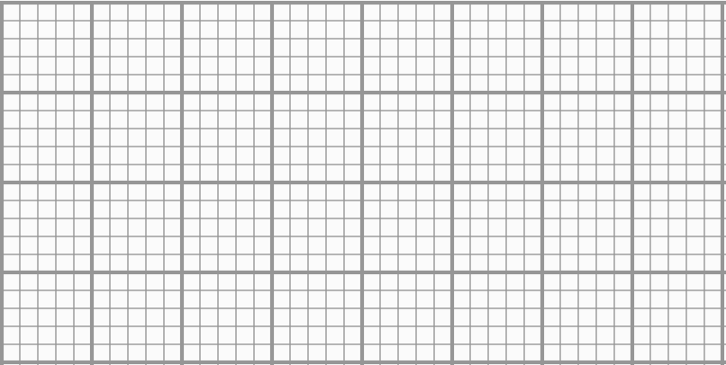
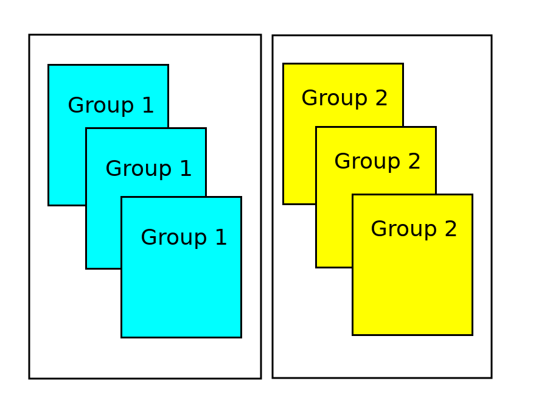
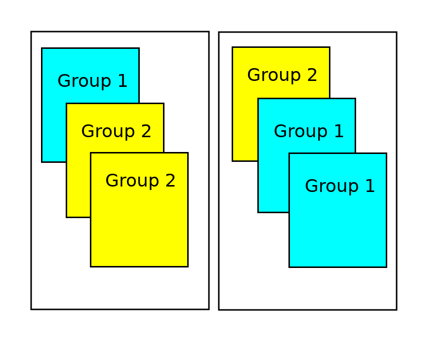
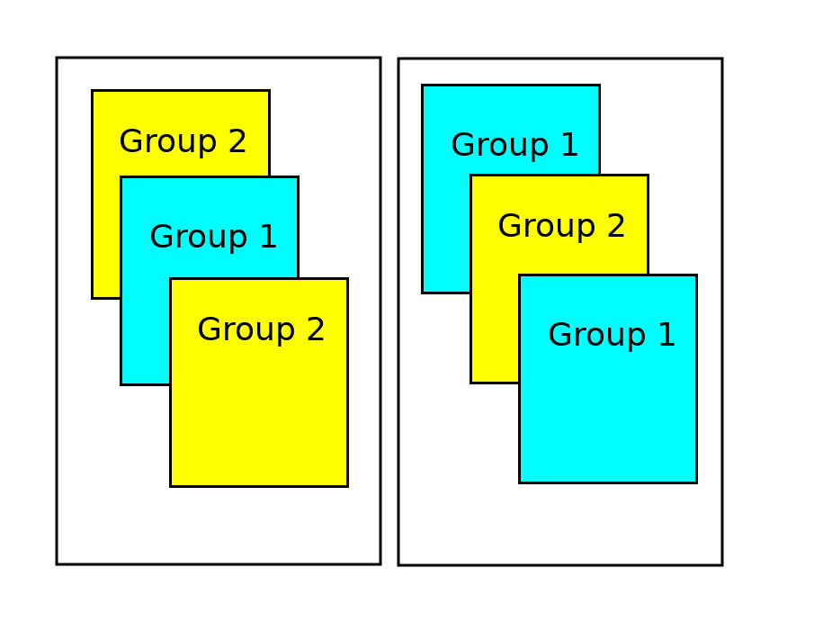

<script type="text/x-mathjax-config">
  MathJax.Hub.Config({ TeX: { extensions: ["color.js", "amsmath.js"] }});
</script>

```{r setup, include = F}

library(ggplot2)
library(tidyverse)
knitr::opts_chunk$set(dpi=300, message = F, warning = F, echo = F, fig.width = 8, fig.height = 4, out.width = "80%", fig.align = "center", cache = T)
theme_set(theme_bw())
```

# Navigation

.pull-left[
.large[By Date]

- March 31: [start](#3) - [end](#15)
- April 2: [start](#16) - [end](#31)
- April 7: [start](#32) - [end](#49)

]
.pull-right[
.large[By Section]
- 6.1: [start](#3) - [end](#15)
- 6.2: [start](#16) - [end](#36)
- 6.3: [start](#37) - [end](#49)
]

---
class:inverse,middle,center
# 6.1: Comparing Two Groups
## Quantitative Response

---
## Describing Distributions of Quantitative Data

- **5-number summary** - the minimum, lower quartile, median, upper quartile, and maximum of a set of data

  - **lower quartile** - 25% of the data lie below this value
  
  - **median** - 50% of the data lie below this value
  
  - **upper quartile** - 75% of the data lie below this value
  
```{r, fig.width = 8, fig.height = 4}
set.seed(205838)
tmp <- tibble(x = sort(rpois(101, 10)),
       lbl = c("minimum", rep(NA, 24), "lower quartile", rep(NA, 24), "median", rep(NA, 24), "upper quartile", rep(NA, 24), "maximum")) %>%
  mutate(lbl = factor(lbl, levels = lbl[!is.na(lbl)], ordered = T))

ggplot(tmp, aes(x = x)) +  
  geom_dotplot(fill = "white") + 
  theme(axis.text.y = element_blank(), axis.ticks.y = element_blank(), axis.title.y = element_blank(), axis.title.x = element_blank())
```

---
## Describing Distributions of Quantitative Data

- **5-number summary** - the minimum, lower quartile, median, upper quartile, and maximum of a set of data

  - **lower quartile** - 25% of the data lie below this value
  
  - **median** - 50% of the data lie below this value
  
  - **upper quartile** - 75% of the data lie below this value
  
```{r fig.width = 8, fig.height = 4}
cols <- RColorBrewer::brewer.pal(name = "Greens", 7)
  ggplot(tmp, aes(x = x)) + 
  geom_dotplot(fill = "white") +  
  geom_dotplot(data = filter(tmp, !is.na(lbl)), aes(fill = lbl)) +
  scale_fill_manual(values = cols[-c(1:2)], name = "5 number summary") + 
  theme(axis.text.y = element_blank(), axis.ticks.y = element_blank(), axis.title.y = element_blank(), axis.title.x = element_blank(),
        legend.pos = c(1,1), legend.justification = c(1.01,1.01))
```


---
## Describing Distributions of Quantitative Data


```{r fig.width = 8, fig.height = 4}
iqr <- quantile(tmp$x, c(.25, .75))
cols <- RColorBrewer::brewer.pal(name = "Greens", 7)
ggplot(tmp, aes(x = x)) + 
  geom_dotplot(fill = "white") + 
  geom_dotplot(data = filter(tmp, !is.na(lbl)), aes(fill = lbl)) +
  scale_fill_manual(values = cols[-c(1:2)], name = "5 number summary") + 
  geom_segment(aes(x = iqr[1], xend = iqr[2], y = .95, yend = .95), arrow = arrow(ends = "both", angle = 90, length = unit(.25, "cm"))) + 
  geom_text(aes(x = median(tmp$x), y = .98, label = "IQR"), size = 5) + 
  theme(axis.text.y = element_blank(), axis.ticks.y = element_blank(), axis.title.y = element_blank(), axis.title.x = element_blank(),
        legend.pos = c(1,1), legend.justification = c(1.01,1.01)) 
```

The distance between the two quartiles is called the **inter-quartile range**(IQR). The IQR is another measure of variability, along with the standard deviation.

The IQR is resistant (or *robust*) to extreme values and skewness, unlike the standard deviation.

---
## Describing Distributions of Quantitative Data

A **boxplot** (or box-and-whisker plot) is a visual display of the 5-number summary. 
- The box displays the middle 50% of the distribution and its width (the IQR) shows the spread of the bulk of the distribution. 
- The 'whiskers' extend to the 
    - smallest and largest values in the dataset 
    - OR the values in the dataset that are within 1.5\*IQR away from the edges of the box. 
        - Observations outside of the 1.5\*IQR range may be shown as dots and are outliers

```{r}
tmp <- tmp %>%
  mutate(in_box = (x >= iqr[1]) & (x <= iqr[2]),
         in_iqr = (x >= iqr[1]-diff(iqr)*1.5) & (x <= iqr[2] + diff(iqr)*1.5))

```

---
## Describing Distributions of Quantitative Data

```{r}
ggplot(tmp, aes(x = x)) + 
  geom_dotplot(fill = "white") + 
  geom_dotplot(data = filter(tmp, !is.na(lbl)), aes(fill = lbl)) +
  scale_fill_manual(values = cols[-c(1:2)], name = "5 number summary") +  
  geom_segment(aes(x = iqr[1], xend = iqr[2], y = .95, yend = .95), arrow = arrow(ends = "both", angle = 90, length = unit(.25, "cm"))) + 
  geom_text(aes(x = median(tmp$x), y = .98, label = "IQR"), size = 5) + 
  theme(axis.text.y = element_blank(), axis.ticks.y = element_blank(), axis.title.y = element_blank(), axis.title.x = element_blank(),
        legend.pos = c(1,1), legend.justification = c(1.01,1.01))
```

What are the following values?
- bottom whisker:
- lower quartile:
- median:
- upper quartile:
- top whisker:

Are there any outliers?

---
## Describing Distributions of Quantitative Data

```{r}
ggplot(tmp, aes(x = x)) + 
  geom_dotplot(fill = "white") + 
  geom_dotplot(data = filter(tmp, !is.na(lbl)), aes(fill = lbl)) +
  scale_fill_manual(guide = F, values = cols[-c(1:2)], name = "5 number summary") +  
  geom_rect(aes(xmin = 7, xmax = 12, ymin = .93, ymax = 1), fill = "white", color = "black") + 
  geom_segment(aes(x = 9, xend = 9, y = .93, yend = 1)) + 
  theme(axis.text.y = element_blank(), axis.ticks.y = element_blank(), axis.title.y = element_blank(), axis.title.x = element_blank(),
        legend.pos = c(1,1), legend.justification = c(1.01,1.01))
```

What are the following values?
- bottom whisker: 
- lower quartile: .red[7]
- median: .red[9]
- upper quartile: .red[12]
- top whisker:

Are there any outliers?

---
## Describing Distributions of Quantitative Data

```{r}
ggplot(tmp, aes(x = x)) + 
  geom_dotplot(fill = "white") + 
  geom_dotplot(data = filter(tmp, !is.na(lbl)), aes(fill = lbl)) +
  scale_fill_manual(guide = F, values = cols[-c(1:2)], name = "5 number summary") + 
  geom_rect(aes(xmin = 7, xmax = 12, ymin = .93, ymax = 1), fill = "white", color = "black") + 
  geom_segment(aes(x = 9, xend = 9, y = .93, yend = 1)) + 
  geom_segment(aes(x = 7, xend = 3, y = .965, yend = .965)) +
  geom_segment(aes(x = 12, xend = 19.5, y = .965, yend = .965)) + 
  # geom_point(aes(x = 21, y = .965)) + 
  theme(axis.text.y = element_blank(), axis.ticks.y = element_blank(), axis.title.y = element_blank(), axis.title.x = element_blank(),
        legend.pos = c(1,1), legend.justification = c(1.01,1.01))
```

- bottom whisker: .red[1.5 x IQR below lower quartile, or smallest observation]    
.red[7 - 1.5(12-7) = -0.5] or .red[3]    
.red[bottom whisker: 3]
- top whisker: .red[1.5 x IQR above upper quartile, or largest observation]    
.red[12 + 1.5(12-7) = 19.5] or .red[21]    
.red[top whisker: 19.5]

Are there any outliers?

---
## Describing Distributions of Quantitative Data

```{r}
ggplot(tmp, aes(x = x)) + 
  geom_dotplot(fill = "white") + 
  geom_dotplot(data = filter(tmp, !is.na(lbl)), aes(fill = lbl)) +
  scale_fill_manual(guide = F, values = cols[-c(1:2)], name = "5 number summary") + 
  geom_rect(aes(xmin = 7, xmax = 12, ymin = .93, ymax = 1), fill = "white", color = "black") + 
  geom_segment(aes(x = 9, xend = 9, y = .93, yend = 1)) + 
  geom_segment(aes(x = 7, xend = 3, y = .965, yend = .965)) +
  geom_segment(aes(x = 12, xend = 19.5, y = .965, yend = .965)) + 
  geom_point(aes(x = 21, y = .965)) + 
  theme(axis.text.y = element_blank(), axis.ticks.y = element_blank(), axis.title.y = element_blank(), axis.title.x = element_blank(),
        legend.pos = c(1,1), legend.justification = c(1.01,1.01))
```

What are the following values?
- bottom whisker: .red[3]
- lower quartile: .red[7]
- median: .red[9]
- upper quartile: .red[12]
- top whisker: .red[19.5] 

Are there any outliers? .red[Yes, at 21]


---
## Describing Distributions of Quantitative Data

Boxplots make it easy to compare distributions of different groups.
```{r}
diseases <- read_csv(here::here("data/izb-cases-by-county-and-year.csv")) %>%
  group_by(year, disease) %>%
  summarize(count = sum(count))

diseases %>%
  # filter(!disease %in% c("Diphtheria", "Varicella Hospitalizations", "Pertussis")) %>%
  filter(disease %in% c("Measles", "Mumps", "Invasive Meningococcal Disease") | str_detect(disease, "Hepatitis [BC]")) %>%
  mutate(disease = str_replace(disease, "Invasive Meningococcal Disease", "Meningitis") %>% str_remove(", Acute")) %>%
ggplot(aes(x = disease, y = count)) + geom_boxplot() + scale_y_continuous("# Cases") +  
  ggtitle("California Reportable Disease Cases, 2000-2018") + 
  theme(axis.text.y = element_text(angle = 90, hjust = .5, vjust = .5), axis.title.x = element_blank())

```

---
## In-Class Practice: Jean Pocket Sizes

Using the graph paper on the next page, create boxplots for each of the dimensions in the chart below. 

```{r fig.width = 6, fig.height = 3}
pockets <- read_csv("https://raw.githubusercontent.com/the-pudding/data/master/pockets/measurements.csv")

pockets_clean <- pockets %>%
  pivot_longer(matches("max|min"), names_to = "region", values_to = "length") %>%
  extract(region, into = c("dim", "measurement", "side"), regex = c("(max|min|rivet)(Width|Height)(Front|Back)")) %>%
  filter(dim == "max") %>%
  filter(side == "Front") %>%
  mutate(length = round(length*2, 0)/2) %>%
  select(menWomen, measurement, length)

ggplot(pockets_clean, aes(x = length)) + geom_dotplot(fill = "grey", binwidth = .5, dotsize = 1) + 
  facet_grid(menWomen~measurement, scales = "free_x",space = "free_x") + 
  scale_x_continuous("Size (cm)", breaks = (6:15)*2, minor_breaks = 12:30) + 
  theme(axis.text.y = element_blank(), axis.ticks.y = element_blank(), axis.title.y = element_blank()) +
  ggtitle("Front Pocket Maximum")
```

.bottom[Data source: https://pudding.cool/2018/08/pockets/]

---
## In-Class Practice: Jean Pocket Sizes



What do you conclude about the distributions of front pocket maximum dimensions when comparing Men's jeans to Women's jeans?

---
## Exploration 6.1: Haircut Prices

Work through Exploration 6.1A in groups. Upload your answers; you must complete at least 1-13. 

If you complete 14-19, you may get extra credit.


---
class:middle,inverse,center
## 6.2: Comparing Two Means: Simulation Based Approach

---
## 3S strategy

1. Statistic
2. Simulation
3. Strength of Evidence

***

Our hypotheses are going to concern $\mu_1$ and $\mu_2$... specifically, the value of $\mu_1 - \mu_2$.

We are interested in the long run (e.g. data collected forever) value of the difference between the group means

$\begin{align}H_0&: \mu_1 - \mu_2 = 0\\H_A&: \mu_1 - \mu_2 \;\{\neq,>,< \} \;0\end{align}$

---
## Simulation 

Group | Value | Simulated Group
----- | ----- | ---------------
1 | a | 1
1 | b | 2 
1 | c | 1
2 | d | 1
2 | e | 2 
2 | f | 2

Assign new group labels to existing values

Think about sorting labeled index cards into stacks for each group.

---
## Simulation 



---
## Simulation 




---
## Simulation 

 


---
## Simulation 


At each simulation, we recalculate our statistic - e.g. $\overline x_1 - \overline x_2$

---
## Simulation

Null hypothesis: Mean .underline[.hidden[measurement]] is the same in both groups

One repetition: Rerandomizing groups for each .underline[.hidden[measurement]]

Statistic: Difference in two group means

---
## Simulation

Null hypothesis: Mean .underline[.red[measurement]] is the same in both groups

One repetition: Rerandomizing groups for each .underline[.red[measurement]]

Statistic: Difference in two group means

---
## Example - Didgeridoo playing and sleep apnea

Scientists examined whether Didgeridoo lessons reduced the symptoms of sleep apnea as measured by the Epworth scale (0-24). Individuals were assessed for sleep apnea at the beginning and end of an 8-week period; the difference in scores was recorded. 14 individuals were randomly assigned to receive Didgeridoo lessons, while 11 did not receive any intervention.

```{r}
apnea <- tibble(group = rep(c("Didgeridoo", "Control"), c(14, 11)) %>% factor(levels = c("Control", "Didgeridoo"), ordered = T), 
                difference = c(10, 9, 8, 3, 2, 3, 11, 2, 5, -1, 2, 5, 1, 4, 3, 0, 4, 1, 1, -3, 2, 1, 1, 0, 0)) %>%
  mutate(color = ifelse(group == "Didgeridoo", "red", "white")) 
res_means <- apnea %>% group_by(group) %>% summarize(difference = mean(difference))
ggplot(apnea, aes(x = difference, fill = color)) + geom_dotplot() + facet_grid(group~.) + 
    geom_vline(data = res_means, aes(xintercept = difference)) + 
  scale_fill_identity() +  
  scale_x_continuous("Difference in Epworth Scale Score after 8 weeks", breaks = seq(-10, 14, by = 2), limits = c(-4, 12)) + 
  theme(axis.text.y = element_blank(), axis.title.y = element_blank(), axis.ticks.y = element_blank())
```

---
## Example - Didgeridoo playing and sleep apnea

$$\begin{align}H_0: \mu_D - \mu_C &= 0\\H_A: \mu_D - \mu_C &>0\end{align}$$

In words:
- $H_0$: The difference in the average change in Epworth Scale score between those who received Didgeridoo lessons and those that did not is 0

- $H_A$: Those who received Didgeridoo lessons will have a higher average change in Epworth Scale score than those who did not.

Because there is random assignment, if we conclude $H_A$, we can say the change is due to the Didgeridoo lessons.


---
## Example - Didgeridoo playing and sleep apnea

```{r fig.width=8, fig.height=4, message = F, warning = F,  ffmpeg.format='gif', fig.show='animate', dev = "jpeg", dpi = 300}
set.seed(240997823)
actual <- apnea %>% group_by(group) %>% summarize(difference = mean(difference))
res <- tibble(i = 1:100, mean_diff = 0)
for (i in 1:100) {
  apnea$groupnew <- sample(apnea$group, size = 25, replace = F) 
  res_means <- apnea %>% group_by(groupnew) %>% summarize(difference = mean(difference))
  res$mean_diff[i] <- diff(res_means$difference)
  p1 <- ggplot(apnea, aes(x = difference, fill = color)) + geom_dotplot() + facet_grid(groupnew~.) + 
    geom_vline(data = res_means, aes(xintercept = difference)) + 
    scale_fill_identity() + 
    scale_x_continuous("Difference in Epworth Scale Score after 8 weeks", breaks = seq(-10, 14, by = 2), limits = c(-4, 12)) + 
    theme(axis.text.y = element_blank(), axis.title.y = element_blank(), axis.ticks.y = element_blank())
  
  p2 <- ggplot() + 
    geom_text(aes(x = diff(actual$difference), y = 30, label = "Observed"), color = "grey30", hjust = 1.1) + 
    geom_vline(xintercept = diff(actual$difference), color = "grey30") +
    geom_vline(xintercept = diff(res_means$difference)) +
    geom_histogram(aes(x = res$mean_diff[1:i]), center = 0, binwidth = 1, fill = "white", color = "black") + 
    ylim(c(0, 30)) + xlim(c(-5, 5)) + xlab("Avg Didgeridoo score - Control score") +
    theme(axis.title.y = element_blank())
  
  gridExtra::grid.arrange(p1, p2, nrow = 1)
}

```

During each simulation, the group labels are shuffled and the difference in the means is calculated. The resulting simulation statistic distribution is used to calculate the p-value.

---
## Example - Didgeridoo playing and sleep apnea

```{r}
res <- res %>% mutate(extreme = ifelse(mean_diff > diff(actual$difference), "red", "white"))
 
ggplot() + 
    geom_text(aes(x = diff(actual$difference), y = 30, label = "Observed"), color = "grey30", hjust = 1.1) + 
    geom_vline(xintercept = diff(actual$difference), color = "grey30") +
    geom_histogram(data = res, aes(x = mean_diff, fill = extreme), center = 0, binwidth = 1, color = "black") +
  scale_fill_identity() + 
  annotate("text", x = -Inf, y = Inf, hjust = -0.1, vjust = 1.1, label = sprintf("p < %0.2f", mean(res$extreme == "red") + 0.01)) + 
    ylim(c(0, 30)) + xlim(c(-5, 5)) + xlab("Avg Didgeridoo score - Control score") +
    theme(axis.title.y = element_blank())

```

Interpretation: 

--

.red[
With p < 0.01, we have very strong evidence against the null hypothesis that the two groups experienced equivalent reductions in Epworth Scale scores. Therefore, we reject $H_0$ and conclude that it is more plausible that the group who received Didgeridoo lessons had a higher average reduction in Epworth Scale score than the control group. There is evidence that Didgeridoo lessons reduce the symptoms of sleep apnea.
]


---
## Exploration 6.2

Complete Exploration 6.2, questions 1 - 15 in your groups.


---
class:center,middle,inverse
## 6.3: Comparing Two Means: Theory-Based Approach

---
## Example 6.3: Breastfeeding and Intelligence

An article published in the journal Pediatrics (1999) studied whether and how children who were breastfed during infancy differed from those who werent breastfed. The study involved 323 white children recruited at birth in 1980-1981 from four Western Michigan Hospitals. After some initial exploration, the researchers deemed the participants in the study were representative of the community in terms of social class, maternal education, age, marital status, and sex of infant.

- Is this an experiment or an observational study? .hidden[Investigators did not assign treatments (breastfeeding/not) to infants]

- Is this a random sample? .hidden[No - infants were not randomly selected - they were 'recruited']

- Is this a representative sample? .hidden[Possibly, based on initial exploration by the researchers. If the population of interest is white infants, then maybe.]

- Can we make causal conclusions (e.g. breastfeeding causes increased intelligence) .hidden[No, we can't make causal conclusions, because there was no random assignment of treatments to observational units]

---
## Example 6.3: Breastfeeding and Intelligence

An article published in the journal Pediatrics (1999) studied whether and how children who were breastfed during infancy differed from those who weren't breastfed. The study involved 323 white children recruited at birth in 1980-1981 from four Western Michigan Hospitals. After some initial exploration, the researchers deemed the participants in the study were representative of the community in terms of social class, maternal education, age, marital status, and sex of infant.

- Is this ~~an experiment~~ or an observational study? .red[Investigators did not assign treatments (breastfeeding/not) to infants]

- Is this a random sample? .red[No - infants were not randomly selected - they were 'recruited']

- Is this a representative sample? .red[Possibly, based on initial exploration by the researchers. If the population of interest is white infants, then maybe.]

- Can we make causal conclusions (e.g. breastfeeding causes increased intelligence) .red[No, we can't make causal conclusions, because there was no random assignment of treatments to observational units]


---
## Example 6.3: Breastfeeding and Intelligence

The researchers followed up with the children at age 4, assessing their abilities using the McCarthy Scales of Children's Abilities. The GCI (General Cognitive Index) was recorded for each child, along with whether or not the child was breastfed.

What should the researchers use as their hypotheses, in words?


---
## Example 6.3: Breastfeeding and Intelligence

The researchers followed up with the children at age 4, assessing their abilities using the McCarthy Scales of Children's Abilities. The GCI (General Cognitive Index) was recorded for each child, along with whether or not the child was breastfed.

What should the researchers use as their hypotheses, in words?

.red[Null: There is no underlying association between breastfeeding during infancy and GCI at age 4.]

.red[Alt: There is an association between breastfeeding during infancy and GCI at age 4.]


---
## Example 6.3: Breastfeeding and Intelligence

The researchers followed up with the children at age 4, assessing their abilities using the McCarthy Scales of Children's Abilities. The GCI (General Cognitive Index) was recorded for each child, along with whether or not the child was breastfed.

What are the hypotheses in symbols?


---
## Example 6.3: Breastfeeding and Intelligence

The researchers followed up with the children at age 4, assessing their abilities using the McCarthy Scales of Children's Abilities. The GCI (General Cognitive Index) was recorded for each child, along with whether or not the child was breastfed.

What are the hypotheses in symbols?

.red[
$$\begin{align}H_0: \mu_{BF} - \mu_{Not}&= 0\\H_A: \mu_{BF} - \mu_{Not} &\neq 0\end{align}$$
]

OR

.red[
$$\begin{align}H_0: \mu_{BF} &= \mu_{Not}\\H_A: \mu_{BF} &\neq \mu_{Not}\end{align}$$
]


---
## Example 6.3: Breastfeeding and Intelligence

Summary Stats:

Group | n | Sample mean | Sample SD
----- | - | ----------- | ---------
Breastfed | 237 | 105.30 | 14.50
Not Breastfed | 85 | 100.90 | 14.00

Simulated Data:
```{r, fig.width = 8, fig.height = 4}
set.seed(109248379)
bf <- tibble(
  status = rep(c("Breastfed", "Not Breastfed"), c(237, 85)),
  GCI = c(rnorm(237, 105.30, 14.5), rnorm(85, 100.90, 14))
)

bf_stats <- bf %>% group_by(status) %>%
  summarize(
    y25 = quantile(GCI, .25),
    y50 = quantile(GCI, .5),
    y75 = quantile(GCI, .75),
    ymin = pmax(y25 - 1.5*(y75-y25), min(GCI)),
    ymax = pmin(y75 + 1.5*(y75-y25), max(GCI))
  )

ggplot() + 
  geom_histogram(data = bf, aes(x = GCI), binwidth = 5, fill = "grey", color = "black") + 
  scale_y_continuous("", breaks = (0:4)*10) +
  geom_rect(data = bf_stats, aes(xmin = y25, xmax = y50, ymin = -10, ymax = -1), color = "red", fill = "white") +  
  geom_rect(data = bf_stats, aes(xmin = y50, xmax = y75, ymin = -10, ymax = -1), color = "red", fill = "white") +  
  geom_segment(data = bf_stats, aes(x = y25, xend = ymin, y = -5, yend = -5), color = "red") + 
  geom_segment(data = bf_stats, aes(x = y75, xend = ymax, y = -5, yend = -5), color = "red") + 
  facet_grid(status ~ .)

```


---
## Example 6.3: Breastfeeding and Intelligence

CI Option 1: Theory-ish based Confidence Interval

- Statistic $\pm$ 2 SD(Statistic)    
SD of difference in means from simulation

```{r}
set.seed(109248379)
bf <- tibble(
  status = rep(c("Breastfed", "Not Breastfed"), c(237, 85)),
  GCI = c(rnorm(237, 105.30, 14.5), rnorm(85, 100.90, 14))
)
stat <- bf %>% group_by(status) %>% summarize(GCI = mean(GCI)) %>%
    summarize(GCI_diff = GCI[status == "Breastfed"] - GCI[status == "Not Breastfed"]) %>%
  unlist()

bf_sim <- purrr::map_df(1:1000, function(x) {
  bf %>%
    mutate(status = sample(status, nrow(bf), replace = F)) %>%
    group_by(status) %>%
    summarize(GCI = mean(GCI)) %>%
    summarize(x = x, GCI_diff = GCI[status == "Breastfed"] - GCI[status == "Not Breastfed"])
}) %>%
  mutate(extreme = abs(GCI_diff) >= abs(stat),
         color = ifelse(extreme, "red", "grey"))

ggplot(bf_sim, aes(x = GCI_diff, fill = color)) + 
  scale_fill_identity() + 
  geom_histogram(color = "black", binwidth = .2) + 
  scale_x_continuous("Avg. GCI(Breastfed) - Avg. GCI(Not)") + 
  annotate("text", x = -Inf, y = Inf, hjust = 0, vjust = 1.1, label = sprintf("N = 1000\nMean = %0.3f\nSD = %0.3f\nExtreme = %d", mean(bf_sim$GCI_diff), sd(bf_sim$GCI_diff), sum(bf_sim$extreme))) + 
  theme(axis.title.y = element_blank()) + 
  ggtitle("Simulated Mean Differences under H0")
```

`r round(stat, 3)` $\pm$ 2 (`r round(sd(bf_sim$GCI_diff), 3)`) = `r sprintf("(%0.3f, %0.3f)", stat - 2 * sd(bf_sim$GCI_diff),  mean(bf_sim$GCI_diff) + 2 * sd(bf_sim$GCI_diff))`

---
## Example 6.3: Breastfeeding and Intelligence

CI Option 2: Theory based Confidence Interval

- Statistic $\pm$ 2 SD(Statistic)    
SD of difference in means from formula

$$\begin{align}SD(\overline x_1 - \overline x_2) &= \sqrt{\frac{s_1^2}{n_1} + \frac{s_2^2}{n_2}} \\&= \sqrt{\frac{14.5^2}{237} + \frac{14.0^2}{85}} \\&= \sqrt{0.887 + 2.306} \\&= 1.787\end{align}$$
`r round(stat, 3)` $\pm$ 2 (1.787) = `r sprintf("(%0.3f, %0.3f)", stat - 2 * 1.787,  mean(bf_sim$GCI_diff) + 2 * 1.787)`

On a test, use Option 2 unless it explicitly says you may use the simulation standard error

---
## Example 6.3: Breastfeeding and Intelligence

A standardized statistic is thus

$$t = \frac{\text{statistic} - \text{hypothesized value}}{SE(\text{statistic})} = \frac{\overline x_1 - \overline x_2 - 0}{\sqrt{\frac{s_1^2}{n_1} + \frac{s_2^2}{n_2}}}$$ 

***
### Validity Conditions

Either

- a symmetric distribution in both groups

OR

- at least 20 observations in each group and sample distributions that are not highly skewed

If the validity conditions hold, you can use the guideline that if $t > 2$, then the p-value is probably $< 0.05$.

---
## Factors Affecting the Width of a CI
