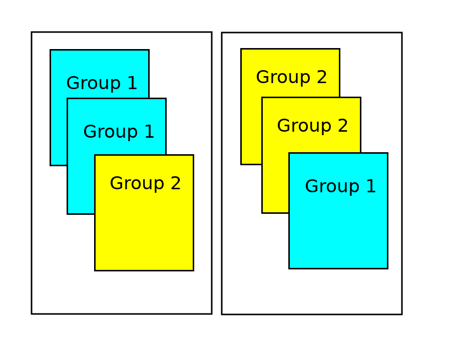

```{r setup, include = F}

library(ggplot2)
library(tidyverse)
knitr::opts_chunk$set(dpi=300, message = F, warning = F, echo = F, fig.width = 8, fig.height = 4, out.width = "80%", fig.align = "center", cache = T)
theme_set(theme_bw())
```


# Navigation


.large[By Section]
- 6.1: [start](#3) - [end](#15)
- 6.2: [start](#16) - [end](#36)
- 6.3: [start](#37) - [end](#49)

???

In Chapter 3, we learned how to handle quantitative data, tests, and intervals for a single mean. In Chapter 5, we started talking about what to do when there are 2 variables, but we were working with proportions. So, in Chapter 6, the next logical thing is to talk about what to do with 2 variables, where one of them is categorical and the other is quantitative. 

---
class:inverse,middle,center
# 6.1: Comparing Two Groups
## Quantitative Response

???

And just as in Chapter 5, where we first talked about how to display data with 2 variables using a segmented bar chart, we're going to spend section 6.1 on how to describe and visualize data where one of the variables is categorical and the other is quantitative. 

---
## Describing Distributions of Quantitative Data

- **5-number summary** - the minimum, lower quartile, median, upper quartile, and maximum of a set of data

  - **lower quartile** - 25% of the data lie below this value
  
  - **median** - 50% of the data lie below this value
  
  - **upper quartile** - 75% of the data lie below this value
  
```{r, fig.width = 8, fig.height = 4}
set.seed(205838)
tmp <- tibble(x = sort(rpois(101, 10)),
       lbl = c("minimum", rep(NA, 24), "lower quartile", rep(NA, 24), "median", rep(NA, 24), "upper quartile", rep(NA, 24), "maximum")) %>%
  mutate(lbl = factor(lbl, levels = lbl[!is.na(lbl)], ordered = T))

ggplot(tmp, aes(x = x)) +  
  geom_dotplot(fill = "white") + 
  theme(axis.text.y = element_blank(), axis.ticks.y = element_blank(), axis.title.y = element_blank(), axis.title.x = element_blank())
```

???

One way we would describe a distribution of continuous data is to use what is called a 5-number summary. This is basically a set of numbers that describe the full spread of the data: the minimum (lowest observation), the lower quartile, the median (50% through the data), the upper quartile, and the maximum (highest observation).


---
## Describing Distributions of Quantitative Data

- **5-number summary** - the minimum, lower quartile, median, upper quartile, and maximum of a set of data

  - **lower quartile** - 25% of the data lie below this value
  
  - **median** - 50% of the data lie below this value
  
  - **upper quartile** - 75% of the data lie below this value
  
```{r fig.width = 8, fig.height = 4}
cols <- RColorBrewer::brewer.pal(name = "Greens", 7)
  ggplot(tmp, aes(x = x)) + 
  geom_dotplot(fill = "white") +  
  geom_dotplot(data = filter(tmp, !is.na(lbl)), aes(fill = lbl)) +
  scale_fill_manual(values = cols[-c(1:2)], name = "5 number summary") + 
  theme(axis.text.y = element_blank(), axis.ticks.y = element_blank(), axis.title.y = element_blank(), axis.title.x = element_blank(),
        legend.pos = c(1,1), legend.justification = c(1.01,1.01))
```

???


The quartiles are a bit unfamiliar, though. 

With the median, we look for the point such that 50% of the data is below and 50% is above. You can think of the lower quartile as the median of the bottom half of the data: It is the point such that 25% of the data is below and 75% of the data is above.

Similarly, the upper quartile is the point where 75% of the data is below and 25% of the data is above. 

If you have $n$ observations, you can count $n/4$ from the bottom, $n/2$ , and $3n/4$ to get the lower quartile, median, and upper quartile (roughly). If you have a fractional value, average the two observations you're between.


---
## Describing Distributions of Quantitative Data


```{r fig.width = 8, fig.height = 4}
iqr <- quantile(tmp$x, c(.25, .75))
cols <- RColorBrewer::brewer.pal(name = "Greens", 7)
ggplot(tmp, aes(x = x)) + 
  geom_dotplot(fill = "white") + 
  geom_dotplot(data = filter(tmp, !is.na(lbl)), aes(fill = lbl)) +
  scale_fill_manual(values = cols[-c(1:2)], name = "5 number summary") + 
  geom_segment(aes(x = iqr[1], xend = iqr[2], y = .95, yend = .95), arrow = arrow(ends = "both", angle = 90, length = unit(.25, "cm"))) + 
  geom_text(aes(x = median(tmp$x), y = .98, label = "IQR"), size = 5) + 
  theme(axis.text.y = element_blank(), axis.ticks.y = element_blank(), axis.title.y = element_blank(), axis.title.x = element_blank(),
        legend.pos = c(1,1), legend.justification = c(1.01,1.01)) 
```

The distance between the two quartiles is called the **inter-quartile range**(IQR). The IQR is another measure of variability, along with the standard deviation.

The IQR is resistant (or *robust*) to extreme values and skewness, unlike the standard deviation.

???

The distance between the 25th and 75th percentiles (or the lower and upper quartiles) gives a rough measure of the spread of the distribution, without being affected by outliers. So for a skewed distribution, the standard deviation will be really affected by an extreme outlier, but the IQR won't change at all. 

---
## Describing Distributions of Quantitative Data

A **boxplot** (or box-and-whisker plot) is a visual display of the 5-number summary. 
- The box displays the middle 50% of the distribution and its width (the IQR) shows the spread of the bulk of the distribution. 
- The 'whiskers' extend to the 
    - smallest and largest values in the dataset 
    - OR the values in the dataset that are within 1.5\*IQR away from the edges of the box. 
        - Observations outside of the 1.5\*IQR range may be shown as dots and are outliers

```{r}
tmp <- tmp %>%
  mutate(in_box = (x >= iqr[1]) & (x <= iqr[2]),
         in_iqr = (x >= iqr[1]-diff(iqr)*1.5) & (x <= iqr[2] + diff(iqr)*1.5))

```

???

A boxplot is one way to summarize a full distribution visually, using the 5-number summary. It's easy to draw/sketch, and doesn't require as much tediousness as drawing a histogram or dotplot by hand. 

There are a couple of variations, but in both, the "box" covers the middle 50% of the data, with a line through the box for the median.

Extending out from the box are the "whiskers". You can make boxplots with whiskers that extend to the lowest and highest values - a direct representation of the 5 number summary. But often, a more useful representation is to make the whiskers extend to the lowest observation or 1.5 * IQR from the edges of the box. This allows us to visually highlight the outliers, which are shown as dots if they fall outside of the 1.5IQR range outside of the box.


---
## Describing Distributions of Quantitative Data

```{r}
ggplot(tmp, aes(x = x)) + 
  geom_dotplot(fill = "white") + 
  geom_dotplot(data = filter(tmp, !is.na(lbl)), aes(fill = lbl)) +
  scale_fill_manual(values = cols[-c(1:2)], name = "5 number summary") +  
  geom_segment(aes(x = iqr[1], xend = iqr[2], y = .95, yend = .95), arrow = arrow(ends = "both", angle = 90, length = unit(.25, "cm"))) + 
  geom_text(aes(x = median(tmp$x), y = .98, label = "IQR"), size = 5) + 
  theme(axis.text.y = element_blank(), axis.ticks.y = element_blank(), axis.title.y = element_blank(), axis.title.x = element_blank(),
        legend.pos = c(1,1), legend.justification = c(1.01,1.01))
```

What are the following values?
- bottom whisker:
- lower quartile:
- median:
- upper quartile:
- top whisker:

Are there any outliers?


???

Let's make a boxplot for our data here. First, we'll do the easy stuff - the quartiles and median.

---
## Describing Distributions of Quantitative Data

```{r}
ggplot(tmp, aes(x = x)) + 
  geom_dotplot(fill = "white") + 
  geom_dotplot(data = filter(tmp, !is.na(lbl)), aes(fill = lbl)) +
  scale_fill_manual(guide = F, values = cols[-c(1:2)], name = "5 number summary") +  
  geom_rect(aes(xmin = 7, xmax = 12, ymin = .93, ymax = 1), fill = "white", color = "black") + 
  geom_segment(aes(x = 9, xend = 9, y = .93, yend = 1)) + 
  theme(axis.text.y = element_blank(), axis.ticks.y = element_blank(), axis.title.y = element_blank(), axis.title.x = element_blank(),
        legend.pos = c(1,1), legend.justification = c(1.01,1.01))
```

What are the following values?
- bottom whisker: 
- lower quartile: .red[7]
- median: .red[9]
- upper quartile: .red[12]
- top whisker:

Are there any outliers?

???


Then, we'll calculate the IQR: 12 - 7 = 5. 

1.5 * IQR is 7.5

---
## Describing Distributions of Quantitative Data

```{r}
ggplot(tmp, aes(x = x)) + 
  geom_dotplot(fill = "white") + 
  geom_dotplot(data = filter(tmp, !is.na(lbl)), aes(fill = lbl)) +
  scale_fill_manual(guide = F, values = cols[-c(1:2)], name = "5 number summary") + 
  geom_rect(aes(xmin = 7, xmax = 12, ymin = .93, ymax = 1), fill = "white", color = "black") + 
  geom_segment(aes(x = 9, xend = 9, y = .93, yend = 1)) + 
  geom_segment(aes(x = 7, xend = 3, y = .965, yend = .965)) +
  geom_segment(aes(x = 12, xend = 19.5, y = .965, yend = .965)) + 
  # geom_point(aes(x = 21, y = .965)) + 
  theme(axis.text.y = element_blank(), axis.ticks.y = element_blank(), axis.title.y = element_blank(), axis.title.x = element_blank(),
        legend.pos = c(1,1), legend.justification = c(1.01,1.01))
```

- bottom whisker: .red[1.5 x IQR below lower quartile, or smallest observation]    
.red[7 - 1.5(12-7) = -0.5] or .red[3]    
.red[bottom whisker: 3]
- top whisker: .red[1.5 x IQR above upper quartile, or largest observation]    
.red[12 + 1.5(12-7) = 19.5] or .red[21]    
.red[top whisker: 19.5]

Are there any outliers?

???


Subtract the IQR from the lower quartile

Add it to the upper quartile

Take the least extreme value that exists in the data. 

---
## Describing Distributions of Quantitative Data

```{r}
ggplot(tmp, aes(x = x)) + 
  geom_dotplot(fill = "white") + 
  geom_dotplot(data = filter(tmp, !is.na(lbl)), aes(fill = lbl)) +
  scale_fill_manual(guide = F, values = cols[-c(1:2)], name = "5 number summary") + 
  geom_rect(aes(xmin = 7, xmax = 12, ymin = .93, ymax = 1), fill = "white", color = "black") + 
  geom_segment(aes(x = 9, xend = 9, y = .93, yend = 1)) + 
  geom_segment(aes(x = 7, xend = 3, y = .965, yend = .965)) +
  geom_segment(aes(x = 12, xend = 19.5, y = .965, yend = .965)) + 
  geom_point(aes(x = 21, y = .965)) + 
  theme(axis.text.y = element_blank(), axis.ticks.y = element_blank(), axis.title.y = element_blank(), axis.title.x = element_blank(),
        legend.pos = c(1,1), legend.justification = c(1.01,1.01))
```

What are the following values?
- bottom whisker: .red[3]
- lower quartile: .red[7]
- median: .red[9]
- upper quartile: .red[12]
- top whisker: .red[19.5] 

Are there any outliers? .red[Yes, at 21]

???

The top whisker extends from 12 to 19.5, but there is a single point beyond that --- that point is an outlier. Outliers are extreme points that sometimes represent rare occurrences and sometimes indicate data recording errors and other data quality issues - it depends on the field, and how extreme the outlier is. 


---
## Describing Distributions of Quantitative Data

Boxplots make it easy to compare distributions of different groups.
```{r}
diseases <- read_csv(here::here("data/izb-cases-by-county-and-year.csv")) %>%
  group_by(year, disease) %>%
  summarize(count = sum(count))

diseases %>%
  # filter(!disease %in% c("Diphtheria", "Varicella Hospitalizations", "Pertussis")) %>%
  filter(disease %in% c("Measles", "Mumps", "Invasive Meningococcal Disease") | str_detect(disease, "Hepatitis [BC]")) %>%
  mutate(disease = str_replace(disease, "Invasive Meningococcal Disease", "Meningitis") %>% str_remove(", Acute")) %>%
ggplot(aes(x = disease, y = count)) + geom_boxplot() + scale_y_continuous("# Cases") +  
  ggtitle("California Reportable Disease Cases, 2000-2018") + 
  theme(axis.text.y = element_text(angle = 90, hjust = .5, vjust = .5), axis.title.x = element_blank())

```

???

Using boxplots, we can compare distributions - for instance, we can say that there are usually fewer cases of measles than any other reportable illness in California, but there have been a couple of years where there were unusually large numbers of measles cases. 

We can see that the distribution of mumps cases is highly skewed - the median is very close to the lower quartile, and the lowest observation is not much lower than the quartile. So most years, we have 75 or so cases of mumps in California, but... in the other years, if we have more than 75 cases, we may have a lot more than 75 cases. That's what a skewed distribution looks like. 

---
## In-Class Practice: Jean Pocket Sizes

Using the graph paper on the next page, create boxplots for each of the dimensions in the chart below. 

```{r fig.width = 6, fig.height = 3}
pockets <- read_csv("https://raw.githubusercontent.com/the-pudding/data/master/pockets/measurements.csv")

pockets_clean <- pockets %>%
  pivot_longer(matches("max|min"), names_to = "region", values_to = "length") %>%
  extract(region, into = c("dim", "measurement", "side"), regex = c("(max|min|rivet)(Width|Height)(Front|Back)")) %>%
  filter(dim == "max") %>%
  filter(side == "Front") %>%
  mutate(length = round(length*2, 0)/2) %>%
  select(menWomen, measurement, length)

ggplot(pockets_clean, aes(x = length)) + geom_dotplot(fill = "grey", binwidth = .5, dotsize = 1) + 
  facet_grid(menWomen~measurement, scales = "free_x",space = "free_x") + 
  scale_x_continuous("Size (cm)", breaks = (6:15)*2, minor_breaks = 12:30) + 
  theme(axis.text.y = element_blank(), axis.ticks.y = element_blank(), axis.title.y = element_blank()) +
  ggtitle("Front Pocket Maximum")
```

.bottom[Data source: https://pudding.cool/2018/08/pockets/]

???

I was pretty proud of this exercise... and then class got cancelled. So I'd appreciate it if you'd follow along and pretend that it's a cool example. 

Someone went through and measured the pocket sizes in jeans for men and women. They measured several dimensions, but we're going to work with the height and width. 

You have all of the data here; practice creating boxplots for each men's dimension and women's dimension. 

When you're done, take a look at the Example 6.1 video in Box, where I work through this problem. I had to record that one on my tablet, so it's a good enough excuse to give you a chance to try things out yourself.

---
## In-Class Practice: Jean Pocket Sizes


What do you conclude about the distributions of front pocket maximum dimensions when comparing Men's jeans to Women's jeans?

???


---
## Exploration 6.1: Haircut Prices

Work through Exploration 6.1A. Upload your answers; you must complete at least 1-13. 

If you complete 14-19, you may get extra credit.


---
class:middle,inverse,center
## 6.2: Comparing Two Means: Simulation Based Approach

???

Welcome to chapter 6.2, where we'll be talking about the simulation based approach to comparing two group means.

---
## 3S strategy

1. Statistic
2. Simulation
3. Strength of Evidence

***

Our hypotheses are going to concern $\mu_1$ and $\mu_2$... specifically, the value of $\mu_1 - \mu_2$.

We are interested in the long run (e.g. data collected forever) value of the difference between the group means

$\begin{align}H_0&: \mu_1 - \mu_2 = 0\\H_A&: \mu_1 - \mu_2 \;\{\neq,>,< \} \;0\end{align}$

???

Let's start by reviewing our 3S strategy: First, we calculate a statistic, then we conduct a simulation, and finally, we evaluate the strength of our evidence.

In Chapter 6.2, we're working with $\mu_1$ and $\mu_2$. As with Chapter 5, what we care about in Chapter 6 is the value of the true difference in group means (or the long-run distance). 

By default, we'll assume our group means are the same - that is, our null hypothesis is generally going to be that $\mu_1 = \mu_2$, or, equivalently, that $\mu_1 - \mu_2 = 0$. Our alternative hypothesis is going to be some variation on "the group means aren't the same" - either greater than, less than, or not equal to, depending on the problem.

---
## Simulation 

Group | Value | Simulated Group
----- | ----- | ---------------
1 | a | 1
1 | b | 2 
1 | c | 1
2 | d | 1
2 | e | 2 
2 | f | 2

Assign new group labels to existing values

Think about sorting labeled index cards into stacks for each group.

???

To simulate this, we'll take all of our values and assign them new group labels. If the groups are the same, then shuffling the labels will make no difference in our statistic's value, right?


---
## Simulation 


???


Let's imagine that we have observations on two different colors of index cards. We compute the average value of each group, and then subtract them to get our sample statistic.

---
## Simulation 


???

In a simulation, we'll shuffle the two sets of cards together and then deal them back out so that there are the right number of cards in each stack. The cards are still colored by their original group, but we've assigned new group labels - stack 1 and stack 2. We compute the mean of all the values in each stack, subtract those, and get a simulated statistic.


---
## Simulation 

 

???

Then we shuffle again, average each stack again, and get another simulated statistic.

---
## Simulation 



At each simulation, we recalculate our statistic - e.g. $\overline x_1 - \overline x_2$

???

Each time we conduct a new trial, we're simulating an entire experiment - we're assigning groups to outcome values.

---
## Simulation

Null hypothesis: Mean .underline[.hidden[measurement]] is the same in both groups

One repetition: Rerandomizing groups for each .underline[.hidden[measurement]]

Statistic: Difference in two group means

???

To recap, our null hypothesis is that the mean is the same in both groups. One repetition consists of rerandomizing groups for each measurement, and we calculate the difference in the two simulated group means.


---
## Simulation

Null hypothesis: Mean .underline[.red[measurement]] is the same in both groups

One repetition: Rerandomizing groups for each .underline[.red[measurement]]

Statistic: Difference in two group means

---
## Example - Didgeridoo playing and sleep apnea

Scientists examined whether Didgeridoo lessons reduced the symptoms of sleep apnea as measured by the Epworth scale (0-24). Individuals were assessed for sleep apnea at the beginning and end of an 8-week period; the difference in scores was recorded. 14 individuals were randomly assigned to receive Didgeridoo lessons, while 11 did not receive any intervention.

```{r}
apnea <- tibble(group = rep(c("Didgeridoo", "Control"), c(14, 11)) %>% factor(levels = c("Control", "Didgeridoo"), ordered = T), 
                difference = c(10, 9, 8, 3, 2, 3, 11, 2, 5, -1, 2, 5, 1, 4, 3, 0, 4, 1, 1, -3, 2, 1, 1, 0, 0)) %>%
  mutate(color = ifelse(group == "Didgeridoo", "red", "white")) 
res_means <- apnea %>% group_by(group) %>% summarize(difference = mean(difference))
ggplot(apnea, aes(x = difference, fill = color)) + geom_dotplot() + facet_grid(group~.) + 
    geom_vline(data = res_means, aes(xintercept = difference)) + 
  scale_fill_identity() +  
  scale_x_continuous("Difference in Epworth Scale Score after 8 weeks", breaks = seq(-10, 14, by = 2), limits = c(-4, 12)) + 
  theme(axis.text.y = element_blank(), axis.title.y = element_blank(), axis.ticks.y = element_blank())
```

???

This is an example from the book, but who doesn't like to say didgeridoo?

Evidently, some scientist got a didgeridoo and started taking lessons, and found that his sleep apnea improved. He was intrigued, so he set up a study with 25 individuals, randomly assigning 14 to receive didgeridoo lessons while 11 presumably found other hobbies.

The difference in sleep apnea scores over the 8 week period was recorded for each individual. 

Our groups are treatment/control (lessons or not), our response variable is the difference in sleep apnea scores after 8 weeks.

---
## Example - Didgeridoo playing and sleep apnea

$$\begin{align}H_0: \mu_D - \mu_C &= 0\\H_A: \mu_D - \mu_C &>0\end{align}$$

In words:
- $H_0$: The difference in the average change in Epworth Scale score between those who received Didgeridoo lessons and those that did not is 0

- $H_A$: Those who received Didgeridoo lessons will have a higher average change in Epworth Scale score than those who did not.

Because there is random assignment, if we conclude $H_A$, we can say the change is due to the Didgeridoo lessons.

???

Setting up our null hypothesis, we define mu D to be the didgeridoo group, and mu C to be the control group. We start out with the assumption that they're equal - there is no effect of didgeridoo lessons, and any group differences are due to random chance alone.

Our alternative hypothesis is that didgeridoo lessons do actually matter and result in a larger change in sleep apnea scores.


---
## Example - Didgeridoo playing and sleep apnea

```{r fig.width=8, fig.height=4, message = F, warning = F,  ffmpeg.format='gif', fig.show='animate', dev = "jpeg", dpi = 300, interval=.2, aniopts = "controls"}
set.seed(240997823)
actual <- apnea %>% group_by(group) %>% summarize(difference = mean(difference))
res <- tibble(i = 1:100, mean_diff = 0)
for (i in 1:100) {
  apnea$groupnew <- sample(apnea$group, size = 25, replace = F) 
  res_means <- apnea %>% group_by(groupnew) %>% summarize(difference = mean(difference))
  res$mean_diff[i] <- diff(res_means$difference)
  p1 <- ggplot(apnea, aes(x = difference, fill = color)) + geom_dotplot() + facet_grid(groupnew~.) + 
    geom_vline(data = res_means, aes(xintercept = difference)) + 
    scale_fill_identity() + 
    scale_x_continuous("Difference in Epworth Scale Score after 8 weeks", breaks = seq(-10, 14, by = 2), limits = c(-4, 12)) + 
    theme(axis.text.y = element_blank(), axis.title.y = element_blank(), axis.ticks.y = element_blank())
  
  p2 <- ggplot() + 
    geom_text(aes(x = diff(actual$difference), y = 30, label = "Observed"), color = "grey30", hjust = 1.1) + 
    geom_vline(xintercept = diff(actual$difference), color = "grey30") +
    geom_vline(xintercept = diff(res_means$difference)) +
    geom_histogram(aes(x = res$mean_diff[1:i]), center = 0, binwidth = 1, fill = "white", color = "black") + 
    ylim(c(0, 30)) + xlim(c(-5, 5)) + xlab("Avg Didgeridoo score - Control score") +
    theme(axis.title.y = element_blank())
  
  gridExtra::grid.arrange(p1, p2, nrow = 1)
}

```

During each simulation, the group labels are shuffled and the difference in the means is calculated. The resulting simulation statistic distribution is used to calculate the p-value.

???

This animation shows the accumulation of 100 simulations using this data. On the left, you can see the "assigned" groups - the different plots; the points are separated out by their original group membership as well using color. 

In the 100 simulation trials we see here, there were no trials that randomly showed a value as extreme as what we observed.

We can't say our p-value is 0 because we haven't run enough simulations, but we can say that p is less than 0.01. 

---
## Example - Didgeridoo playing and sleep apnea

```{r}
res <- res %>% mutate(extreme = ifelse(mean_diff > diff(actual$difference), "red", "white"))
 
ggplot() + 
    geom_text(aes(x = diff(actual$difference), y = 30, label = "Observed"), color = "grey30", hjust = 1.1) + 
    geom_vline(xintercept = diff(actual$difference), color = "grey30") +
    geom_histogram(data = res, aes(x = mean_diff, fill = extreme), center = 0, binwidth = 1, color = "black") +
  scale_fill_identity() + 
  annotate("text", x = -Inf, y = Inf, hjust = -0.1, vjust = 1.1, label = sprintf("p < %0.2f", mean(res$extreme == "red") + 0.01)) + 
    ylim(c(0, 30)) + xlim(c(-5, 5)) + xlab("Avg Didgeridoo score - Control score") +
    theme(axis.title.y = element_blank())

```

Interpretation: 

???

We'd interpret this in the same way that we interpreted any other p-value: With p<0.01, we have very strong evidence against the null hypothesis that the two groups are equal. We reject the null and conclude that Didgeridoo lessons cause sleep apnea scores to decrease relative to a control group. There is evidence that didgeridoo lessons reduce symptoms of sleep apnea.

--

.red[
With p < 0.01, we have very strong evidence against the null hypothesis that the two groups experienced equivalent reductions in Epworth Scale scores. Therefore, we reject $H_0$ and conclude that it is more plausible that the group who received Didgeridoo lessons had a higher average reduction in Epworth Scale score than the control group. There is evidence that Didgeridoo lessons reduce the symptoms of sleep apnea.
]


---
## Exploration 6.2

Complete Exploration 6.2, questions 1 - 15. Upload your results to Canvas. 

You may work in groups if you wish, just put everyone's name on the assignment and only turn it in once.


---
class:center,middle,inverse
## 6.3: Comparing Two Means: Theory-Based Approach

---
## Example 6.3: Breastfeeding and Intelligence

An article published in the journal Pediatrics (1999) studied whether and how children who were breastfed during infancy differed from those who werent breastfed. The study involved 323 white children recruited at birth in 1980-1981 from four Western Michigan Hospitals. After some initial exploration, the researchers deemed the participants in the study were representative of the community in terms of social class, maternal education, age, marital status, and sex of infant.

- Is this an experiment or an observational study? .hidden[Investigators did not assign treatments (breastfeeding/not) to infants]

- Is this a random sample? .hidden[No - infants were not randomly selected - they were 'recruited']

- Is this a representative sample? .hidden[Possibly, based on initial exploration by the researchers. If the population of interest is white infants, then maybe.]

- Can we make causal conclusions (e.g. breastfeeding causes increased intelligence) .hidden[No, we can't make causal conclusions, because there was no random assignment of treatments to observational units]

---
## Example 6.3: Breastfeeding and Intelligence

An article published in the journal Pediatrics (1999) studied whether and how children who were breastfed during infancy differed from those who weren't breastfed. The study involved 323 white children recruited at birth in 1980-1981 from four Western Michigan Hospitals. After some initial exploration, the researchers deemed the participants in the study were representative of the community in terms of social class, maternal education, age, marital status, and sex of infant.

- Is this ~~an experiment~~ or an observational study? .red[Investigators did not assign treatments (breastfeeding/not) to infants]

- Is this a random sample? .red[No - infants were not randomly selected - they were 'recruited']

- Is this a representative sample? .red[Possibly, based on initial exploration by the researchers. If the population of interest is white infants, then maybe.]

- Can we make causal conclusions (e.g. breastfeeding causes increased intelligence) .red[No, we can't make causal conclusions, because there was no random assignment of treatments to observational units]


---
## Example 6.3: Breastfeeding and Intelligence

The researchers followed up with the children at age 4, assessing their abilities using the McCarthy Scales of Children's Abilities. The GCI (General Cognitive Index) was recorded for each child, along with whether or not the child was breastfed.

What should the researchers use as their hypotheses, in words?


---
## Example 6.3: Breastfeeding and Intelligence

The researchers followed up with the children at age 4, assessing their abilities using the McCarthy Scales of Children's Abilities. The GCI (General Cognitive Index) was recorded for each child, along with whether or not the child was breastfed.

What should the researchers use as their hypotheses, in words?

.red[Null: There is no underlying association between breastfeeding during infancy and GCI at age 4.]

.red[Alt: There is an association between breastfeeding during infancy and GCI at age 4.]


---
## Example 6.3: Breastfeeding and Intelligence

The researchers followed up with the children at age 4, assessing their abilities using the McCarthy Scales of Children's Abilities. The GCI (General Cognitive Index) was recorded for each child, along with whether or not the child was breastfed.

What are the hypotheses in symbols?


---
## Example 6.3: Breastfeeding and Intelligence

The researchers followed up with the children at age 4, assessing their abilities using the McCarthy Scales of Children's Abilities. The GCI (General Cognitive Index) was recorded for each child, along with whether or not the child was breastfed.

What are the hypotheses in symbols?

.red[
$$\begin{align}H_0: \mu_{BF} - \mu_{Not}&= 0\\H_A: \mu_{BF} - \mu_{Not} &\neq 0\end{align}$$
]

OR

.red[
$$\begin{align}H_0: \mu_{BF} &= \mu_{Not}\\H_A: \mu_{BF} &\neq \mu_{Not}\end{align}$$
]


---
## Example 6.3: Breastfeeding and Intelligence

Summary Stats:

Group | n | Sample mean | Sample SD
----- | - | ----------- | ---------
Breastfed | 237 | 105.30 | 14.50
Not Breastfed | 85 | 100.90 | 14.00

Simulated Data:
```{r, fig.width = 8, fig.height = 4}
set.seed(109248379)
bf <- tibble(
  status = rep(c("Breastfed", "Not Breastfed"), c(237, 85)),
  GCI = c(rnorm(237, 105.30, 14.5), rnorm(85, 100.90, 14))
)

bf_stats <- bf %>% group_by(status) %>%
  summarize(
    y25 = quantile(GCI, .25),
    y50 = quantile(GCI, .5),
    y75 = quantile(GCI, .75),
    ymin = pmax(y25 - 1.5*(y75-y25), min(GCI)),
    ymax = pmin(y75 + 1.5*(y75-y25), max(GCI))
  )

ggplot() + 
  geom_histogram(data = bf, aes(x = GCI), binwidth = 5, fill = "grey", color = "black") + 
  scale_y_continuous("", breaks = (0:4)*10) +
  geom_rect(data = bf_stats, aes(xmin = y25, xmax = y50, ymin = -10, ymax = -1), color = "red", fill = "white") +  
  geom_rect(data = bf_stats, aes(xmin = y50, xmax = y75, ymin = -10, ymax = -1), color = "red", fill = "white") +  
  geom_segment(data = bf_stats, aes(x = y25, xend = ymin, y = -5, yend = -5), color = "red") + 
  geom_segment(data = bf_stats, aes(x = y75, xend = ymax, y = -5, yend = -5), color = "red") + 
  facet_grid(status ~ .)

```


---
## Example 6.3: Breastfeeding and Intelligence

CI Option 1: Theory-ish based Confidence Interval

- Statistic $\pm$ 2 SD(Statistic)    
SD of difference in means from simulation

```{r}
set.seed(109248379)
bf <- tibble(
  status = rep(c("Breastfed", "Not Breastfed"), c(237, 85)),
  GCI = c(rnorm(237, 105.30, 14.5), rnorm(85, 100.90, 14))
)
stat <- bf %>% group_by(status) %>% summarize(GCI = mean(GCI)) %>%
    summarize(GCI_diff = GCI[status == "Breastfed"] - GCI[status == "Not Breastfed"]) %>%
  unlist()

bf_sim <- purrr::map_df(1:1000, function(x) {
  bf %>%
    mutate(status = sample(status, nrow(bf), replace = F)) %>%
    group_by(status) %>%
    summarize(GCI = mean(GCI)) %>%
    summarize(x = x, GCI_diff = GCI[status == "Breastfed"] - GCI[status == "Not Breastfed"])
}) %>%
  mutate(extreme = abs(GCI_diff) >= abs(stat),
         color = ifelse(extreme, "red", "grey"))

ggplot(bf_sim, aes(x = GCI_diff, fill = color)) + 
  scale_fill_identity() + 
  geom_histogram(color = "black", binwidth = .2) + 
  scale_x_continuous("Avg. GCI(Breastfed) - Avg. GCI(Not)") + 
  annotate("text", x = -Inf, y = Inf, hjust = 0, vjust = 1.1, label = sprintf("N = 1000\nMean = %0.3f\nSD = %0.3f\nExtreme = %d", mean(bf_sim$GCI_diff), sd(bf_sim$GCI_diff), sum(bf_sim$extreme))) + 
  theme(axis.title.y = element_blank()) + 
  ggtitle("Simulated Mean Differences under H0")
```

`r round(stat, 3)` $\pm$ 2 (`r round(sd(bf_sim$GCI_diff), 3)`) = `r sprintf("(%0.3f, %0.3f)", stat - 2 * sd(bf_sim$GCI_diff),  mean(bf_sim$GCI_diff) + 2 * sd(bf_sim$GCI_diff))`

---
## Example 6.3: Breastfeeding and Intelligence

CI Option 2: Theory based Confidence Interval

- Statistic $\pm$ 2 SD(Statistic)    
SD of difference in means from formula

$$\begin{align}SD(\overline x_1 - \overline x_2) &= \sqrt{\frac{s_1^2}{n_1} + \frac{s_2^2}{n_2}} \\&= \sqrt{\frac{14.5^2}{237} + \frac{14.0^2}{85}} \\&= \sqrt{0.887 + 2.306} \\&= 1.787\end{align}$$
`r round(stat, 3)` $\pm$ 2 (1.787) = `r sprintf("(%0.3f, %0.3f)", stat - 2 * 1.787,  mean(bf_sim$GCI_diff) + 2 * 1.787)`

On a test, use Option 2 unless it explicitly says you may use the simulation standard error

---
## Example 6.3: Breastfeeding and Intelligence

A standardized statistic is thus

$$t = \frac{\text{statistic} - \text{hypothesized value}}{SE(\text{statistic})} = \frac{\overline x_1 - \overline x_2 - 0}{\sqrt{\frac{s_1^2}{n_1} + \frac{s_2^2}{n_2}}}$$ 

***
### Validity Conditions

Either

- a symmetric distribution in both groups

OR

- at least 20 observations in each group and sample distributions that are not highly skewed

If the validity conditions hold, you can use the guideline that if $t > 2$, then the p-value is probably $< 0.05$.

---
## Factors Affecting the Width of a CI

- size of $n_1$ and $n_2$
  - If $N = n_1 + n_2$ is constant, the difference between $n_1$ and $n_2$
    - the more balanced, the smaller the margin of error (all else equal)
  - Higher $N$ = smaller margin of error

- variability of group 1 and/or group 2

- multiplier
