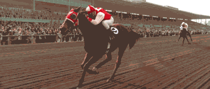
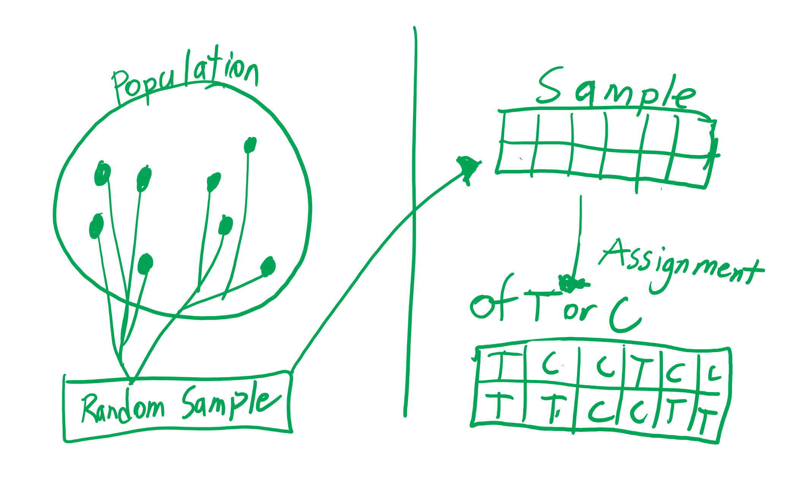

<script type="text/x-mathjax-config">
  MathJax.Hub.Config({ TeX: { extensions: ["color.js"] }});
</script>

```{r setup, include = F}

library(ggplot2)
library(tidyverse)
knitr::opts_chunk$set(dpi=300, message = F, warning = F, echo = F, fig.width = 8, fig.height = 4, out.width = "80%", fig.align = "center", cache = T)
theme_set(theme_bw())
```

# Navigation

.pull-left[
.large[By Date]

- April 9th: [start](#3) - [end](#10)
- April 14th: [start](#11) - [end](#19)
- April 16th: [start](#11) - [end](#19)

]
.pull-right[
.large[By Section]
- 7.1: [start](#3) - [end](#10)
- 7.2: [start](#11) - [end](#19)
- 7.3: [start](#11) - [end](#19)
]

---
class:inverse,middle,center
# 7.1: Paired Designs


---

## Introduction: Independent Groups vs. Paired Design

- We compared long-run proportions (probabilities) of two groups in chapter 5

- We compared long-run averages (means) of two groups in chapter 6

- These chapters studied independent groups.

  - The observational units in different groups are not related to each other. 
  
  
---

## Paired Design

- Data is observed in pairs. Each observational unit is a pair. 
  - Now, a subject in group 1 is related to its partner in group 2.
  
.center[

]
  

---
## Two Features in Paired Designs

1. One pair of responses per observational/experimental unit

2. Data is built to compare the two groups for every pair

**Here is an example from the book:**
 
27 students will listen to music with lyrics or listen to music without lyrics. While students are listening to the music, they will play a memorization game: They will study a list of 25 common five-letter words for 90 seconds. Then, the students will write down as many of the words as they can remember.

Instead of randomly assigning students to each of the two groups, each student will play the memorization game twice: once listening to the song with lyrics and once without lyrics.

---

## There is a New Response Variable

- This response variable is quantitative

- **Response Variable**: The difference between the two groups

  - Each observational unit pair will have a recorded difference. The difference can be positive or negative. 
  
- Differences are expected to have **less variablility** than measurements in two independent groups (a person in one group may be very different than another in the second group)
 
---

## Types of Paired Designs

- **Repeated Measures**: Measure each subject twice, once under explanatory group 1 and once under explanatory group 2

  - Each horse run a 100 yard dash with the shoes a rancher currently uses vs. a new shoe they may buy.


  - A person gets a medicine, then a placebo a few days later. 
  
.center[

]

---

## Types of Paired Designs

- **Matching Pairs**: Match individuals based on prior knowledge to create our pairs

  - Match two pigs of the same litter to see which feed will add more fat to the meat.

  - Pair people, based on their BMI, to see the difference in the amount of pushups they can do in regular clothes vs. workout clothes. 
  
.center[

]

---

## Paired Designs Benefits

- Paired Designs, just by themselves excludes all confounding variables except two
  - order of tasks
  - carryover effects

- To get rid of the task order confounding variable: 

  -Randomize the order in which the tasks are done.
  
  -Randomize which task is first.

- To get rid of the carryover effects:

  - Include a rest period (wash-out period) in order to eliminate a carry-over effect of the first task to the second.

  - Example: Wait a few days for the drug left over in your blood system to leave the body
  - Example: Rest to recover from a physical fitness test

  
---

## When Should You Use a Paired Design?

- When we expect a strong association between repeated observations within a pair

- Why use Paired Designs?
  - In some scenarios, you will get more informative results


---

## Parameter and Statistic


Parameter: $\mu_D$

The long-run mean difference of _______ between group 1 and group 2

Hypotheses:

$H_0: \mu_D = 0$
$H_a: \mu_D >, <, \ne 0$

Statistic: $\bar{x}$

Sample mean difference between two groups


---
##Quick Note

Observational studies can have paired designs too!

---

## Practice Problems

Student researchers, who were big fans of Jeopardy, wanted to see whether an adult’s reaction time is different if they hit a button once they see a flashing light vs. hear a noise. They randomly sampled 55 adults. To start, the adult subjects would have both hands behind their back. Then, the researchers had a computer program display a red circle. When it flashed or when the computer made a loud noise, the subjects were to hit the buzzer as fast as they could. The computer would calculate the reaction time in seconds. Researchers recorded the reaction time. Each subject did both tests. The researchers randomly determined which test was first (flashing button vs. a noise) was completed first.

- Is this an indpendent groups or paired design? 

- If it is a paired design, what type is it? **Justify your answer**.


---
## Practice Problems

On March 19th 2019, Lincoln residents and businesses were urged to continue to voluntarily reduce water consumption by 25 percent (see the article here). UNL’s Institute of Agriculture and Natural Resources wanted to see if voluntary water restrictions reduced water consumption.

They went to Old Cheney Place apartments. They randomly gave a flier notifying residents of voluntary water restrictions to 100 one-bedroom apartments. For the control group, they gave a flier to 100 other apartments  and only advertised the CASNR week food drive. 

- Is this an indpendent groups or paired design? 

- If it is a paired design, what type is it? **Justify your answer**.

- If not, how could you make this a paired design? 

---
## Come Up With Your Own Study


---
class:inverse,middle,center
# 4.2: Observational Studies Vs. Experiments


---

## Observational Study

- The values of the explanatory variable are simply observed. Researchers cannot change or assign them to observational units. Examples are: 

  - Does your child sleep with a night light? 
  - Which NBA team does a player play for? 
  - Which country were you born in? 
  - An animal's gender
  - Number of social media profiles
  - Amount of video games a person owns
  - Commute to work in minutes

---

## Experiment

- Researchers can assign the values of the explanatory variable to observational units

  - In experiments, we can say observational units are called experimental units
  
- Examples:

  - Treatment vs. Control (do nothing or give a placebo)
  - Did you use the internet to play a game or pencil and paper?
  - Amount of days a plant doesn't have any water
  
---

## Setting Up a Good Experiment

- We want to avoid two things:

  - **Sampling Bias**
  - **Confounding Variables**
  
We use two strategies in STAT 218

- Simple Random Sampling


- Random Assignment: Use a random/chance device to assign values of the explanatory variable to experimental units
    - Randomly assign groups (categorical explanatory variable)
    - Randomly assign a measurement (quantitative explanatory variable)
    
---
## Random Sampling and Random Assignment

- You can use neither, one of them, or both to do your experiment

.center[

]

    
---

## Example and Benefits

- I need some random students from the class...

- I will randomly assign them a group

- Benefits:
  - Random sampling gets rid of sampling bias. We can **generalize our conclusions** to the whole population
  - Random assignment removes the effect of confounding variables. We can determine **cause-and-effect** if we have enough evidence to reject $H_0$
  
---

## Observational Study Vs. Experiment

- Therefore, we aren't justified in determining cause-and-effect in an observational study

  - Observational studies may be affected by confounding variables

---

## Types of Experiments

- No random assignment

  - quasi-experiment (observational study)
  
- Random assignment

  - randomized experiment

- Random assignment and neither the researcher or experimental unit know what group or measurement they have

  - double-blind experiment
  
---

## Answer These Questions with your Group
Suppose you want to measure the average daily weight gain of steers. You assigned each steer dry-rolled corn or wet (fermented) corn. Then, you measured their average daily weight gain. You gathered a sample of 60 steers. 

- What is the explanatory variable?

- What is the response variable? 

- How could you gather a random sample of steers? 

- How would you do random assignment in this study?

- Can you identify a confounding variable? 

---

## Exploration 4.2

- Do questions 1 through 11 with your group

- We will periodically review answers as a class

<!-- Let's give them a bit of periodic guidance by going over e.g. questions 1-4 after a bit of work, then 5-9, then 10-12 -->

<!--Ok. That sounds like a good plan. Kevin-->
