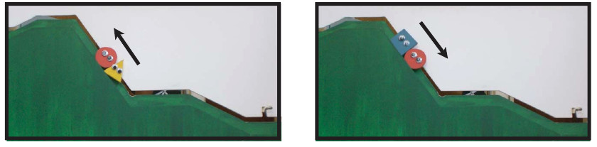
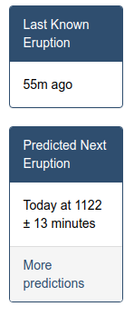

```{r setup, include = F}

library(ggplot2)
library(tidyverse)
knitr::opts_chunk$set(message = F, warning = F, echo = F, fig.width = 8, fig.height = 4, out.width = "80%", out.extra = "center")
```

class: inverse,middle,center
# Jumping right in: 
## Exploring Infant Behavior

---
## Infants and Social Cues



- 16 10 month old infants

- Shown a series of puppet scenes: 
    - (2x) climber (red circle) trying to climb the hill and failing
    - helper or hinderer scenario (shown in the picture above)
- The sequence of scenes was repeated until the infant got bored (habituation)

- The infants were then asked to pick one of the two puppets: the helper or the hinderer

- 14 of the 16 infants chose the helper (yellow triangle)
    

---
## Simulation

We can simulate this experiment if we use a **null model** that assumes that infants are equally likely to choose the helper or hinderer puppet.

Let heads = selecting the helper puppet, and flip a coin 16 times.

The **test statistic** is the number of infants selecting the helper puppet (the number of heads)

If infants are equally likely to select either puppet, this replicates the original experiment (16 infants)

By combining multiple simulated trials, we can see what the **distribution** of the test statistic would be under the null model.

---
## Class Discussion

- What does each dot on the plot represent?

- Why didn't every group get the same value?

- If you truly don't have any preference, how many times would you have chosen the helper toy by chance?

- What would a dot in the right tail of the dot plot mean? The left tail?

- If we want lots of points, we need to collect lots more data. How could we do this?


---
class:inverse, middle, center
# P.1: Introduction to the Six-Step Method

---
## Steps of Statistical Investigation

1. Ask a research question (that can be addressed by collecting data)

2. Design a study and collect data

3. Explore the data (charts and graphs)

4. Draw inferences beyond the data

5. Formulate conclusions (using step 4)

6. Look back (limitations) and look ahead (new questions)

---
## Group Discussion

How do the six steps apply to the Helper vs. Hinderer experiment?

---
class: inverse, middle,center
# P.2: Exploring Data

---
class:inverse,center
## Example: Old Faithful

<iframe width="710" height="399" src="https://www.youtube.com/embed/UXFEiEMvdDo" frameborder="0" allow="accelerometer; autoplay; encrypted-media; gyroscope; picture-in-picture" allowfullscreen></iframe>

[Livestream](https://www.nps.gov/yell/learn/photosmultimedia/webcams.htm)

---
## Example: Old Faithful

.right-column[
[](https://geysertimes.org/geyser.php?id=old+faithful)
]
.left-column[

- Erupts every 35-120 minutes

- Park Rangers (and others) make [predictions on next eruption time](https://geysertimes.org/geyser.php?id=old+faithful)


<br/><br/>
[Read more about Old Faithful eruptions here](https://yellowstone.net/geysers/old-faithful/)
]

---
## Example: Old Faithful

1. Ask a research question
--

  - How long between eruptions?
  
  - How high will the eruption be?
  
  - ??    
--

2. Design a study and collect data

  - Measure time between eruptions, eruption length

---
## Example: Old Faithful
1. Ask a research question
2. Design a study and collect data
3. Explore the data
.center[
```{r, echo = F, message = F, warning = F}
# data(geyser, package = "MASS")
data(faithful, package = "datasets")
ggplot(aes(x = waiting), data = faithful) + 
  geom_dotplot(binwidth = 1, method = "histodot", stackratio = 1.2, origin = 0.5) +
  scale_y_continuous(NULL, breaks = NULL) + 
  scale_x_continuous("Time until next eruption (minutes)", breaks = seq(40, 120, by = 10))
```
]


???

distribution - bimodal (two peaks)
variability - some within each peak, but lots between the two peaks
process - what could cause the bimodality? Could longer eruptions lead to longer waiting times?

<!--
---
## Example: Old Faithful
1. Ask a research question
2. Design a study and collect data
3. Explore the data
.center[

```{r, echo = F}
faithful %>%
  mutate(Length = ifelse(eruptions > 3.5, "Long (>3.5 mins)", "Short (<=3.5 min)")) %>%
ggplot(aes(x = waiting, y = eruptions)) +
  geom_point() + 
  scale_y_continuous("Eruption length (minutes)", breaks = 1:6) + 
  scale_x_continuous("Time until next eruption (minutes)", breaks = seq(40, 120, by = 10))
```
]

???
Somewhere between 3 and 3.5 minutes is a good cutoff for the clustering of the points

---
## Example: Old Faithful
1. Ask a research question
2. Design a study and collect data
3. Explore the data
.center[
```{r, echo = F, fig.height = 6}
faithful %>%
  mutate(Length = ifelse(eruptions > 3.5, "Long (>3.5 mins)", "Short (<=3.5 min)")) %>%
ggplot(aes(x = waiting)) + 
  facet_grid(Length~.) + 
  geom_dotplot(binwidth = 1, method = "histodot", stackratio = 1, origin = 1) +
  scale_y_continuous(NULL, breaks = NULL) + 
  scale_x_continuous("Time until next eruption (minutes)", breaks = seq(40, 120, by = 10))
```
]
???
With this cutoff, we get two separate unimodal distributions that have lower overall variability

-->

---
## Distributions

- Center - what is the most likely value?
  - mean (average), median (middle value), mode (most common value)
  
- Shape - how many "peaks" does the distribution have? Is it symmetric?

- Variability - how spread out is the distribution? 
  - standard deviation - typical distance between the data values and the mean of the distribution

```{r, echo = F}
faithful %>%
  mutate(Length = ifelse(eruptions > 3.5, "Long (>3.5 mins)", "Short (<=3.5 min)")) %>%
ggplot(aes(x = waiting, fill = Length)) + 
  scale_fill_brewer(palette = "Dark2") + 
  theme(legend.position = c(0, 1), legend.justification = c(0, 1), legend.background = element_rect(fill = "transparent")) +
  geom_dotplot(binwidth = 1, method = "histodot", stackratio = 1, origin = 1) +
  scale_y_continuous(NULL, breaks = NULL) + 
  scale_x_continuous("Time until next eruption (minutes)", breaks = seq(40, 120, by = 10))
```

---
class: inverse, middle, center
# P.3: Exploring Random Processes

---
## Cars or Goats

<div class="right-column">


</div>

- TV Show from the 1960s and 1970s

- 3 doors containing prizes:

    - a new car
    
    - 2 goats
    
What is the probability of picking the car? 


---
## Cars or Goats

Work through Exploration P.3. 

Plot your results for questions 6 and 8 in a chart, with number of games on the x axis and proportion of wins on the y axis (see Fig. P.6 for an example). Upload the graph to Canvas. 
